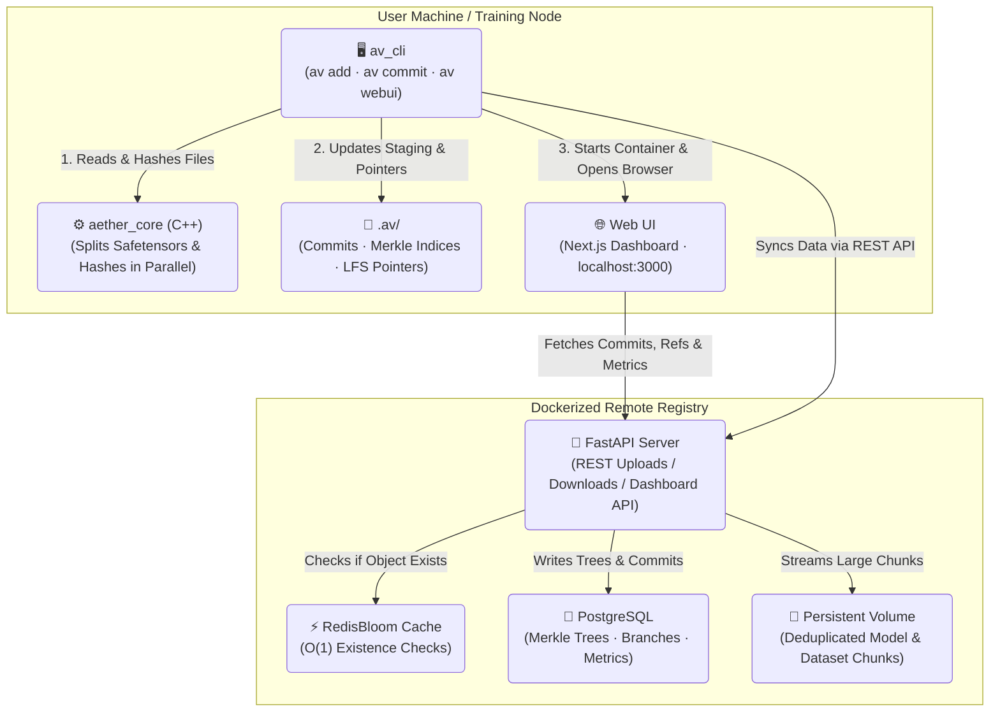

# 🌌 Aether-Vault

> **High-performance, Git-like version control and registry for Machine Learning models, datasets, and code — in a single atomic commit.**

Aether-Vault solves the core challenge of ML reproducibility by versioning the **"Holy Trinity"** together:

| | Type | Examples |
|---|---|---|
| 1 | **Code** | Python training scripts, pipelines, validators |
| 2 | **Model Weights** | `.pt`, `.safetensors`, `.onnx` |
| 3 | **Datasets** | `.csv`, `.parquet`, `.h5`, `.arrow` |

---

## ⚡ Architecture

Aether-Vault bridges Python and C++ for maximum throughput:

- **C++ Performance Core (`aether_core`)** — Reads multi-gigabyte files in 8MB chunks, hashing them in parallel with a C++11 ThreadPool. Layer-aware `.safetensors` parsing enables per-layer deduplication.
- **Python CLI (`av_cli`)** — Familiar Git-like interface (`av add`, `av commit`, `av checkout`). Files above the LFS threshold are automatically replaced by lightweight pointer files.
- **FastAPI CAS Server (`av_server`)** — Dockerized Content-Addressable Storage backend, backed by PostgreSQL (Merkle Tree DAG) and RedisBloom (O(1) existence checks).
- **Next.js Web UI (`webui`)** — Browser-based dashboard for visualizing the commit graph, branches, and ML metrics. Launched with `av webui`.

### System Diagram



---

## 🛠️ Installation

### Prerequisites

| Requirement | Notes |
|---|---|
| **Docker & Docker Compose** | Required for the registry and Web UI |
| **Python ≥ 3.10** | For the `av` CLI |
| **C++ Build Tools** | Visual Studio Build Tools (Windows) · GCC/Clang (Linux/macOS) |
| **CMake** | For building the C++ hashing core |

### 1. Start the Registry (Docker)

```bash
git clone https://github.com/leon1706/aether-vault
cd aether-vault

# Start the full backend stack (API server, PostgreSQL, Redis)
docker compose up --build -d
```

The FastAPI server will be available at `http://localhost:8000`.  
Interactive API docs: `http://localhost:8000/docs`

### 2. Install the CLI

```bash
# Compiles the C++ core and installs the `av` command
pip install -e .
```

---

## 📖 CLI Reference

### `av init`
Initialize an Aether-Vault repository in the current directory.
```bash
av init
```

### `av config`
Set the LFS size threshold (in MB). Files larger than this are automatically streamed to the remote and replaced by pointer files.
```bash
av config 100   # 100 MB threshold
```

### `av add`
Stage files or entire directories for the next commit. Supports `.safetensors` layer-splitting automatically.
```bash
av add src/train.py data/features.parquet weights/epoch_50.safetensors

# Stage everything recursively
av add .
```

### `av status`
Show staged, modified, deleted, and untracked files.
```bash
av status
```

### `av commit`
Record a snapshot of the staged files into the local DAG and push to the remote registry. Attach arbitrary ML metrics and labels directly to the commit.
```bash
av commit -m "LSTM tuned on Q2 data" \
  --tag production \
  --metric sharpe=2.45 \
  --metric drawdown=0.12 \
  --metric val_loss=0.034
```

### `av branch` / `av checkout`
Create and switch between experiment branches. Missing model weights are automatically downloaded from the remote.
```bash
av branch feature-transformers
av checkout feature-transformers
av checkout main
```

### `av list-meta`
Display all registered tag labels and metric keys across the repository history.
```bash
av list-meta
```

### `av graph`
Parse the repository's Python AST and generate an Obsidian-compatible Markdown vault of the full function call graph and dependency map.
```bash
av graph            # Generate and attempt to launch Obsidian
av graph --update   # Silently regenerate after code changes
```

### `av webui` 🆕
Launch the browser-based Web UI dashboard. Checks that Docker is running, starts the `aether-vault-webui` container, and opens `http://localhost:3000` automatically.
```bash
av webui
# 1. Checks Docker is running
# 2. Starts the Next.js Web UI container
# 3. Waits for the service to be ready
# 4. Opens http://localhost:3000 in your browser
```

**Dashboard panels:**
- **Experiment Graph** — SVG commit DAG with coloured branch lanes
- **Commit Log** — Full history with authors, timestamps, tags & metrics pills
- **Branch List** — All refs with tip commit details
- **ML Metrics Chart** — Line chart plotting all numeric metrics over commits
- **Stats Bar** — Live counts for commits, branches, CAS objects, and storage size

### `av gc`
Trigger a mark-and-sweep garbage collection on the remote server to purge orphaned storage shards and rebuild the Redis Bloom Filter.
```bash
av gc
```

---

## 🗺️ Build Phases & Development Walkthrough

Aether-Vault was built in eight distinct phases:

### Phase 1 — High-Performance C++ Hashing Core
- **Custom SHA-256 Engine**: Thread-safe cryptographic hashing.
- **Parallel Tree-Hashing**: Splits files into 8MB chunks, hashes concurrently across all CPU cores.

### Phase 2 — CLI Framework & LFS Pointers
- **Staging Index Manager**: Manages the local `.av/index`.
- **LFS-Style Pointers**: Detects large files, copies them to object storage, and replaces them with `.av-pointer` files.

### Phase 3 — Content-Addressable Storage (CAS)
- **Robust CAS Manager**: Deduplicates by SHA-256 hash with atomic writes.
- **FastAPI Endpoints**: High-concurrency streaming uploads, downloads, and branch management.

### Phase 4 — Database & Cache Integration
- **PostgreSQL Schema**: Structured SQL representation of the commit DAG, branches, and metadata.
- **Redis Integration**: `redis-stack-server` for high-performance in-memory caching.

### Phase 5 — Safetensors & Merkle Trees
- **C++ Layer-Splitting**: Parses `.safetensors` JSON headers to independently hash individual model layers — saving up to **99% storage** when only classifier heads change.
- **Merkle Tree DAG**: PostgreSQL tables modelling the full directory hierarchy as a content-addressed tree.

### Phase 6 — Scalability & Garbage Collection
- **RedisBloom Filter**: O(1) hash existence checks, dramatically reducing Postgres load.
- **Mark-and-Sweep GC**: Traverses all Merkle Trees to purge orphaned data shards.

### Phase 7 — ML Experiment Tracking
- **Dynamic Metadata**: `--tag` and `--metric` flags bind arbitrary tracking data (Sharpe ratio, loss, accuracy, drawdown) directly into atomic commits.

### Phase 8 — Native Codebase Visualization
- **AST Parsing & Graph Generation**: `av graph` dynamically maps function calls, external library dependencies, and docstrings into an Obsidian-compatible Markdown vault.

### Phase 9 — Web UI Dashboard ✅
- **Next.js Frontend**: Dark glassmorphism dashboard at `http://localhost:3000`.
- **SVG Commit Graph**: DAG visualizer with coloured branch lanes and bezier edges.
- **Recharts Metrics**: Line charts plotting all numeric ML metrics over time.
- **Live API**: `GET /api/commits`, `GET /api/dashboard/summary` — auto-refreshes every 15 seconds.
- **Docker Service**: `aether-vault-webui` added to `docker-compose.yml`, launched via `av webui`.

---

## 🚀 Open Source Roadmap

| Status | Feature |
|---|---|
| ✅ | **Web UI Dashboard** — Browser interface for commit graph, branches & ML metrics (`av webui`) |
| 🔲 | **Weight Diffing** — Visualize parameter changes between two `.safetensors` checkpoints |
| 🔲 | **Framework Plugins** — Native callbacks for PyTorch Lightning & HuggingFace Transformers |
| 🔲 | **S3 Support** — Amazon S3 as an alternative backend storage adapter |

---

## 🏢 Enterprise Roadmap (Commercial Variant)

For enterprise research teams and institutional algorithmic trading firms:

| Feature | Description |
|---|---|
| **RBAC** | Fine-grained read/write permissions for teams, users, and repositories |
| **SSO** | OAuth2, SAML, and Active Directory integration |
| **Audit Logging** | Immutable, cryptographically signed logs for regulatory compliance |
| **High Availability** | Multi-node horizontal scaling for the FastAPI registry and distributed Postgres/Redis |
| **Cloud Connectors** | AWS IAM, GCP Cloud Storage, Azure Blob Storage with automated cold-storage tiering |

---

## 🤝 Contributing

1. Fork the repository
2. Create a feature branch: `git checkout -b feature/my-feature`
3. Commit your changes following the phase structure above
4. Open a Pull Request

---

<div align="center">
  <sub>Built with ⚙️ C++11 · 🐍 Python · 🚀 FastAPI · 🌐 Next.js · 🐘 PostgreSQL · ⚡ Redis</sub>
</div>
