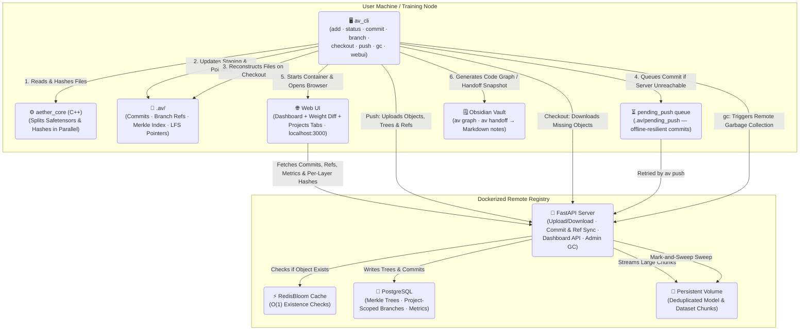

# 🌌 Aether-Vault

> **High-performance, Git-like version control and registry for Machine Learning models, datasets, and code — in a single atomic commit.**

Aether-Vault solves the core challenge of ML reproducibility by versioning the **"Holy Trinity"** together:

| | Type | Examples |
|---|---|---|
| 1 | **Code** | Python training scripts, pipelines, validators |
| 2 | **Model Weights** | `.pt`, `.safetensors`, `.onnx` |
| 3 | **Datasets** | `.csv`, `.parquet`, `.h5`, `.arrow` |

---

## ⚡ Architecture

Aether-Vault bridges Python and C++ for maximum throughput:

- **C++ Performance Core (`aether_core`)** — Reads multi-gigabyte files in 8MB chunks, hashing them in parallel with a C++11 ThreadPool. Layer-aware `.safetensors` parsing enables per-layer deduplication.
- **Python CLI (`av_cli`)** — Familiar Git-like interface (`av add`, `av commit`, `av checkout`). Files above the LFS threshold are automatically replaced by lightweight pointer files.
- **FastAPI CAS Server (`av_server`)** — Dockerized Content-Addressable Storage backend, backed by PostgreSQL (Merkle Tree DAG) and RedisBloom (O(1) existence checks).
- **Next.js Web UI (`webui`)** — Browser-based dashboard for visualizing the commit graph, branches, and ML metrics, plus a "Weight Diff" tab for visually comparing per-layer checkpoint changes. Launched with `av webui`.

### System Diagram



> The "Local" box represents **any number** of independent `av init` repos on the same (or
> different) machines — they all default to sharing the one Dockerized registry shown here.
> Each repo gets its own `project_id` (see Phase 14), so the registry's commits/branches stay
> attributable per project even though the object store is intentionally deduplicated across
> all of them. Use `av config --remote-url` to point a repo at a different registry instead.

---

## 🛠️ Installation

### Prerequisites

| Requirement | Notes |
|---|---|
| **Docker & Docker Compose** | Required for the registry and Web UI |
| **Python ≥ 3.10** | For the `av` CLI |
| **C++ Build Tools** | Visual Studio Build Tools (Windows) · GCC/Clang (Linux/macOS) |
| **CMake** | For building the C++ hashing core |

### 1. Start the Registry (Docker)

```bash
git clone https://github.com/leon1706/aether-vault
cd aether-vault

# Start the full backend stack (API server, PostgreSQL, Redis)
docker compose up --build -d
```

The FastAPI server will be available at `http://localhost:8000`.  
Interactive API docs: `http://localhost:8000/docs`

### 2. Install the CLI

```bash
# Compiles the C++ core and installs the `av` command
pip install -e .
```

---

## 📖 CLI Reference

### `av init`
Initialize an Aether-Vault repository in the current directory.
```bash
av init
```

### `av config`
Set the LFS size threshold (in MB), the remote registry URL, and/or this repo's display name on a shared registry. Run with no arguments to print the current configuration (including the auto-generated `project_id`).
```bash
av config 100                              # 100 MB LFS threshold
av config --remote-url http://host:8000    # point this repo at a different registry
av config --name "my-llm-finetune"         # rename this repo's project (display only)
av config                                  # print current LFS threshold / remote URL / project
```

### `av add`
Stage files or entire directories for the next commit. Supports `.safetensors` layer-splitting automatically.
```bash
av add src/train.py data/features.parquet weights/epoch_50.safetensors

# Stage everything recursively
av add .
```

### `av status`
Show staged, modified, deleted, and untracked files.
```bash
av status
```

### `av commit`
Record a snapshot of the staged files into the local DAG and push to the remote registry. Attach arbitrary ML metrics and labels directly to the commit.
```bash
av commit -m "LSTM tuned on Q2 data" \
  --tag production \
  --metric sharpe=2.45 \
  --metric drawdown=0.12 \
  --metric val_loss=0.034
```
`av add` only re-stages a file when its content hash actually changed, so running `av add .` again right after a commit with no new changes correctly reports `Nothing to commit` instead of creating an empty duplicate commit.

If the remote registry is unreachable at commit time, the commit is still saved locally and queued in `.av/pending_push` — it will not show up in the Web UI dashboard until it's synced (see `av push`).

### `av push`
Retry syncing locally committed commits that couldn't reach the remote registry (e.g. the server/Docker stack wasn't running yet). Every `av commit` also auto-retries the queue when the server is back up.
```bash
av push
```

### `av branch` / `av checkout`
Create and switch between experiment branches. Missing model weights are automatically downloaded from the remote.
```bash
av branch feature-transformers
av checkout feature-transformers
av checkout main
```

### `av list-meta`
Display all registered tag labels and metric keys across the repository history.
```bash
av list-meta
```

### `av graph`
Parse the repository's Python AST and generate an Obsidian-compatible Markdown vault of the full function call graph and dependency map.
```bash
av graph            # Generate and attempt to launch Obsidian
av graph --update   # Silently regenerate after code changes
```

### `av webui` 
Launch the browser-based Web UI dashboard. Checks that Docker is running, starts the `aether-vault-webui` container, and opens `http://localhost:3000` automatically. If the container is already running and healthy, this skips straight to opening the browser instead of re-running `docker compose` every time.
```bash
av webui
# 1. Checks Docker is running
# 2. If already running & healthy, opens the browser immediately
# 3. Otherwise starts the Next.js Web UI container and waits for it to be ready
# 4. Opens http://localhost:3000 in your browser

av webui --rebuild   # force a fresh image build after changing webui/ source
```

**Dashboard panels:**
- **Experiment Graph** — SVG commit DAG with coloured branch lanes
- **Commit Log** — Full history with authors, timestamps, tags & metrics pills
- **Branch List** — All refs with tip commit details
- **ML Metrics Chart** — Line chart plotting all numeric metrics over commits
- **Stats Bar** — Live counts for commits, branches, CAS objects, and storage size
- **Weight Diff** — drag two checkpoints into comparison slots for a per-layer heatmap + drift chart (see Phase 13)
- **Projects** — every project that has pushed to this registry, with an "Open" button to scope the whole dashboard to just that one (see Phase 14)

### `av gc`
Trigger a mark-and-sweep garbage collection on the remote server to purge orphaned storage shards and rebuild the Redis Bloom Filter.
```bash
av gc
```

### `av handoff`  — Agent Context Export
While most ML tracking tools (MLflow, DVC, W&B) record experiments for humans to read, `av handoff` generates a structured, machine-readable context snapshot for **AI agents** picking up the work — branch, commit, tags, metrics, model/dataset lineage, and an optional freeform instruction note, in an open `.avh` (Aether Vault Handoff) JSON format. Every invocation also writes a human-readable Markdown note into `Aether-Handoff/`, indexed chronologically by a central hub file.

```bash
av handoff                              # write handoff.avh + a new Aether-Handoff/ snapshot
av handoff --update                     # refresh handoff.avh with the latest repo state
av handoff --note "fine-tune lr=0.001"  # attach freeform instructions for the next agent
av handoff --instructions-file task.md  # read instructions from a file instead
av handoff --diff-weights               # add a per-layer weight-diff vs. the parent commit
av handoff --since <commit-or-tag>      # diff against an arbitrary earlier commit/tag
av handoff init                         # create the Aether-Handoff/ folder structure only
av handoff log                          # list all snapshots taken so far
av handoff show <snapshot-id>           # print a previous snapshot's Markdown note
```

```
Aether-Handoff/
├── Handoff-Hub.md                # chronological index of every snapshot
├── snapshots/
│   ├── 2026-06-23T120000Z_abc123d.avh
│   └── 2026-06-23T120000Z_abc123d.md
└── latest.avh                    # always-overwritten copy of the most recent snapshot
```

`--diff-weights` reuses the per-layer safetensors hashes already produced during `av add` (see Phase 5 below) to report exactly which model layers changed since the parent commit — a focused slice of the "Weight Diffing" roadmap item.

### Framework Plugins — PyTorch Lightning & HuggingFace Transformers
Optional callbacks that auto-stage and auto-commit checkpoints as they're saved during training, so versioning never depends on remembering to run `av add`/`av commit` by hand. Install with the relevant extra:
```bash
pip install aether-vault[lightning]      # PyTorch Lightning
pip install aether-vault[transformers]   # HuggingFace Transformers
```

```python
# PyTorch Lightning
from av_plugins.lightning import AetherVaultCallback

trainer = Trainer(callbacks=[AetherVaultCallback(tag="experiment-1")])
```

```python
# HuggingFace Transformers
from av_plugins.transformers import AetherVaultTrainerCallback

trainer = Trainer(..., callbacks=[AetherVaultTrainerCallback(tag="experiment-1")])
```

Each callback commits with the current step/epoch as the message and any numeric metrics (loss, eval scores, ...) attached via `--metric`, and flushes a final `av push` at the end of training. The training script must be run from inside (or below) an `av init`-ed repository.

---

## 🗺️ Build Phases & Development Walkthrough

Aether-Vault was built in eight distinct phases:

### Phase 1 — High-Performance C++ Hashing Core
- **Custom SHA-256 Engine**: Thread-safe cryptographic hashing.
- **Parallel Tree-Hashing**: Splits files into 8MB chunks, hashes concurrently across all CPU cores.

### Phase 2 — CLI Framework & LFS Pointers
- **Staging Index Manager**: Manages the local `.av/index`.
- **LFS-Style Pointers**: Detects large files, copies them to object storage, and replaces them with `.av-pointer` files.

### Phase 3 — Content-Addressable Storage (CAS)
- **Robust CAS Manager**: Deduplicates by SHA-256 hash with atomic writes.
- **FastAPI Endpoints**: High-concurrency streaming uploads, downloads, and branch management.

### Phase 4 — Database & Cache Integration
- **PostgreSQL Schema**: Structured SQL representation of the commit DAG, branches, and metadata.
- **Redis Integration**: `redis-stack-server` for high-performance in-memory caching.

### Phase 5 — Safetensors & Merkle Trees
- **C++ Layer-Splitting**: Parses `.safetensors` JSON headers to independently hash individual model layers — saving up to **99% storage** when only classifier heads change.
- **Merkle Tree DAG**: PostgreSQL tables modelling the full directory hierarchy as a content-addressed tree.

### Phase 6 — Scalability & Garbage Collection
- **RedisBloom Filter**: O(1) hash existence checks, dramatically reducing Postgres load.
- **Mark-and-Sweep GC**: Traverses all Merkle Trees to purge orphaned data shards.

### Phase 7 — ML Experiment Tracking
- **Dynamic Metadata**: `--tag` and `--metric` flags bind arbitrary tracking data (Sharpe ratio, loss, accuracy, drawdown) directly into atomic commits.

### Phase 8 — Native Codebase Visualization
- **AST Parsing & Graph Generation**: `av graph` dynamically maps function calls, external library dependencies, and docstrings into an Obsidian-compatible Markdown vault.

### Phase 9 — Web UI Dashboard 
- **Next.js Frontend**: Dark glassmorphism dashboard at `http://localhost:3000`.
- **SVG Commit Graph**: DAG visualizer with coloured branch lanes and bezier edges.
- **Recharts Metrics**: Line charts plotting all numeric ML metrics over time.
- **Live API**: `GET /api/commits`, `GET /api/dashboard/summary` — auto-refreshes every 15 seconds.
- **Docker Service**: `aether-vault-webui` added to `docker-compose.yml`, launched via `av webui`.

### Phase 10 — Commit Integrity & Offline Resilience
- **Change-Aware Staging**: `av add` only re-stages a file when its content hash actually changed, so re-running `av add .` after a commit no longer produces an empty duplicate commit.
- **Pending-Push Queue**: Commits made while the remote registry is unreachable are saved locally and queued in `.av/pending_push` instead of silently failing to reach the Web UI dashboard.
- **`av push`**: Retries syncing queued commits to the remote registry on demand; every `av commit` also auto-retries the queue when the server is back up.

### Phase 11 — Agent Context Handoff
- **`.avh` Open Format**: A JSON snapshot of branch, commit, tags, metrics, model/dataset lineage, and freeform agent instructions — designed to be read by another AI agent picking up the work.
- **`av handoff`**: Generates/updates `handoff.avh` plus a human-readable Markdown note logged chronologically into `Aether-Handoff/`, indexed by a central `Handoff-Hub.md`.
- **Per-Layer Weight Diffing**: `av handoff --diff-weights` reuses the Phase 5 safetensors layer hashes to report exactly which model layers changed since the parent commit, without re-hashing the file.
- **`av handoff log` / `show`**: Browse and inspect the chronological snapshot history directly from the terminal.

### Phase 12 — Hardening & Robustness
- **Race-Free Garbage Collection**: `av gc` now honours a grace period — object shards (and their DB rows) created during the upload→commit window are never reaped, so a GC running concurrently with a push can no longer delete a live object whose commit is still in flight.
- **Batched Merkle-Tree Resolution**: Commit-tree reconstruction (`GET /api/commits/{hash}`) and the GC mark phase no longer issue one DB query per tree node (N+1). Tree resolution runs level-by-level with a single batched query per depth (dedup-safe via path prefixes); GC loads all tree rows once and walks them in memory. Bulk deletes are chunked to stay within driver bind-parameter limits.
- **Unified File-Metadata Source**: Size/mtime change-detection is handled exclusively through Python's `os.stat` (a single Unix-epoch source). This removes a cross-language hazard where the C++ core's `std::filesystem::last_write_time` (implementation-defined epoch) and Python's `st_mtime_ns` could disagree and make unchanged files appear "modified"; the C++ core is now used purely for hashing.
- **Crash-Safe Local Writes**: Commit objects, refs/HEAD, the pending-push queue, the metadata registry and config are written atomically (temp file + `fsync` + `os.replace`), so an interrupted `av commit` can never leave a ref pointing at a half-written or missing commit.
- **Idempotent Registry API**: Concurrent uploads of the same object hash, or concurrent pushes of the same commit, now resolve to a clean `409` instead of a `500` (`IntegrityError` is caught and treated as success). `push_commit` also enforces payload limits (tree size, metric/tag counts, message length) to reject abusive input on the unauthenticated endpoint.
- **Shallow / Out-of-Order Pushes**: A commit whose parent isn't on the server yet (offline pending-push, partial clone) no longer triggers a foreign-key `500`; DAG integrity is anchored by content-addressed hashes.
- **Single-Request Commit Loading**: The Web UI fetches recent commits in one `/api/commits` call (newest-first, with parent links) instead of walking the parent chain one request at a time, and runs all dashboard fetches in parallel.
- **Smaller polish**: pointer detection reads only the fixed magic prefix in binary mode (safe on multi-GB inputs); the parallel hasher only spins up a thread pool when there is enough work to amortize it; `VaultClient` is now closable / a context manager; deprecated `datetime.utcnow()` and `@app.on_event` replaced with timezone-correct helpers and a FastAPI `lifespan`.

### Phase 13 — Visual Weight Diffing
- **"Weight Diff" Web UI tab**: a sidebar tab (lifted into the existing single-page dashboard, no new route) lets you drag two checkpoints from a list into two comparison slots and see a colored per-layer heatmap, summary stats (changed/total/% changed), and a Recharts bar chart of which layers changed across model depth. Entirely client-side — it reuses the per-layer hashes `GET /api/commits/{hash}` already returns, so no new server endpoints were needed.
- **Fixed while building it — commits referencing layer-split `.safetensors` artifacts could never sync to the server.** Two compounding bugs: (1) `av commit`/`av push` uploaded a commit *before* its objects, and the server's tree rows had a hard foreign key to the objects table, so the insert always failed; the offline-queue retry path additionally never uploaded objects at all; (2) the server's generic `except IntegrityError` mapped *any* integrity violation to a "commit already exists" 409 — which the client (by design) treats as idempotent success — so the failure was completely silent: `av push` reported success while the commit and ref never reached the database. Fixed by uploading objects before the commit (in both the live and queued-retry paths), dropping the now-provably-wrong foreign key (a layer-split file's whole-file blob is never uploaded by design), and having the server re-check by hash before deciding a 409 is genuine.
- **Fixed:** `av add` computed per-layer safetensors hashes but never actually persisted them to `.av/index` (an internal `auto_save` wrote the index before the layers were attached to the in-memory entry) — so every `av commit` silently shipped an empty `layers: []`, degrading `av handoff --diff-weights` (and now the Web UI) into a whole-file comparison for every checkpoint, undetected until this feature exercised it end-to-end.
- **Fixed:** `atomic_write_text`'s temp filename (PID + full UUID4 hex) could push a commit's path past Windows' 260-character `MAX_PATH` limit, making the write — and the whole commit — fail outright on deeply nested working directories.
- See [`Probleme.md`](Probleme.md) for full details, severity ratings, and a couple of smaller items left open.

### Phase 14 — Per-Project Registry Separation + Real-World Fixes
- **Per-project identity on the shared registry**: every `av init` repo previously pointed at the exact same `http://localhost:8000` with no way to tell commits from different local folders apart — so a Web UI started from one repo would show commits pushed by an unrelated one. `av init` now generates a stable `project_id` (UUID) + `project_name` (folder name, renameable via `av config --name`), included in the hashed commit payload and namespacing every branch ref as `"<project_id>/<branch>"` (so two projects can each have a `main` without colliding). Repos initialized before this change are backfilled automatically and stably on first use.
- **`av config --remote-url`**: point a repo at a different registry entirely; `av config` with no arguments now prints the current LFS threshold, remote URL, and project identity.
- **New "Projects" Web UI tab**: lists every project that has pushed to the registry (commit count, last push), with an "Open" button that scopes the Dashboard, Branch List, and Weight Diff tab to just that project (persisted across reloads); a badge in the top bar shows the active filter with a one-click clear.
- **`GET /api/projects`** (new) and an optional `?project_id=` filter on `GET /api/commits`/`GET /api/refs`. Object storage stays deduplicated *across* projects on purpose — only commit/ref metadata is scoped.
- **Fixed real usability bugs reported from a separate test install**: the Layer Drift chart's tooltip text was unreadable (black on dark background) and its X-axis label was clipped with no Y-axis explanation; `av webui` rebuilt/re-evaluated the Docker image on every single invocation even when nothing changed (now skips straight to the browser if already healthy, ~15s instead of 2+ minutes; `--rebuild` forces a fresh build when needed).
- See [`Probleme.md`](Probleme.md) for the full edge-case pass (legacy configs, project-name collisions, branch-name collisions across projects, GC/stats behavior with multiple projects) and what was deliberately left unscoped.

### Phase 15 — Framework Plugins (PyTorch Lightning & HuggingFace Transformers)
- **`av_plugins` package**: `AetherVaultCallback` (Lightning) and `AetherVaultTrainerCallback` (Transformers) hook into each framework's native checkpoint-save callback and drive the existing `av` CLI in-process (`cli.main(..., standalone_mode=False)`) rather than duplicating add/commit/push logic — every existing guarantee (LFS pointers, safetensors layer splitting, offline pending-push queueing, per-project ref namespacing) is reused as-is.
- Both frameworks are optional extras (`pip install aether-vault[lightning]` / `[transformers]`) — the core package stays framework-agnostic.
- Plain PyTorch/TensorFlow were deliberately left out of scope: neither exposes a native checkpoint-save hook comparable to Lightning's `Callback` or HF's `TrainerCallback`, so supporting them would mean a manual "call this after `torch.save()`" API — a different, lower-value feature.

> See [`Probleme.md`](Probleme.md) for the full audit log of correctness, performance and security findings (resolved and still-open).

---

## 🚀 Open Source Roadmap

| Status | Feature |
|---|---|
| ✅ | **Web UI Dashboard** — Browser interface for commit graph, branches & ML metrics (`av webui`) |
| ✅ | **Offline-Resilient Commits** — Change-aware staging + `.av/pending_push` queue + `av push`, so no commit is lost or dashboard-invisible due to a down registry |
| ✅ | **Agent Context Handoff** — Open `.avh` format + `av handoff` snapshots for AI-agent-to-agent ML pipeline handoff, including per-layer weight-diffing |
| ✅ | **Weight Diffing (Visual)** — A "Weight Diff" tab in the Web UI: drag two checkpoints from a list into comparison slots to get a colored layer heatmap, summary stats, and a per-layer depth chart of what changed |
| ✅ | **Framework Plugins** — Native callbacks for PyTorch Lightning & HuggingFace Transformers |
| 🔲 | **S3 Support** — Amazon S3 as an alternative backend storage adapter |

---

## 🏢 Enterprise Roadmap (Commercial Variant)

For enterprise research teams and institutional algorithmic trading firms:

| Feature | Description |
|---|---|
| **RBAC** | Fine-grained read/write permissions for teams, users, and repositories |
| **SSO** | OAuth2, SAML, and Active Directory integration |
| **Audit Logging** | Immutable, cryptographically signed logs for regulatory compliance |
| **High Availability** | Multi-node horizontal scaling for the FastAPI registry and distributed Postgres/Redis |
| **Cloud Connectors** | AWS IAM, GCP Cloud Storage, Azure Blob Storage with automated cold-storage tiering |

---

## 🤝 Contributing

1. Fork the repository
2. Create a feature branch: `git checkout -b feature/my-feature`
3. Commit your changes following the phase structure above
4. Open a Pull Request

---

<div align="center">
  <sub>Built with ⚙️ C++11 · 🐍 Python · 🚀 FastAPI · 🌐 Next.js · 🐘 PostgreSQL · ⚡ Redis</sub>
</div>
