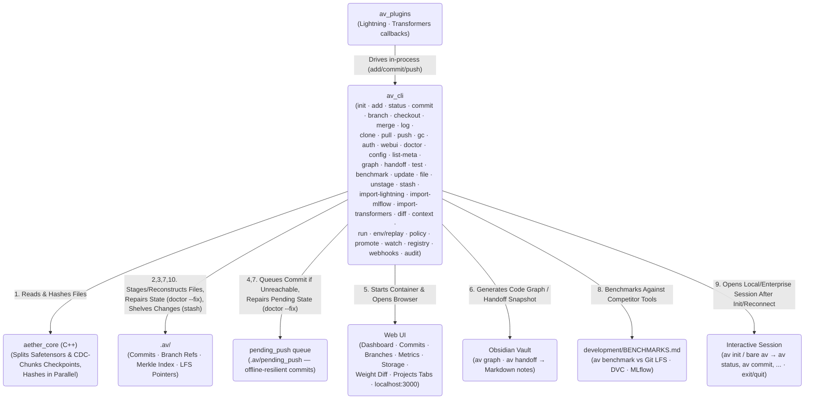
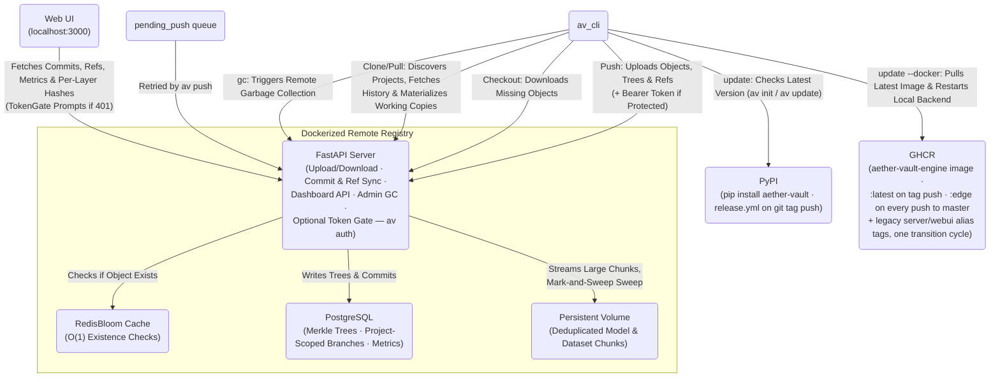

<p align="center"></p>

<h1 align="center">Aether-Vault</h1>

<p align="center">
  <strong>The version-control layer built for continuous & autonomous AI training.</strong>
</p>

<p align="center">
  <sub>C++17 · pybind11 · Click · FastAPI · Next.js · PostgreSQL · RedisBloom · GitHub Actions · Alembic</sub>
</p>

<p align="center">
  
  
  
  
  
</p>

Aether-Vault is not git for big files. It is version control purpose-built for machine-learning work: **code + weights + datasets** in one atomic commit that checks out identically on any machine. Throughput comes from a **C++17 core** that hashes multi-gigabyte files in parallel and splits safetensors into per-layer shards. Storage is **deduplicated by construction** — identical layers across fine-tune epochs and identical chunks across saves store once, locally and on the registry alike. The **FastAPI registry** serves any number of independent projects from a single Dockerized engine, backed by **PostgreSQL** Merkle trees and **RedisBloom** O(1) existence checks. Agents are first-class operators: stable **JSON envelopes**, a single-writer **Python SDK**, resumable **event streams**, and **.avh v2 context memory** so the next agent inherits intent without API calls. Start at [docs/for-agents.md](docs/for-agents.md).

## Known Limitations

- **Benchmark #5 (cold clone)** — `av clone` shipped in v1.1.1 but the measured row in the comparison table is still "capture pending". Lands on the next `av benchmark --markdown` run against a live registry.
- **Perf #4 (no-op status/add)** — ~15x slower than Git LFS at interpreter startup. Open finding, tracked in `development/BENCHMARKS.md`.
- **Legacy image aliases** — the historical `aether-vault-server`/`-webui` images are published as aliases of the engine image for one transition cycle; removed next release.

## Table of Contents

- [Download](#download)
- [Getting Started](#getting-started)
- [Requirements](#requirements)
- [Architecture](#architecture)
- [Module Documentation](#module-documentation)
- [Development Documentation](#development-documentation)
- [Open Source Files](#open-source-files)
- [Framework Plugins](#framework-plugins)
- [Benchmark Comparison](#benchmark-comparison)
- [Test Suite](#test-suite)
- [For Agents (SDK, JSON, events, .avh)](#for-agents-sdk-json-events-avh)
- [CLI Reference](#cli-reference)
  - [`av init`](#av-init)
  - [`av auth`](#av-auth)
  - [`av update`](#av-update)
  - [`av help`](#av-help)
  - [`av status`](#av-status)
  - [`av config`](#av-config)
  - [`av add`](#av-add)
  - [`av file`](#av-file)
  - [`av unstage`](#av-unstage)
  - [`av commit`](#av-commit)
  - [`av push`](#av-push)
  - [`av clone`](#av-clone)
  - [`av pull`](#av-pull)
  - [`av log`](#av-log)
  - [`av branch` / `av checkout`](#av-branch--av-checkout)
  - [`av merge`](#av-merge)
  - [`av diff`](#av-diff)
  - [`av run`](#av-run)
  - [`av context`](#av-context)
  - [`av policy` / `av promote`](#av-policy--av-promote)
  - [`av env`](#av-env)
  - [`av watch`](#av-watch)
  - [`av registry`](#av-registry)
  - [`av audit`](#av-audit)
  - [`av stash`](#av-stash)
  - [`av webui`](#av-webui)
  - [`av list-meta`](#av-list-meta)
  - [`av graph`](#av-graph)
  - [`av handoff`](#av-handoff)
  - [`av gc`](#av-gc)
  - [`av doctor`](#av-doctor)
  - [`av test`](#av-test)
  - [`av benchmark`](#av-benchmark)
- [Release Process](#release-process)
- [Roadmap](#roadmap)
- [Enterprise Roadmap](#enterprise-roadmap-commercial-variant)

---

## Download

```bash
pip install aether-vault                # CLI + registry server + plugins
docker pull ghcr.io/leon1706/aether-vault-engine:latest   # the engine image (registry + dashboard)
```

## Getting Started

```bash
pip install aether-vault
av init                                  # pick Local or Enterprise; opens the interactive shell
av add train.py model.safetensors
av commit -m "first commit" \
  --metric val_loss=0.034 --metric sharpe=2.45
av push
exit
```

Every command also works as a one-off from outside the shell — `av status` in a regular terminal behaves identically. The shell entered by `av init` (or bare `av` in an initialized repo) is a convenience layer, not a different mode of operation.

## Requirements

| Requirement | Notes |
|---|---|
| **Python ≥ 3.10** | For the `av` CLI |
| **Docker & Docker Compose** | Only needed for Local mode's registry/Web UI — `av init` detects and walks you through it |
| **C++ Build Tools + CMake** | Only if `pip` falls back to building from source (no prebuilt wheel for your platform/Python version) — most users never hit this |

For development installs (editable mode):

```bash
git clone https://github.com/leon1706/aether-vault
cd aether-vault
pip install -e .[dev]
```

## Architecture

Split into two focused diagrams — what happens on your machine, and how it talks to the network:

#### Local CLI Architecture



#### Sync, Remote Registry & Release Pipeline



> The "Local CLI Architecture" diagram represents **any number** of independent `av init` repos on the same (or different) machines — they all default to sharing the one Dockerized registry. Each repo gets its own `project_id` (see [Phase 14](development/CHANGELOG.md#phase-14--per-project-registry-separation--real-world-fixes)), so the registry's commits/branches stay attributable per project even though the object store is intentionally deduplicated across all of them. Use `av config --remote-url` to point a repo at a different registry instead.

For the full subsystem contracts (staging, commit, sync, merge, restore, GC, auth, transport, webui, plugins, release), see [`development/architecture.md`](development/architecture.md).

---

## Module Documentation

Every folder documents itself with its own `README.md` — contents, conventions, and pointers deeper into the project:

| Module | What it owns | Docs |
|---|---|---|
| [`python/av_cli/`](python/av_cli/README.md) | The `av` CLI: commands, local DAG/CAS, sync, merge, log, chunking, signing, doctor | [package overview](python/README.md) |
| [`python/av_server/`](python/av_server/README.md) | FastAPI CAS registry (PostgreSQL + RedisBloom) | [package overview](python/README.md) |
| [`python/av_plugins/`](python/av_plugins/README.md) | Lightning / Transformers / MLflow auto-commit callbacks | [package overview](python/README.md) |
| [`src/`](src/README.md) | C++17 performance core (`aether_core`): hashing, safetensors split, CDC chunker | — |
| [`tests/`](tests/README.md) | ~590-test suite across 25+ files (CLI, core, server, plugins) | — |
| [`benchmarks/`](benchmarks/README.md) | Nine cross-tool benchmarks vs Git LFS / DVC / MLflow | — |
| [`webui/`](webui/README.md) | Next.js dashboard incl. Weight Diff + Playwright E2E | — |

---

## Development Documentation

| Document | What it is |
|---|---|
| [`architecture.md`](development/architecture.md) | What the system **is**: one contract section per subsystem, system/tech-stack diagrams, testing map |
| [`infrastructure.md`](development/infrastructure.md) | How to **run** it: Docker compose stack, env vars, Protected mode, migrations, releases, SQL |
| [`CHANGELOG.md`](development/CHANGELOG.md) | Full build-phase history: what was built, when, and why |
| [`Probleme.md`](development/Probleme.md) | Audit log of correctness, performance and security findings with severity ratings |
| [`VERSIONING.md`](VERSIONING.md) | SemVer per compatibility surface, deprecation policy, release runbook |
| [`SECURITY.md`](SECURITY.md) | Threat model, signing trust chain, reporting process |

---

## Open Source Files

| File | Purpose |
|---|---|
| [`CONTRIBUTING.md`](CONTRIBUTING.md) | Dev setup, manual-debugging-first workflow, code conventions, PR checklist |
| [`CODE_OF_CONDUCT.md`](CODE_OF_CONDUCT.md) | Community standards |
| [`LICENSE`](LICENSE) | PolyForm Noncommercial License 1.0.0 |
| [`SECURITY.md`](SECURITY.md) | Threat model, signing trust chain, reporting process |
| [`VERSIONING.md`](VERSIONING.md) | SemVer per compatibility surface, deprecation policy, release runbook |
| [`docs/for-agents.md`](docs/for-agents.md) | Agent-facing contracts: JSON envelopes, SDK, events, .avh context memory |

---

## Framework Plugins

Native callbacks for PyTorch Lightning and HuggingFace Transformers that auto-commit checkpoints during training:

```bash
pip install aether-vault[lightning]      # PyTorch Lightning
pip install aether-vault[transformers]   # HuggingFace Transformers
```

```python
# PyTorch Lightning
from av_plugins.lightning import AetherVaultCallback
trainer = Trainer(callbacks=[AetherVaultCallback(tag="experiment-1", dataset_paths="data/train.parquet")])

# HuggingFace Transformers
from av_plugins.transformers import AetherVaultTrainerCallback
trainer = Trainer(..., callbacks=[AetherVaultTrainerCallback(tag="experiment-1", dataset_paths="data/train.csv")])
```

Each callback commits with the current step/epoch as the message and numeric metrics attached via `--metric`, flushing a final `av push` at the end of training. `dataset_paths` is staged once at training start, tagged `dataset` for lineage tracking. Re-importing an unchanged checkpoint is a no-op; scoped commits leave your staged files untouched.

### Importing existing artifacts

```bash
av import-lightning path/to/epoch=12.ckpt --tag backfill
av import-transformers path/to/checkpoint-1000 --tag backfill
av import-mlflow <run_id> --tag backfill   # requires: pip install aether-vault[mlflow]
```

---

## Benchmark Comparison

`av benchmark` runs 9 reproducible benchmarks against **Git LFS**, **DVC**, and **MLflow**. Every number is measured from a real subprocess or HTTP call — tools that cannot run a benchmark are shown as `not installed`/N/A, never guessed.

| # | Benchmark | vs. best competitor | Notes |
|---|---|---|---|
| 1 | Hashing Throughput at Scale | ~2–3x faster than Git LFS, up to 17x faster than DVC | fastest at every size tested (10–200 MB) |
| 2 | Safetensors Layer-Dedup | **63% smaller** | 47 MB vs. 126 MB after 6 fine-tune commits |
| 3 | Commit + Push Latency | push ~70% faster · commit ~6x slower *(by design, vs. DVC)* | av uploads during commit; DVC defers to a separate push |
| 4 | No-Op `status`/`add` | ~15x slower than Git LFS | open finding — interpreter/import startup cost |
| 5 | Cold Clone / First Pull | shipped — capture pending | `av clone` exists as of v1.1.1; measured row lands next run |
| 6 | Partial-Checkpoint Fetch | unique capability | only tool that can fetch a single layer instead of the whole file |
| 7 | Storage Footprint Curve | **63% smaller**, gap widens every commit | same dedup advantage as #2, sustained over time |
| 8 | Concurrent Push Throughput | Aether-only | no competitor has a comparable concurrent-server primitive |
| 9 | Garbage Collection Throughput | Aether-only | no competitor has a comparable server-side GC primitive |

For full methodology, every raw number, and the rating legend, see [`development/BENCHMARKS.md`](development/BENCHMARKS.md).

---

## Test Suite

The full suite (`av test` or `pytest tests/ -q`) runs ~590 tests across 25+ files covering the CLI, C++ bindings, live registry server, plugins, and webui logic. A plain `av test` (no `-k`) keeps this README's `tests-N/M passing` badge in sync with the real result — it parses pytest's summary line and rewrites the badge (and turns it red if anything failed) so the count is never manually edited. A `-k`-scoped run never touches it.

```bash
av test                  # full suite
av test -k checkout      # scope to one feature
av test --cov            # with coverage
av test --webui          # + webui/ Vitest suite
av test --speed          # + synthetic speed benchmark
av test --speed --webui  # + webui/ bench suite too
```

---

## For Agents (SDK, JSON, events, .avh)

Aether-Vault is built so autonomous agents are first-class operators. Four stable contracts:

1. **JSON envelopes + exit codes** — `av --output json <cmd>` emits
   `{"ok": true, "data": {…}, "error": null, "meta": {"command": "…"}}`;
   failures set `ok:false` with `error.code` in {not_a_repo, nothing_to_commit,
   auth_failed, unreachable_queued, merge_conflict, validation, policy_denied} and exit
   codes 10–16.
2. **Python SDK** — `from av_sdk import Repo`: add/commit/push/log/diff/runs/context with
   typed `SDKError`; drives the same single-writer path as the CLI.
3. **Event stream + webhooks** — resumable ordered feed:
   `GET /api/events?since=<id>&kinds=commit&wait=25`; signed webhook deliveries
   (`X-AV-Signature: hex(hmac-sha256(secret, body))`), managed via `av webhooks …`.
4. **.avh v2 context memory** — lineage + semantic summary + replay recipe +
   append-only agent notes; the next agent inherits intent and trend without any API calls.

Full details, examples, and the guardrails you should arm: [docs/for-agents.md](docs/for-agents.md).

---

## CLI Reference

#### `av init`

Initialize an Aether-Vault repository. Drops you into an interactive session — type commands (still prefixed with `av`) without re-invoking the process; `exit`/`quit`/Ctrl+D leaves. Running bare `av` in an already-initialized repo reconnects without needing `init` again.

Interactive init asks **Anonymous** (no token) or **Protected** (shared-secret access token — see `av auth`). Protected has a second choice: generate a new token or enter an existing one. An **Enterprise** mode exists as a seam for the commercial variant but is only reachable via `--mode enterprise`.

```bash
av init                                   # interactive: asks Anonymous/Protected, then opens the session
av init --mode local --yes --no-repl      # non-interactive: for scripts/CI, defaults to Anonymous
av init --mode local --protected          # non-interactive Protected + generate a new token
av init --mode local --token <token>      # non-interactive Protected + join an existing registry
av                                        # bare, in an initialized repo: reconnect + open the session
```

#### `av auth`

Manage the optional access-token gate ("Protected" mode). Unset means every route is open ("Anonymous"). Setting any token switches to "Protected" — every route, reads included, requires a valid Bearer token (except `GET /api/health`).

Two credential sources coexist: the owner's shared secret (`AV_API_TOKEN`) and optional **per-user tokens** (`AV_AUTH_USERS`, a `{username: token}` map). A request authenticates against either; per-user teammates who push with the default `anonymous` author get their username stamped as the commit author automatically.

```bash
av auth set-token              # generate a random token, write it, restart the server
av auth set-token <token>      # set a specific token (e.g. one a teammate already uses)
av auth clear                  # back to Anonymous
av auth status                 # report whether a token is configured (masked)
av auth add-user <name>        # grant NAME its own token (generated + printed once)
av auth add-user <name> <tok>  # ...or with a specific token
av auth list-users             # masked list of per-user tokens
av auth remove-user <name>     # revoke NAME's personal token
```

Per-user flow: run `av auth add-user alice`, share Alice her token over a trusted channel; she puts it in her own repo via `av auth set-token <her-token>` and pushes as usual — her commits show up attributed to `alice` without any shared secret leaving your machine. Per-user tokens work everywhere the shared secret does, including the webui's token prompt.

If any CLI command hits a Protected registry with no/wrong token, it prompts interactively (saves it, then asks you to re-run) rather than failing with a generic error — or, non-interactively, prints exactly which command to run.

#### `av update`

Check PyPI for a newer release and optionally install it. `av init` also prints a one-line banner if you're behind, but never checks on routine commands — only here and at init time.

```bash
av update                       # check, then prompt to upgrade if one's available
av update --check               # report only, no prompt
av update --list-versions       # list every published version, newest first
av update --enable-auto-update  # opt in to silent auto-upgrade (off by default)
av update --disable-auto-update
```

With `--enable-auto-update` on, every `av` command checks once more for an update at exit and silently `pip install --upgrade`s if one's available. Off by default; explicit `av update` always works regardless.

```bash
av update --docker          # pull the latest published image; prompts before restarting
av update --docker --yes    # skip the restart confirmation
```

Only does real work from a real `pip install aether-vault` (against the GHCR-published `:latest` image); from a source checkout it tells you to `git pull` + `av webui --rebuild` instead.

#### `av help`

Every command supports `--help`, including the top-level `av` group itself.

```bash
av --help            # list every command
av commit --help     # options for a specific command
```

#### `av status`

Show staged, modified, deleted, and untracked files.

```bash
av status
```

#### `av config`

Set the LFS size threshold (in MB), the remote registry URL, and/or this repo's display name on a shared registry. Run with no arguments to print the current configuration (including the auto-generated `project_id`).

```bash
av config 100                              # 100 MB LFS threshold
av config --remote-url http://host:8000    # point this repo at a different registry
av config --name "my-llm-finetune"         # rename this repo's project (display only)
av config                                  # print current config
```

#### `av add`

Stage files or entire directories for the next commit. Supports `.safetensors` layer-splitting automatically.

```bash
av add src/train.py data/features.parquet weights/epoch_50.safetensors
av add .                                   # stage everything recursively
```

`av add .` skips anything matching a pattern in `.avignore` (gitignore-style, one glob per line) — see `av file --avignore` below to generate one.

#### `av file`

Generate scaffold files in the repo root.

```bash
av file --avignore       # writes a .avignore template
av file --avattributes   # writes a .avattributes template
```

Refuses to overwrite an existing file. `.avattributes` is gitattributes-style: glob patterns with staging directives, last matching line wins. Supported flags: `no-chunk` (store opaque checkpoints as whole-file blobs instead of CDC chunks) and `no-layer-split` (never split safetensors into per-layer shards).

#### `av unstage`

Undo `av add` — without touching the working-tree files. Reverts each staged entry back to its last-committed state.

```bash
av unstage              # unstage everything currently staged
av unstage file1 file2  # unstage just these paths
```

#### `av commit`

Record a snapshot of the staged files into the local DAG. Attach arbitrary ML metrics and labels directly to the commit.

```bash
av commit -m "LSTM tuned on Q2 data" \
  --tag production \
  --metric sharpe=2.45 \
  --metric drawdown=0.12 \
  --metric val_loss=0.034
```

`av add` only re-stages a file when its content hash actually changed, so running `av add .` again right after a commit with no new changes correctly reports `Nothing to commit`. If the remote registry is unreachable at commit time, the commit is still saved locally and queued in `.av/pending_push` — it syncs when the server comes back up (see `av push`).

#### `av push`

Retry syncing locally committed commits that couldn't reach the remote registry. Every `av commit` also auto-retries the queue when the server is back up.

```bash
av push
```

#### `av clone`

Materialize a fresh working copy of a project someone else already pushed — the team-collaboration entry point. Resolves the project by exact id, exact name, or unique name prefix from the registry's project list.

```bash
av clone my-llm-finetune                 # into ./my-llm-finetune
av clone my-llm-finetune work-copy       # explicit target directory (must be empty/new)
av clone <project-id> --token <token>    # by id, joining a Protected registry
```

Full commit history comes down as cheap metadata; only the default branch's tip materializes its objects — older versions lazy-download on first checkout, so `av log`, `av handoff`, and `av checkout <old>` all work offline right after cloning.

#### `av pull`

Fetch the current branch from the registry and fast-forward onto it.

```bash
av pull            # fast-forward only
av pull --force    # discard uncommitted local changes instead of aborting
```

Deliberately **fast-forward-only**: when local and remote histories have diverged it refuses instead of guessing a merge — but the fetched commits are stored locally first, so it prints the exact command to resolve: `av merge <remote-tip>`.

#### `av log`

Show local commit history, newest first — no registry round trip, works fully offline.

```bash
av log                       # walk the parent chain from HEAD (default limit 30)
av log --limit 100           # more history
av log --branch feature-x    # start from another branch's tip
av log --all                 # every local commit across branches, timestamp-ordered
```

Branch tips are annotated git-style (`[a54a0b2] (HEAD, main) message`), with an indented detail line for author/timestamp when present plus tags and metrics.

#### `av branch` / `av checkout`

Create and switch between experiment branches. Missing model weights are automatically downloaded from the remote.

```bash
av branch feature-transformers
av checkout feature-transformers
av checkout main
```

Commits can be checked out by their full hash or any unique prefix of it — including the 7-character short form `av commit` itself prints (`av checkout a54a0b2`). An ambiguous prefix is rejected with an error asking for more characters. `checkout` refuses to run if you have uncommitted changes it would overwrite, unless you pass `--force` — `av stash` is the non-destructive alternative.

#### `av merge`

Merge another branch or commit into the current branch — tree-level three-way merge against the nearest common ancestor. Per file, whichever side changed wins; if BOTH sides changed the same file differently the merge aborts cleanly (nothing touched) and lists the conflicts.

```bash
av merge feature-transformers           # fast-forward when possible, else two-parent merge commit
av merge feature-transformers -m "msg"  # custom merge commit message
av merge <commit-hash> --ours           # auto-resolve conflicts keeping this branch's versions
av merge <commit-hash> --theirs         # ... or taking the target's versions
av merge <target> --no-ff               # force a merge commit even when a fast-forward would do
```

Successful merges create a real two-parent commit that syncs to the registry and shows up in `av log`. Content-level line merging is intentionally out of scope — versioned payloads are binary artifacts; an honest abort beats a corrupt merge. `--force` bypasses an armed branch policy for this one merge (see `av policy` below).

#### `av diff`

Semantic change summary between two refs/commits (default: HEAD vs its parent) — built on the layer/chunk hashes the core already produces, so it answers *what moved and by how much*, not just which files.

```bash
av diff                       # HEAD vs parent: layers moved, chunks reused, datasets touched
av diff feature-x             # HEAD vs another branch/commit
av diff v2 --from v1          # explicit base→target pair
av --output json diff v2      # machine-readable full breakdown (models[].moved, chunks, totals)
```

#### `av run`

First-class experiment runs: group every commit of a training effort, link lineage (parent runs), and keep the latest value per metric queryable server-side.

```bash
av run start fine-tune-v2        # commits now auto-tag run:<id> until finish
av run start --parent <run-id>   # lineage: 'descended from that run'
av run finish --metric final=0.31
av run finish --fail
av run list [--status completed]
av run show <run-id>             # linked commits + metrics summary + code pointer
```

`AV_RUN_ID=<id>` makes ANY process' commits join the run — zero integration required. The webui has a matching **Runs** tab with a live activity badge fed by the event stream.

#### `av context`

Agent context memory. Notes are append-only and durable; `export` renders the full `.avh` v2 document — lineage, semantic summary, replay recipe, metric trend, and the notes — so the next agent inherits intent without any API calls.

```bash
av context note "baseline established; next agent should tune LR"
av context note "dataset v3 fixed the NaN rows" --agent alice
av context show
av context validate              # structural check against the .avh v2 contract
av context export --format md --out CONTEXT.md   # also: avh | json
```

#### `av policy` / `av promote`

Promotion guardrails for autonomous loops: arm a per-branch metric policy, evaluated client-side before merges land (server-side authz is enterprise-tier).

```bash
av policy set main val_loss "<" --baseline-ref "main~1"
av policy set release val_loss "<" --threshold 0.35
av policy list / av policy remove main
av promote <candidate> --into main      # evaluate → checkout main → merge (two-parent)
av promote <candidate> --force          # conscious bypass, recorded in the merge message
av merge <target> --force               # same bypass at merge level (exit code 16 on deny)
```

#### `av env`

Recipe-exact environment snapshots and reproduction recipes. Snapshots are content-addressed (the canonical snapshot's hash IS its id) and upload through the normal object flow at push, so any clone can reproduce an experiment's environment.

```bash
av env snapshot              # python + curated package pins → .av/env_snapshot.json + CAS
av env snapshot --full       # include complete pip freeze
av env replay                # print the reproduction recipe for the latest local snapshot
av env replay --dockerfile   # emit a Dockerfile draft
av env replay <target>       # TARGET = run id, commit hash, or snapshot id
av env replay --execute      # execute the pip installs after showing them (-y skips ask)
```

`av replay` works as a top-level alias; on another machine resolve by run id or the id in `.avh.replay`.

#### `av watch`

Filesystem watcher for continuous training loops without framework plugins: stages + commits new/changed artifacts matching a pattern as soon as they stabilize (upload deferred; offline queue applies). Pure stdlib polling — no extra dependency.

```bash
av watch --glob "runs/*.ckpt" --interval 10 --debounce 5
av watch --max-commits 20    # exit after N auto-commits (CI-friendly)
```

#### `av registry`

Registry-level backup and attestation.

```bash
av registry export ./backup            # commits+refs+runs+objects archive, hashes re-verified
av attest  <commit-hash>               # HMAC attestation tag via metadata commit (legacy, integrity-v0)
av verify  <commit-hash>               # verify the ed25519 commit signature (or a legacy attestation
                                       # tag); tampering after signing exits non-zero. Unsigned commits
                                       # are valid — tamper evidence, not a trust network
av auth keygen                         # generate an ed25519 signing keypair (.av/keys/, private 0600;
                                       # requires the [sign] extra) — commits are then AUTO-SIGNED
```

#### `av audit`

Read-side query surface for the registry's audit trail (every mutating API call is recorded with identity, action, project and the HTTP outcome).

```bash
av audit list                          # newest entries
av audit list --action commit.push     # exact action filter
av audit list --project <project-id>   # scope to one project
av audit list --since 2026-08-01 --limit 100
```

#### `av stash`

Git-stash-style temporary shelving of uncommitted changes (staged + modified tracked files — not untracked or deleted files), so you can switch branches or pull without committing half-finished work.

```bash
av stash                    # shelve everything dirty (same as `av stash push`)
av stash -m "wip on lr"     # ...with a label
av stash list               # newest first
av stash pop [id]           # apply + delete (defaults to the most recent)
av stash apply [id]         # apply without deleting
av stash drop [id]          # delete without applying
```

v1 doesn't attempt conflict detection against a dirty tree on `pop`/`apply` — it overwrites whatever's currently at each path, same as a `checkout` would.

#### `av webui`

Launch the browser-based Web UI dashboard. Checks that Docker is running, starts the engine container, and opens `http://localhost:3000` automatically.

```bash
av webui                   # opens http://localhost:3000; skips rebuild if already healthy
av webui --rebuild         # force a fresh image after editing webui/ source
```

**Dashboard panels:** Dashboard overview (stats bar, SVG commit DAG, branch/metrics/commit teasers) · Commits (paginated, searchable, click-to-expand with file tree and added/removed/changed diff) · Branches (full list, untruncated tip details, commits-ahead count, expand, branch-from-here) · Metrics (full-size chart with toggles, metrics table, single-branch comparison) · Storage (CAS object/size stats, file-type breakdown, dedup ratio) · Weight Diff (drag two checkpoints for per-layer heatmap + drift chart) · Projects (every project that has pushed, with scoped-open button).

#### `av list-meta`

Display all registered tag labels and metric keys across the repository history.

```bash
av list-meta
```

#### `av graph`

Parse the repository's Python AST and generate an Obsidian-compatible Markdown vault of the full function call graph and dependency map.

```bash
av graph            # generate and attempt to launch Obsidian
av graph --update   # silently regenerate after code changes
```

#### `av handoff`

Agent context export. Generates a structured, machine-readable context snapshot for **AI agents** picking up the work — branch, commit, tags, metrics, model/dataset lineage, and optional freeform instruction note, in `.avh` (Aether Vault Handoff) JSON format. Every invocation also writes a human-readable Markdown note into `Aether-Handoff/`, indexed chronologically by a central hub file.

```bash
av handoff                              # write handoff.avh + a new Aether-Handoff/ snapshot
av handoff --update                     # refresh handoff.avh with the latest repo state
av handoff --note "fine-tune lr=0.001"  # attach freeform instructions for the next agent
av handoff --instructions-file task.md  # read instructions from a file instead
av handoff --diff-weights               # add a per-layer weight-diff vs. the parent commit
av handoff --since <commit-or-tag>      # diff against an arbitrary earlier commit/tag
av handoff init                         # create the Aether-Handoff/ folder structure only
av handoff log                          # list all snapshots taken so far
av handoff show <snapshot-id>           # print a previous snapshot's Markdown note
```

```
Aether-Handoff/
├── Handoff-Hub.md                # chronological index of every snapshot
├── snapshots/
│   ├── 2026-06-23T120000Z_abc123d.avh
│   └── 2026-06-23T120000Z_abc123d.md
└── latest.avh                    # always-overwritten copy of the most recent snapshot
```

`--diff-weights` reuses the per-layer safetensors hashes already produced during `av add` to report exactly which model layers changed since the parent commit.

#### `av gc`

Trigger a mark-and-sweep garbage collection on the remote server to purge orphaned storage shards and rebuild the Redis Bloom Filter.

```bash
av gc
```

#### `av doctor`

Diagnose common repo and environment problems: native core availability, remote server reachability, index/pointer consistency, the pending-push queue, and leftover temp files from interrupted writes. Read-only by default — reports issues but does not modify anything.

```bash
av doctor                    # diagnose only
av doctor --fix              # repair what's safely recoverable
av doctor --fix --dry-run    # preview what --fix would do, without changing anything
av doctor --speed            # also print a read-only timing snapshot of this repo's hot paths
```

`--fix` re-links orphaned/stale `.av-pointer` files back to their objects (downloading from the remote if needed), clears `*.tmp.*` leftovers, and clears pending-push entries whose commit no longer exists locally while retrying the rest. Anything it can't safely recover is left as `[WARN]` rather than fabricated or silently dropped. `--speed` times `Index.load()`, `load_config()`, a working-tree scan, and local object-store stats — a quick way to spot where a specific user's repo is actually slow, as opposed to `av test --speed`'s synthetic, cross-machine-comparable numbers.

#### `av test`

**Development only.** Runs Aether-Vault's own pytest suite from source. Requires an editable/dev install (`pip install -e .[dev]`) — not a tool for inspecting an end user's `.av/` repository (use `av doctor` for that).

```bash
av test                  # run the full suite
av test -k checkout      # only run tests matching "checkout"
av test --cov            # with a coverage report
av test --webui          # also run the webui/ Vitest suite (npm test) after the Python suite
av test --speed          # also run a synthetic speed benchmark of av's hot paths
av test --speed --webui  # ...and the webui/ Vitest bench suite (npm run bench) too
```

`--speed` runs the same hot paths as `av doctor --speed` against disposable, fixed-size synthetic fixtures (so results are repeatable across machines and runs), plus `pytest --durations=20` to surface the slowest tests. Each probe prints next to a soft advisory budget — exceeding it only flags the row `SLOW`, it never fails the command. Combined with `--webui`, it also runs a small Vitest `bench()` suite covering the dashboard's graph-building and metrics-extraction logic.

A plain `av test` (no `-k`) also keeps this README's own `tests-N/M passing` badge above in sync with the real result — it parses pytest's own "N passed, M failed" summary line and rewrites the badge (and turns it red if anything failed) so the count is never manually edited or allowed to go stale. A `-k`-scoped run never touches it, since a subset's count would be misleading.

The Playwright E2E suite (Weight Diff + dashboard, against a real `docker compose` stack) is separate, since it needs the live backend running:

```bash
docker compose up -d db redis aether-vault-server   # real backend the E2E flows talk to
python webui/e2e/seed_data.py                       # pushes 2 real commits via the actual av CLI
cd webui && npm run build && npm run start &        # or `npm run dev` for a quicker iteration loop
npx playwright test                                 # runs against http://localhost:3000
```

#### `av benchmark`

**Development only.** Runs the cross-tool benchmark suite against **Git LFS**, **DVC**, and **MLflow** — see [`development/BENCHMARKS.md`](development/BENCHMARKS.md) for the latest captured numbers and [`benchmarks/README.md`](benchmarks/README.md) for the full flag reference. Requires `pip install -e .[dev,benchmarks]` to install DVC/MLflow as comparison targets (Git LFS is assumed already on `PATH`).

```bash
av benchmark                                          # run all 9 benchmarks, console output
av benchmark --only hashing_throughput                # scope to one benchmark (repeatable)
av benchmark --vs git-lfs --vs dvc                    # scope competitor columns (repeatable)
av benchmark --markdown development/BENCHMARKS.md     # regenerate the full Markdown report
av benchmark --baseline prior.json --save-json new.json   # regression-track av's own numbers
```

Every result is a real measured number from a real subprocess/HTTP call — a tool that isn't on `PATH`, or whose primitive doesn't apply to a given benchmark, is shown as `not installed`/`N/A` with a footnote, never guessed at.

---

## Release Process

A release is exactly one manual step, deliberately no automatic release on
every push to `main`, only on an explicitly pushed version tag
(`.github/workflows/release.yml`, triggered on `push: tags: ["v*.*.*"]`):


```powershell
git tag v0.1.0
git push origin v0.1.0
```


This then automatically runs (no manual version bump anywhere in the repo,
`pyproject.toml` reads the version straight from the tag via
`setuptools-scm`):


1. The test suite (`pytest`), a failure blocks the release entirely.
2. PyPI publishing via Trusted Publishing (OIDC), no PyPI token is stored as a GitHub secret.
3. Docker image build and push to `ghcr.io/leon1706/aether-vault-engine`, tagged with the version number and `:latest`.


**One-time manual setup, before the first tag is ever pushed** (can't be
done from here):


- Create a "Trusted Publisher" on pypi.org for this project (pointing at `leon1706-lol/Aether-quant` + the `release.yml` workflow file).
- After the very first tag push: check the **Packages** tab of this repo to see whether the new `aether-quant` package is private, and switch it to public if needed so `docker pull` works for everyone.

---

## Roadmap

No open items — shipped milestones (clone/pull, log, merge, chunk dedup, Alembic migrations, CORS + rate-limit hardening, cp310–cp314 wheels, per-user auth, merge visualization) live in the [CHANGELOG](development/CHANGELOG.md) and GitHub Releases.

---

## Enterprise Roadmap (Commercial Variant)

For enterprise research teams and institutional algorithmic trading firms:

| Feature | Description |
|---|---|
| **Enterprise Login** (not yet built) | A stable `EnterpriseAuthProvider` seam exists (`python/av_cli/enterprise.py`); the mode is deliberately hidden from interactive `av init` until the real account-based login ships |
| **Multi-User Collaboration** | The OSS baseline shipped in v1.1.1 (`av clone`/`av pull`/`av merge`, per-project refs). Enterprise tier adds server-side branch protection, review/approval flows, and quota management |
| **RBAC** | Fine-grained read/write permissions for teams, users, and repositories |
| **SSO** | OAuth2, SAML, and Active Directory integration |
| **Audit Logging** | Immutable, cryptographically signed logs for regulatory compliance |
| **High Availability** | Multi-node horizontal scaling for the FastAPI registry and distributed Postgres/Redis |
| **Cloud Connectors** | AWS IAM, GCP Cloud Storage, Azure Blob Storage with automated cold-storage tiering |

---

<p align="center">
  Built by <strong>Leon Schwarzkopf</strong>, <a href="mailto:leonschwarzkopf08@gmail.com">leonschwarzkopf08@gmail.com</a>
</p>

---

<div align="center">
  <sub>Aether Vault</sub>
</div>
