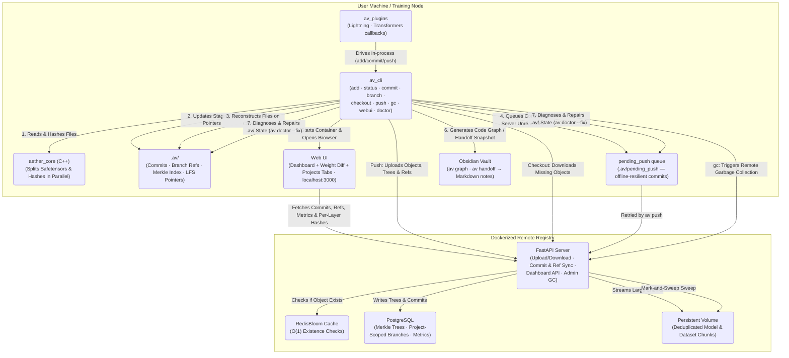

<p align="center"></p>

<h1 align="center">Aether-Vault</h1>

<p align="center">
  <strong>High-performance, Git-like version control and registry for Machine Learning models, datasets, and code — in a single atomic commit.</strong>
</p>

<p align="center">
  
  
  
  
</p>

Aether-Vault solves the core challenge of ML reproducibility by versioning the **"Holy Trinity"** together:

| | Type | Examples |
|---|---|---|
| 1 | **Code** | Python training scripts, pipelines, validators |
| 2 | **Model Weights** | `.pt`, `.safetensors`, `.onnx` |
| 3 | **Datasets** | `.csv`, `.parquet`, `.h5`, `.arrow` |

## Table of Contents

- [Architecture](#architecture)
- [Installation](#installation)
- [CLI Reference](#cli-reference)
- [Framework Plugins](#framework-plugins)
- [Development Progress](#development-progress)
- [Benchmark Comparison](#benchmark-comparison)
- [Open Source Roadmap](#open-source-roadmap)
- [Enterprise Roadmap](#enterprise-roadmap-commercial-variant)
- [Contributing](#contributing)

---

## Architecture

Aether-Vault bridges Python and C++ for maximum throughput:

- **C++ Performance Core (`aether_core`)** — Reads multi-gigabyte files in 8MB chunks, hashing them in parallel with a C++11 ThreadPool. Layer-aware `.safetensors` parsing enables per-layer deduplication.
- **Python CLI (`av_cli`)** — Familiar Git-like interface (`av add`, `av commit`, `av checkout`). Files above the LFS threshold are automatically replaced by lightweight pointer files.
- **Framework Plugins (`av_plugins`)** — Optional native callbacks for PyTorch Lightning and HuggingFace Transformers that drive the CLI in-process to auto-commit checkpoints during training.
- **FastAPI CAS Server (`av_server`)** — Dockerized Content-Addressable Storage backend, backed by PostgreSQL (Merkle Tree DAG) and RedisBloom (O(1) existence checks).
- **Next.js Web UI (`webui`)** — Browser-based dashboard for visualizing the commit graph, branches, and ML metrics, plus a "Weight Diff" tab for visually comparing per-layer checkpoint changes. Launched with `av webui`.

### System Diagram



> The "Local" box represents **any number** of independent `av init` repos on the same (or
> different) machines — they all default to sharing the one Dockerized registry shown here.
> Each repo gets its own `project_id` (see [Phase 14](development/CHANGELOG.md#phase-14--per-project-registry-separation--real-world-fixes)),
> so the registry's commits/branches stay attributable per project even though the object store
> is intentionally deduplicated across all of them. Use `av config --remote-url` to point a repo
> at a different registry instead.

---

## Installation

### Prerequisites

| Requirement | Notes |
|---|---|
| **Docker & Docker Compose** | Required for the registry and Web UI |
| **Python ≥ 3.10** | For the `av` CLI |
| **C++ Build Tools** | Visual Studio Build Tools (Windows) · GCC/Clang (Linux/macOS) |
| **CMake** | For building the C++ hashing core |

### 1. Start the Registry (Docker)

```bash
git clone https://github.com/leon1706/aether-vault
cd aether-vault

# Start the full backend stack (API server, PostgreSQL, Redis)
docker compose up --build -d
```

The FastAPI server will be available at `http://localhost:8000`.
Interactive API docs: `http://localhost:8000/docs`

### 2. Install the CLI

```bash
# Compiles the C++ core and installs the `av` command
pip install -e .
```

---

## CLI Reference

### `av init`
Initialize an Aether-Vault repository in the current directory.
```bash
av init
```

### `av config`
Set the LFS size threshold (in MB), the remote registry URL, and/or this repo's display name on a shared registry. Run with no arguments to print the current configuration (including the auto-generated `project_id`).
```bash
av config 100                              # 100 MB LFS threshold
av config --remote-url http://host:8000    # point this repo at a different registry
av config --name "my-llm-finetune"         # rename this repo's project (display only)
av config                                  # print current LFS threshold / remote URL / project
```

### `av add`
Stage files or entire directories for the next commit. Supports `.safetensors` layer-splitting automatically.
```bash
av add src/train.py data/features.parquet weights/epoch_50.safetensors

# Stage everything recursively
av add .
```

### `av status`
Show staged, modified, deleted, and untracked files.
```bash
av status
```

### `av commit`
Record a snapshot of the staged files into the local DAG and push to the remote registry. Attach arbitrary ML metrics and labels directly to the commit.
```bash
av commit -m "LSTM tuned on Q2 data" \
  --tag production \
  --metric sharpe=2.45 \
  --metric drawdown=0.12 \
  --metric val_loss=0.034
```
`av add` only re-stages a file when its content hash actually changed, so running `av add .` again right after a commit with no new changes correctly reports `Nothing to commit` instead of creating an empty duplicate commit.

If the remote registry is unreachable at commit time, the commit is still saved locally and queued in `.av/pending_push` — it will not show up in the Web UI dashboard until it's synced (see `av push`).

### `av push`
Retry syncing locally committed commits that couldn't reach the remote registry (e.g. the server/Docker stack wasn't running yet). Every `av commit` also auto-retries the queue when the server is back up.
```bash
av push
```

### `av branch` / `av checkout`
Create and switch between experiment branches. Missing model weights are automatically downloaded from the remote.
```bash
av branch feature-transformers
av checkout feature-transformers
av checkout main
```

### `av list-meta`
Display all registered tag labels and metric keys across the repository history.
```bash
av list-meta
```

### `av graph`
Parse the repository's Python AST and generate an Obsidian-compatible Markdown vault of the full function call graph and dependency map.
```bash
av graph            # Generate and attempt to launch Obsidian
av graph --update   # Silently regenerate after code changes
```

### `av webui`
Launch the browser-based Web UI dashboard. Checks that Docker is running, starts the `aether-vault-webui` container, and opens `http://localhost:3000` automatically. If the container is already running and healthy, this skips straight to opening the browser instead of re-running `docker compose` every time.
```bash
av webui
# 1. Checks Docker is running
# 2. If already running & healthy, opens the browser immediately
# 3. Otherwise starts the Next.js Web UI container and waits for it to be ready
# 4. Opens http://localhost:3000 in your browser

av webui --rebuild   # force a fresh image build after changing webui/ source
```

**Dashboard panels:**
- **Experiment Graph** — SVG commit DAG with coloured branch lanes
- **Commit Log** — Full history with authors, timestamps, tags & metrics pills
- **Branch List** — All refs with tip commit details
- **ML Metrics Chart** — Line chart plotting all numeric metrics over commits
- **Stats Bar** — Live counts for commits, branches, CAS objects, and storage size
- **Weight Diff** — drag two checkpoints into comparison slots for a per-layer heatmap + drift chart
- **Projects** — every project that has pushed to this registry, with an "Open" button to scope the whole dashboard to just that one

### `av gc`
Trigger a mark-and-sweep garbage collection on the remote server to purge orphaned storage shards and rebuild the Redis Bloom Filter.
```bash
av gc
```

### `av doctor`
Diagnose common repo and environment problems: native core availability, remote server reachability, index/pointer consistency, the pending-push queue, and leftover temp files from interrupted writes. Read-only by default — reports issues but does not modify anything.
```bash
av doctor                    # diagnose only
av doctor --fix              # repair what's safely recoverable
av doctor --fix --dry-run    # preview what --fix would do, without changing anything
av doctor --speed            # also print a read-only timing snapshot of this repo's hot paths
```
`--fix` re-links orphaned/stale `.av-pointer` files back to their objects (downloading from the remote if the object is only available there), clears `*.tmp.*` leftovers from interrupted writes, and clears pending-push entries whose commit no longer exists locally while retrying the rest. Anything it can't safely recover (e.g. the object is missing both locally and on an unreachable remote) is left as `[WARN]` rather than fabricated or silently dropped.

`--speed` times `Index.load()`, `load_config()`, a working-tree scan, and the local object-store stats against *this* repo, read-only — a quick way to spot where a specific user's repo is actually slow, as opposed to `av test --speed`'s synthetic, cross-machine-comparable numbers below.

### `av test`
**Development only.** Runs Aether-Vault's own pytest suite from source. Requires an editable/dev install (`pip install -e .[dev]`) — not a tool for inspecting an end user's `.av/` repository (use `av doctor` for that).
```bash
av test                  # run the full suite
av test -k checkout      # only run tests matching "checkout"
av test --cov            # with a coverage report
av test --webui          # also run the webui/ Vitest suite (npm test) after the Python suite
av test --speed          # also run a synthetic speed benchmark of av's hot paths
av test --speed --webui  # ...and the webui/ Vitest bench suite (npm run bench) too
```
`--speed` runs the same hot paths as `av doctor --speed` against disposable, fixed-size synthetic fixtures (so results are repeatable across machines and runs, not dependent on whatever happens to be in a real repo), plus `pytest --durations=20` to surface the slowest tests. Each probe prints next to a soft advisory budget — exceeding it only flags the row `SLOW`, it never fails the command. Combined with `--webui`, it also runs a small Vitest `bench()` suite (`webui/src/components/__benchmarks__/speed.bench.ts`) covering the dashboard's graph-building and metrics-extraction logic. See `python/av_cli/speedcheck.py` to add probes or adjust budgets.

`--webui` runs `webui/`'s pure-logic *and* component tests (Vitest + React Testing Library). The
Playwright E2E suite below (Weight Diff + dashboard, against a real `docker compose` stack) is
separate, since it needs the live backend running:
```bash
docker compose up -d db redis aether-vault-server   # real backend the E2E flows talk to
python webui/e2e/seed_data.py                       # pushes 2 real commits via the actual av CLI
cd webui && npm run build && npm run start &        # or `npm run dev` for a quicker iteration loop
npx playwright test                                 # runs against http://localhost:3000
```

### `av handoff` — Agent Context Export
While most ML tracking tools (MLflow, DVC, W&B) record experiments for humans to read, `av handoff` generates a structured, machine-readable context snapshot for **AI agents** picking up the work — branch, commit, tags, metrics, model/dataset lineage, and an optional freeform instruction note, in an open `.avh` (Aether Vault Handoff) JSON format. Every invocation also writes a human-readable Markdown note into `Aether-Handoff/`, indexed chronologically by a central hub file.

```bash
av handoff                              # write handoff.avh + a new Aether-Handoff/ snapshot
av handoff --update                     # refresh handoff.avh with the latest repo state
av handoff --note "fine-tune lr=0.001"  # attach freeform instructions for the next agent
av handoff --instructions-file task.md  # read instructions from a file instead
av handoff --diff-weights               # add a per-layer weight-diff vs. the parent commit
av handoff --since <commit-or-tag>      # diff against an arbitrary earlier commit/tag
av handoff init                         # create the Aether-Handoff/ folder structure only
av handoff log                          # list all snapshots taken so far
av handoff show <snapshot-id>           # print a previous snapshot's Markdown note
```

```
Aether-Handoff/
├── Handoff-Hub.md                # chronological index of every snapshot
├── snapshots/
│   ├── 2026-06-23T120000Z_abc123d.avh
│   └── 2026-06-23T120000Z_abc123d.md
└── latest.avh                    # always-overwritten copy of the most recent snapshot
```

`--diff-weights` reuses the per-layer safetensors hashes already produced during `av add` to report exactly which model layers changed since the parent commit.

## Framework Plugins

Native callbacks for PyTorch Lightning and HuggingFace Transformers. Optional callbacks that auto-stage and auto-commit checkpoints as they're saved during training, so versioning never depends on remembering to run `av add`/`av commit` by hand. Install with the relevant extra:
```bash
pip install aether-vault[lightning]      # PyTorch Lightning
pip install aether-vault[transformers]   # HuggingFace Transformers
```

```python
# PyTorch Lightning
from av_plugins.lightning import AetherVaultCallback

trainer = Trainer(callbacks=[AetherVaultCallback(tag="experiment-1", dataset_paths="data/train.parquet")])
```

```python
# HuggingFace Transformers
from av_plugins.transformers import AetherVaultTrainerCallback

trainer = Trainer(..., callbacks=[AetherVaultTrainerCallback(tag="experiment-1", dataset_paths="data/train.csv")])
```

Each callback commits with the current step/epoch as the message and any numeric metrics (loss, eval scores, ...) attached via `--metric`, and flushes a final `av push` at the end of training. The training script must be run from inside (or below) an `av init`-ed repository.

`dataset_paths` (a single path or list of paths) is staged and committed once at the start of training, tagged `dataset` so `av handoff`'s lineage classification reports it as dataset lineage rather than a model checkpoint. There's no reliable way to auto-detect a dataset's on-disk path from a generic `Dataset`/`DataLoader` object, so this is opt-in rather than automatic.

### Importing existing artifacts

If a checkpoint or run already exists on disk (or in MLflow) from before a callback was wired in, all three plugins provide a matching import path — both as a Python function and as a CLI command, so backfilling works the same way regardless of framework:

```bash
av import-lightning path/to/epoch=12.ckpt --tag backfill
av import-transformers path/to/checkpoint-1000 --tag backfill
av import-mlflow <run_id> --tag backfill                      # requires: pip install aether-vault[mlflow]
```

```python
from av_plugins.lightning import import_checkpoint as import_lightning_checkpoint
from av_plugins.transformers import import_checkpoint as import_transformers_checkpoint
from av_plugins.mlflow import import_run as import_mlflow_run

import_lightning_checkpoint("path/to/epoch=12.ckpt", tag="backfill")
import_transformers_checkpoint("path/to/checkpoint-1000", tag="backfill")
import_mlflow_run("<run_id>", tag="backfill")
```

Each import commits the checkpoint/run artifacts plus any metrics found alongside them (Lightning reads `checkpoint["callback_metrics"]`, Transformers reads `trainer_state.json`'s `log_history`, MLflow reads the run's own metrics/params) — tagged `lightning-import`, `transformers-import`, or `mlflow-import` respectively. Re-importing an unchanged checkpoint is a no-op (same "Nothing to commit" behavior as `av commit`). Like every `av commit`, an import commits *everything* currently staged, not just the imported path — stage only what you want included before running an import if you have other unrelated changes pending.

---

## Development Progress

- [`development/CHANGELOG.md`](development/CHANGELOG.md) — full build-phase history: what was built, when, and why, across all 15 development phases.
- [`development/Probleme.md`](development/Probleme.md) — full audit log of correctness, performance and security findings, resolved and still-open, with severity ratings.

More development-process documents will live under [`development/`](development/) over time.

---

## Benchmark Comparison

`av add` + `av commit` on a 60-file mixed code/model fixture (20MB total: 50 source files + 10 2MB binaries), vs. equivalent Git LFS and DVC operations. Generated via `python scripts/run_benchmark_comparison.py` (Aether-Vault @ `562bad9`, git-lfs 3.7.1, DVC not installed in the capturing environment — shown as such rather than guessed at; re-run the script with `dvc` on PATH to fill that column in), captured 2026-06-26 on Windows:

| Operation | Aether-Vault | Git LFS | DVC |
|---|---:|---:|---:|
| init | 1669.2 ms | 4022.9 ms | not installed |
| add (60 files) | 2711.0 ms | 2099.4 ms | not installed |
| commit | 3935.1 ms | 1546.0 ms | not installed |

These are single-run, single-machine numbers (disk/antivirus-bound, like the rest of this section) — re-run the script yourself before relying on them for a decision. `av commit` is currently the slower step relative to Git LFS's commit; see `development/Probleme.md` for known performance findings if you're investigating further.

---

## Open Source Roadmap

| Status | Feature |
|---|---|
| 🔲 | **S3 Support** — Amazon S3 as an alternative backend storage adapter |

---

## Enterprise Roadmap (Commercial Variant)

For enterprise research teams and institutional algorithmic trading firms:

| Feature | Description |
|---|---|
| **RBAC** | Fine-grained read/write permissions for teams, users, and repositories |
| **SSO** | OAuth2, SAML, and Active Directory integration |
| **Audit Logging** | Immutable, cryptographically signed logs for regulatory compliance |
| **High Availability** | Multi-node horizontal scaling for the FastAPI registry and distributed Postgres/Redis |
| **Cloud Connectors** | AWS IAM, GCP Cloud Storage, Azure Blob Storage with automated cold-storage tiering |

---

## Contributing

1. Fork the repository
2. Create a feature branch: `git checkout -b feature/my-feature`
3. Commit your changes following the existing module structure (see [`development/CHANGELOG.md`](development/CHANGELOG.md) for the project's development history)
4. Open a Pull Request

---

<div align="center">
  <sub>Built with C++11 · Python · FastAPI · Next.js · PostgreSQL · Redis</sub>
</div>
