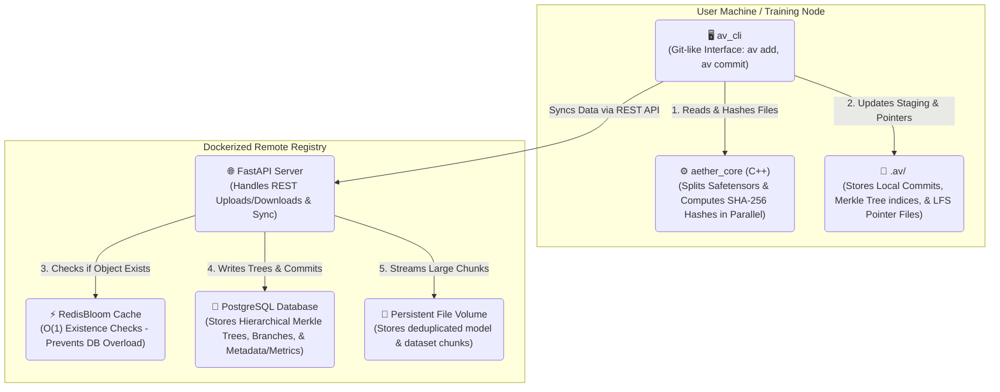

# 🌌 Aether-Vault

**Aether-Vault** is a high-performance, modular, Dockerized, Git-like version control and registry system specifically designed for algorithmic trading and machine learning frameworks.

It solves the major challenge of versioning the **"Holy Trinity"** of Machine Learning in a single atomic commit:
1. **Code**: Python training, validation, and pipeline scripts.
2. **Model Weights**: Deep learning weights (e.g., `.pt`, `.safetensors`).
3. **Datasets**: Large input data files (e.g., `.csv`, `.parquet`, `.h5`).

---

## ⚡ Architecture

Aether-Vault achieves outstanding speed by bridging Python and C++:

- **C++ Performance Core (`aether_core`)**: Reads multi-gigabyte files in chunks and hashes them in parallel using a C++11 ThreadPool. Layer-aware parsing splits massive models for deduplication.
- **Python CLI (`av_cli`)**: Provides the familiar Git-like user experience (`av add`, `av commit`, `av status`). Large artifacts (>50MB) are automatically replaced by Git-LFS style pointer files.
- **FastAPI CAS Server (`av_server`)**: A centralized, Docker-backed Content-Addressable Storage (CAS) backend backed by PostgreSQL and RedisBloom for massive scale.

### System Diagram



---

## 🛠️ Installation

### 1. Start the Remote Registry (Docker)
Ensure Docker and Docker-Compose are installed on your system.
```bash
# Clone the repository and navigate to it
cd aether-vault

# Start the registry backend and persistent storage
docker-compose up --build -d
```
*The server will be available at `http://localhost:8000`. Your data is safely stored in a persistent local Docker volume.*

### 2. Install the CLI Tool (Locally)
To use the `av` command on your machine, you need to compile the C++ performance core.
*(Note for Windows users: You must have Visual Studio C++ Build Tools installed).*
```bash
pip install -e .
```

---

## 📖 CLI Usage Guide

Using Aether-Vault is just like using Git!

### Initialize a Repository
Navigate to your PyTorch/Machine Learning project and initialize Aether-Vault:
```bash
av init
```

### Configure LFS (Large File) Threshold
Set the file size limit (in Megabytes) above which files are automatically streamed to the remote server and replaced by lightweight pointers locally.
```bash
av config 100
```

### Stage Files
Just like Git, you can stage individual files, folders, or everything at once. Add your python code, datasets, and compiled weights to the staging index:
```bash
# Stage specific files
av add src/train.py data/features.parquet weights/epoch_50.safetensors

# Or stage ALL changes in the current directory recursively
av add .
```
*Aether-Vault will instantly hash your files, split `.safetensors` into layers, and flag large files as LFS Artifacts.*

### Atomic Commit with Metrics
Commit your "Holy Trinity" securely into the local `.av` Directed Acyclic Graph (DAG) and push it to the remote FastAPI registry. You can attach tracking metrics directly to the commit!
```bash
av commit -m "LSTM tuned on Q2 data" --tag production --metric sharpe=2.45
```

### Branching & Checkout
Easily switch between different experiments and branches. Aether-Vault will automatically download any missing model weights from the remote Docker server!
```bash
av branch feature-transformers
av checkout feature-transformers
```

### List Metadata Registry
View all registered tracking tags and metric keys used in the repository history.
```bash
av list-meta
```

### Visualize Codebase Dependencies
Automatically parse your repository's Python AST to generate an interactive Markdown-based call graph of all functions, classes, and dependencies, ready to be viewed in Obsidian.
```bash
# Generate the vault and attempt to launch Obsidian
av graph

# Quietly update/regenerate the graph notes after making code changes
av graph --update
```

### Run Garbage Collection (Admin)
Trigger a mark-and-sweep cleanup on the remote server to delete orphaned storage shards and rebuild the cache.
```bash
av gc
```

---

## 🗺️ Build Phases & Development Walkthrough

Aether-Vault was designed and constructed in multiple distinct phases, bridging high-performance C++ systems programming with a clean Python developer experience:

### Phase 1: High-Performance C++ Hashing Core
* **Custom SHA-256 Engine**: Thread-safe cryptographic hashing engine.
* **Parallel Tree-Hashing**: Divides large files into 8MB chunks, hashing them concurrently across all CPU cores.

### Phase 2: CLI Framework & LFS Pointers
* **Staging Index Manager**: Manages local `.av/index`.
* **LFS-Style Pointers**: Automatically detects large files, duplicates them to object storage, and replaces them with an `.av-pointer`.

### Phase 3: Content-Addressable Storage (CAS)
* **Robust CAS Manager**: Deduplicates files by SHA-256 hashes, with atomic writes to prevent corruption.
* **FastAPI Endpoints**: Handles high-concurrency streaming uploads, downloads, and branch management.

### Phase 4: Database & Cache Integration
* **PostgreSQL Schema**: Migrated the registry to SQL for structured DAG representation, commits, and refs.
* **Redis Integration**: Connected `redis-stack-server` for high-performance in-memory caching.

### Phase 5: Safetensors & Merkle Trees
* **C++ Layer-Splitting**: Natively parses `.safetensors` JSON headers to extract and independently hash individual model layers, saving up to 99% of storage when only specific layers (like classifier heads) change.
* **Merkle Tree DAG**: Structured PostgreSQL tables to perfectly represent the directory and file hierarchy as a content-addressed Merkle Tree.

### Phase 6: Scalability & Garbage Collection
* **RedisBloom Filter**: Implemented a Bloom Filter for O(1) hash existence checks, radically reducing Postgres load and saving RAM.
* **Mark-and-Sweep GC**: Automated garbage collection traversing the Merkle Trees to purge orphaned data shards.

### Phase 7: ML Experiment Tracking
* **Dynamic Metadata**: Bound directly into the atomic commits, `--tag` and `--metric` flags allow users to attach arbitrary data (like training loss, accuracy, or Sharpe ratio) to versioned model checkpoints.

### Phase 8: Native Codebase Visualization
* **AST Parsing & Graph Generation**: Integrated Python Abstract Syntax Tree (AST) parsing directly into the CLI via `av graph`. It dynamically maps internal module calls, external library dependencies, and docstrings, exporting them into an Obsidian-compatible Markdown vault for real-time visual dependency tracking.

---

## 🚀 Open Source Project Roadmap

This open-source repository serves as the core showcase for what Aether-Vault can do. Planned improvements include:

- [ ] **Web UI Dashboard**: A native browser interface to visualize the commit graph, compare branches, and plot ML metrics over time.
- [ ] **Weight Diffing**: Advanced tooling to visualize parameter changes and drifts between two `.safetensors` model checkpoints.
- [ ] **Framework Plugins**: Direct integrations and callbacks for PyTorch Lightning and HuggingFace Transformers.
- [ ] **S3 Support**: Support for Amazon S3 as an alternative backend storage adapter.

---

## 🏢 Enterprise Roadmap (Commercial Variant)

For enterprise research teams and institutional algorithmic trading firms, an extended Enterprise variant is planned with the following capabilities:

- [ ] **Role-Based Access Control (RBAC)**: Fine-grained read/write permissions for teams, users, and specific repositories.
- [ ] **Single Sign-On (SSO)**: Integration with OAuth2, SAML, and Active Directory.
- [ ] **Compliance & Audit Logging**: Immutable, cryptographically signed audit logs for regulatory compliance (e.g., in financial or medical ML applications).
- [ ] **High Availability & Clustering**: Multi-node horizontal scaling for the FastAPI CAS registry and distributed Postgres/Redis clusters.
- [ ] **Enterprise Cloud Connectors**: Deep integration with AWS IAM, GCP Cloud Storage, Azure Blob Storage, and automated cold-storage tiering.
