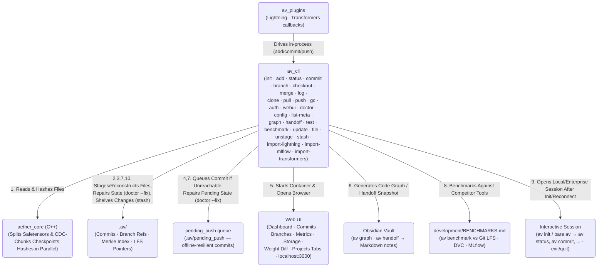
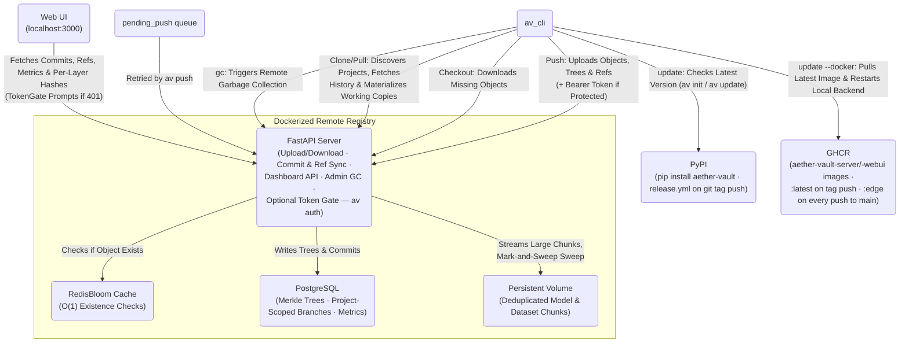

<p align="center"></p>

<h1 align="center">Aether-Vault</h1>

<p align="center">
  <strong>High-performance, Git-like version control and registry for Machine Learning models, datasets, and code — in a single atomic commit.</strong>
</p>

<p align="center">
  
  
  
  
</p>

Aether-Vault solves the core challenge of ML reproducibility by versioning the **"Holy Trinity"** together:

| | Type | Examples |
|---|---|---|
| 1 | **Code** | Python training scripts, pipelines, validators |
| 2 | **Model Weights** | `.pt`, `.safetensors`, `.onnx` |
| 3 | **Datasets** | `.csv`, `.parquet`, `.h5`, `.arrow` |

## Table of Contents

- [Architecture](#architecture)
- [Repository Map](#repository-map)
- [Installation](#installation)
- [Quick Start: From Install to Push](#quick-start-from-install-to-push)
- [CLI Reference](#cli-reference)
- [Framework Plugins](#framework-plugins)
- [Development Progress](#development-progress)
- [Benchmark Comparison](#benchmark-comparison)
- [Open Source Roadmap](#open-source-roadmap)
- [Enterprise Roadmap](#enterprise-roadmap-commercial-variant)
- [Contributing](#contributing)

---

## Architecture

Aether-Vault bridges Python and C++ for maximum throughput:

- **C++ Performance Core (`aether_core`)** — Reads multi-gigabyte files in 8MB chunks, hashing them in parallel with a C++11 ThreadPool. Layer-aware `.safetensors` parsing enables per-layer deduplication; content-defined chunking gives opaque checkpoints (`.pt`/`.pth`/`.ckpt`) chunk-level dedup without any framework dependency.
- **Python CLI (`av_cli`)** — Familiar Git-like interface (`av add`, `av commit`, `av checkout`, plus `clone`/`pull`/`merge`/`log` for team workflows). Files above the LFS threshold are automatically replaced by lightweight pointer files.
- **Framework Plugins (`av_plugins`)** — Optional native callbacks for PyTorch Lightning and HuggingFace Transformers that drive the CLI in-process to auto-commit checkpoints during training.
- **FastAPI CAS Server (`av_server`)** — Dockerized Content-Addressable Storage backend, backed by PostgreSQL (Merkle Tree DAG) and RedisBloom (O(1) existence checks).
- **Next.js Web UI (`webui`)** — Browser-based dashboard for visualizing the commit graph, branches, and ML metrics, plus a "Weight Diff" tab for visually comparing per-layer checkpoint changes. Launched with `av webui`.

### System Diagram

Split into two focused diagrams rather than one large one — what happens on your machine, and how it talks to the network — so each stays compact and its labels stay legible instead of crowding together.

#### Local CLI Architecture



#### Sync, Remote Registry & Release Pipeline



> The "Local CLI Architecture" diagram represents **any number** of independent `av init` repos
> on the same (or different) machines — they all default to sharing the one Dockerized
> registry shown in the second diagram.
> Each repo gets its own `project_id` (see [Phase 14](development/CHANGELOG.md#phase-14--per-project-registry-separation--real-world-fixes)),
> so the registry's commits/branches stay attributable per project even though the object store
> is intentionally deduplicated across all of them. Use `av config --remote-url` to point a repo
> at a different registry instead.

---

## Repository Map

Every folder documents itself with its own `README.md` — contents, conventions, and
pointers deeper into the project (`.github/` is the exception: it's CI plumbing, see its
workflows directly):

| Folder | What it is | Details |
|---|---|---|
| [`python/av_cli/`](python/av_cli/README.md) | The `av` CLI: commands, local DAG/CAS, sync, merge, log, chunking, doctor | [package overview](python/README.md) |
| [`python/av_server/`](python/av_server/README.md) | FastAPI CAS registry (PostgreSQL + RedisBloom) | [package overview](python/README.md) |
| [`python/av_plugins/`](python/av_plugins/README.md) | Lightning / Transformers / MLflow auto-commit callbacks | [package overview](python/README.md) |
| [`src/`](src/README.md) | C++ performance core (`aether_core`): hashing, safetensors split, CDC chunker | — |
| [`tests/`](tests/README.md) | ~330-test suite across 20 files (CLI, core, server, plugins) | — |
| [`benchmarks/`](benchmarks/README.md) | The nine cross-tool benchmarks vs Git LFS / DVC / MLflow | — |
| [`webui/`](webui/README.md) | Next.js dashboard incl. Weight Diff + Playwright E2E | — |
| [`development/`](development/README.md) | Phase-by-phase CHANGELOG, the Probleme.md audit log, captured BENCHMARKS.md | — |
| [`.github/`](.github/workflows/tests.yml) | CI workflows (5 test jobs), PyPI release pipeline, GHCR edge images, issue/PR templates | — |
| [`scripts/`](scripts/README.md) | Checkout-local developer utilities | — |

The Obsidian vault (`Aether-vault-Obsidian-Vault/`) is a locally generated knowledge base
(code graph, handoff log, wrap-up checklist) and intentionally gitignored.

---

## Installation

### Quick Install

```bash
pip install aether-vault
av init
```

That's it. `av init` checks whether the Docker backend is running, built, or missing and
handles whichever applies automatically — no manual
`docker compose` step required.

### Prerequisites

| Requirement | Notes |
|---|---|
| **Python ≥ 3.10** | For the `av` CLI |
| **Docker & Docker Compose** | Only needed for **Local** mode's registry/Web UI — `av init` detects and walks you through it, nothing to set up by hand first |
| **C++ Build Tools + CMake** | Only if `pip` falls back to building from source (no prebuilt wheel for your platform/Python version) — most users on common platforms/Python versions never hit this path |

### Development Install (from source)

```bash
git clone https://github.com/leon1706/aether-vault
cd aether-vault

# Compiles the C++ core locally and installs the `av` command in editable mode
pip install -e .[dev]
```

This path always compiles the C++ core via pybind11, so the C++ Build Tools + CMake prerequisite
above does apply here. To start the registry manually instead of via `av init` (e.g. for
webui-only development):
```bash
docker compose up --build -d
```
The FastAPI server will then be available at `http://localhost:8000` (interactive API docs at
`http://localhost:8000/docs`).

---

## Quick Start: From Install to Push

```bash
pip install aether-vault
av init                                  # pick Local or Enterprise; opens the interactive shell
av status                                # (now inside the shell — still typed with the `av` prefix)
av add train.py model.safetensors
av commit -m "first commit"
av push
exit                                     # back to your normal shell
```

Every one of these also works as a normal one-off command from outside the shell — `av status`
typed in a regular terminal behaves identically. The shell (entered automatically by `av init`,
and by bare `av` in an already-initialized repo) is a convenience layer for staying "inside"
aether-vault across several commands, not a different mode of operation. See `av init` below for
the full Local/Enterprise/shell details.

---

## CLI Reference

### `av init`
*(see [Quick Start](#quick-start-from-install-to-push) for the full install-to-push walkthrough)*

Initialize an Aether-Vault repository in the current directory. `av init` drops you into an
interactive session afterward — type commands (still prefixed with `av`, e.g. `av status`)
without re-invoking the process each time; `exit`/`quit`/Ctrl+D leaves back to your normal
shell. Running bare `av` (no subcommand) in an already-initialized repo does the same
reconnect + session entry without needing `init` again.

Interactive init asks whether to run **Anonymous** (no token, anyone reachable can use it —
the default) or **Protected** (every action requires a shared-secret access token — see
`av auth` below). Protected has a second choice: generate a new token (you're standing this
registry up for the first time) or enter an existing one (you're joining a registry a
teammate already protected).

An **Enterprise** mode (account-based login, RBAC/SSO) exists as a seam for the commercial
variant but is deliberately not offered interactively yet — it's reachable only via the
explicit `--mode enterprise` flag and currently falls back to Local.
```bash
av init                                   # interactive: asks Anonymous/Protected, then opens the session
av init --mode local --yes --no-repl      # non-interactive: for scripts/CI, skips prompts, defaults to Anonymous
av init --mode local --protected          # non-interactive equivalent of Protected + generate a new token
av init --mode local --token <token>      # non-interactive equivalent of Protected + join an existing registry
av                                        # bare, in an initialized repo: reconnect + open the session
```

### `av auth`
Manage the optional access-token gate ("Protected" mode). Unset (the default) means every
route behaves exactly as it always has — no credentials needed ("Anonymous"). Setting any
token switches the server to "Protected" — every route, reads included, then requires a
valid Bearer token (except `GET /api/health`, always reachable so Docker healthchecks and
the CLI's own reachability checks never need a token themselves).

Two credential sources coexist: the owner's shared secret (`AV_API_TOKEN`) and optional
**per-user tokens** (`AV_AUTH_USERS`, a `{username: token}` map managed by the commands
below). A request authenticates against either; per-user teammates who push with the
default `anonymous` author get their username stamped as the commit author automatically,
while an explicit `AV_AUTHOR` is always respected.
```bash
av auth set-token              # generate a random token, write it, restart the server with it active
av auth set-token <token>       # set a specific token instead (e.g. one a teammate already uses)
av auth set-token <new-token>   # re-running this is also the "I forgot it" path — no separate reset flow
av auth clear                   # remove the token everywhere — back to Anonymous
av auth status                  # report whether a token is configured (masked), without printing it

av auth add-user <name>         # grant NAME its own token (generated + printed once)
av auth add-user <name> <token> # ...or with a specific token
av auth list-users              # masked list of per-user tokens
av auth remove-user <name>      # revoke NAME's personal token
```
Per-user flow: run `av auth add-user alice`, share Alice her token over a trusted channel;
she puts it in her own repo via `av auth set-token <her-token>` and pushes as usual — her
commits show up attributed to `alice` in the log and webui without any shared secret ever
leaving your machine.
If any CLI command hits a registry that's Protected and no/the-wrong token is configured, it
prompts interactively for the token (saves it, then asks you to re-run) rather than failing
with a generic error — or, non-interactively, prints exactly which command to run. The webui
behaves the same way: opening it via `av webui` auto-fills the token if the CLI already has
one configured; opened any other way (a bookmark, a teammate's own browser), it shows the same
entry prompt once. Per-user tokens work everywhere the shared secret does, including the
webui's token prompt.

### `av update`
Check PyPI for a newer release and optionally install it. `av init` also prints a one-line
banner if you're behind, but never checks on routine commands (`av add`, `av status`, etc.) —
only here and at `init` time, so normal usage never pays a network-call cost.
```bash
av update                       # check, then prompt to upgrade if one's available
av update --check               # report only, no prompt
av update --list-versions       # list every published version, newest first
av update --enable-auto-update  # opt in to silent auto-upgrade (off by default)
av update --disable-auto-update
```
With `--enable-auto-update` on, every `av` command checks once more for an update right as the
process is about to exit (after any interactive session has finished) and silently
`pip install --upgrade`s if one's available — pushing a new tagged release to GitHub is enough
for already-installed opted-in users to pick it up on their next `av` invocation, with no
action needed on their end. Off by default; explicit `av update` always works regardless of
this setting.
`av update --docker` is a separate, opt-in action that only touches the local Docker backend —
it never runs as part of plain `av update`, since restarting a running container is disruptive:
```bash
av update --docker          # pull the latest published image; prompts before restarting if changed
av update --docker --yes    # skip the restart confirmation
```
Only does real work when running from a real `pip install aether-vault` (against the
GHCR-published `:latest` image); from a source checkout it tells you to `git pull` +
`av webui --rebuild` instead, since a dev checkout's backend isn't tied to a published image tag.

### `av help`
Every command supports `--help`, including the top-level `av` group itself — the fastest way
to see the full command list or a specific command's options without leaving the terminal.
```bash
av --help            # list every command
av commit --help     # options for a specific command
```

### `av status`
Show staged, modified, deleted, and untracked files.
```bash
av status
```

### `av config`
Set the LFS size threshold (in MB), the remote registry URL, and/or this repo's display name on a shared registry. Run with no arguments to print the current configuration (including the auto-generated `project_id`).
```bash
av config 100                              # 100 MB LFS threshold
av config --remote-url http://host:8000    # point this repo at a different registry
av config --name "my-llm-finetune"         # rename this repo's project (display only)
av config                                  # print current LFS threshold / remote URL / project
```

### `av add`
Stage files or entire directories for the next commit. Supports `.safetensors` layer-splitting automatically.
```bash
av add src/train.py data/features.parquet weights/epoch_50.safetensors

# Stage everything recursively
av add .
```
`av add .` skips anything matching a pattern in `.avignore` (gitignore-style, one glob per
line) — see `av file --avignore` below to generate one.

### `av file`
Generates scaffold files in the repo root. Each kind of generated file is its own flag, so more
can be added later without restructuring the command.
```bash
av file --avignore       # writes a .avignore template (gitignore-style — venv/, *.log, etc.)
av file --avattributes   # writes a .avattributes template (per-path staging directives)
```
Refuses to overwrite an existing file rather than silently clobbering edits you've already made.

`.avattributes` is gitattributes-style: glob patterns with staging directives, last matching
line wins. Supported flags: `no-chunk` (store an opaque checkpoint as a whole-file blob
instead of CDC chunks) and `no-layer-split` (never split safetensors into per-layer shards).
```gitattributes
*.pt no-chunk
models/frozen/*.safetensors no-layer-split
```

### `av unstage`
Undo `av add` — without touching the working-tree files. Reverts each staged entry back to its
last-committed state (so it shows up as "modified" again, or untracked if it was never
committed), like `git reset` / `git restore --staged`.
```bash
av unstage              # unstage everything currently staged
av unstage file1 file2  # unstage just these paths
```

### `av commit`
Record a snapshot of the staged files into the local DAG and push to the remote registry. Attach arbitrary ML metrics and labels directly to the commit.
```bash
av commit -m "LSTM tuned on Q2 data" \
  --tag production \
  --metric sharpe=2.45 \
  --metric drawdown=0.12 \
  --metric val_loss=0.034
```
`av add` only re-stages a file when its content hash actually changed, so running `av add .` again right after a commit with no new changes correctly reports `Nothing to commit` instead of creating an empty duplicate commit.

If the remote registry is unreachable at commit time, the commit is still saved locally and queued in `.av/pending_push` — it will not show up in the Web UI dashboard until it's synced (see `av push`).

### `av push`
Retry syncing locally committed commits that couldn't reach the remote registry (e.g. the server/Docker stack wasn't running yet). Every `av commit` also auto-retries the queue when the server is back up.
```bash
av push
```

### `av clone`
Materialize a fresh working copy of a project someone else already pushed — the team-collaboration
entry point. Resolves the project by exact id, exact name, or unique name prefix from the
registry's project list; the clone inherits the source project's identity, so pushes from either
copy land in the same project on the shared registry.
```bash
av clone my-llm-finetune                 # into ./my-llm-finetune
av clone my-llm-finetune work-copy       # explicit target directory (must be empty/new)
av clone <project-id> --token <token>    # by id, joining a Protected registry
```
Full commit history comes down as cheap metadata; only the default branch's tip (`main`, else
first) materializes its objects — older versions lazy-download on first checkout, so `av log`,
`av handoff`, and `av checkout <old>` all work offline right after cloning.

### `av pull`
Fetch the current branch from the registry and fast-forward onto it.
```bash
av pull            # fast-forward only
av pull --force    # discard uncommitted local changes instead of aborting
```
Pull is deliberately **fast-forward-only**: when local and remote histories have diverged it
refuses instead of guessing a merge — but the fetched commits are stored locally first, so it
prints the exact command to resolve: `av merge <remote-tip>`. Uncommitted changes are guarded
the same way `checkout` guards them.

### `av log`
Show local commit history, newest first — no registry round trip, works fully offline.
```bash
av log                       # walk the parent chain from HEAD (default limit 30)
av log --limit 100           # more history
av log --branch feature-x    # start from another branch's tip
av log --all                 # every local commit across branches, timestamp-ordered
```
Branch tips are annotated git-style (`[a54a0b2] (HEAD, main) message`), with an indented detail
line for author/timestamp when present plus tags and metrics.

### `av branch` / `av checkout`
Create and switch between experiment branches. Missing model weights are automatically downloaded from the remote.
```bash
av branch feature-transformers
av checkout feature-transformers
av checkout main
```
Commits can be checked out by their full hash or any unique prefix of it — including the
7-character short form `av commit` itself prints (`av checkout a54a0b2`). An ambiguous prefix
is rejected with an error asking for more characters rather than guessing.
`checkout` refuses to run if you have uncommitted changes it would overwrite, unless you pass
`--force` (which discards them) — `av stash` is the non-destructive alternative.

### `av merge`
Merge another branch or commit into the current branch — tree-level three-way merge against the
nearest common ancestor. Per file, whichever side changed wins; if BOTH sides changed the same
file differently the merge aborts cleanly (nothing touched) and lists the conflicts.
```bash
av merge feature-transformers           # fast-forward when possible, else a two-parent merge commit
av merge feature-transformers -m "msg"  # custom merge commit message
av merge <commit-hash> --ours           # auto-resolve conflicts keeping this branch's versions
av merge <commit-hash> --theirs         # ... or taking the target's versions
av merge <target> --no-ff               # force a merge commit even when a fast-forward would do
```
Successful merges create a real two-parent commit that syncs to the registry (servers ≥ v1.1.1
store both parents) and shows up in `av log`. Content-level line merging is intentionally out of
scope — versioned payloads are binary artifacts; an honest abort beats a corrupt merge.

### `av stash`
Git-stash-style temporary shelving of uncommitted changes (staged + modified tracked files —
not untracked or deleted files), so you can switch branches or pull without committing
half-finished work. Reverts the working tree to match HEAD; `pop`/`apply` bring it back exactly
as it was, staged or not.
```bash
av stash                    # shelve everything dirty (same as `av stash push`)
av stash -m "wip on lr"      # ...with a label
av stash list                # newest first
av stash pop [id]            # apply + delete (defaults to the most recent)
av stash apply [id]          # apply without deleting
av stash drop [id]           # delete without applying
```
v1 doesn't attempt conflict detection against a dirty tree on `pop`/`apply` — it overwrites
whatever's currently at each path, same as a `checkout` would.

### `av webui`
Launch the browser-based Web UI dashboard. Checks that Docker is running, starts the `aether-vault-webui` container, and opens `http://localhost:3000` automatically. If the container is already running and healthy, this skips straight to opening the browser instead of re-running `docker compose` every time.
```bash
av webui
# 1. Checks Docker is running
# 2. If already running & healthy, opens the browser immediately
# 3. Otherwise starts the Next.js Web UI container and waits for it to be ready
# 4. Opens http://localhost:3000 in your browser

av webui --rebuild   # force a fresh image build after changing webui/ source
```

**Dashboard panels:**
- **Dashboard (overview)** — Stats bar, SVG commit DAG, branch teaser, metrics teaser, and commit-log teaser, all at a glance
- **Commits** — Paginated, searchable commit log (filters the loaded page by message/author/tag and by branch), with click-to-expand rows showing the full file tree and an added/removed/changed diff vs. the parent commit
- **Branches** — Full branch list with untruncated tip details, a "commits ahead of main" count, branch-row expand to see its commits, and a "branch from here" action
- **Metrics** — Full-size ML metrics chart with per-metric show/hide toggles, a metrics table (commit × metric), and a single-branch comparison view
- **Storage** — Store-wide CAS object/size stats plus a file-type breakdown, largest-tracked-files list, and an approximate dedup ratio derived from the latest commit's snapshot
- **Weight Diff** — drag two checkpoints into comparison slots for a per-layer heatmap + drift chart
- **Projects** — every project that has pushed to this registry, with an "Open" button to scope the whole dashboard to just that one

### `av list-meta`
Display all registered tag labels and metric keys across the repository history.
```bash
av list-meta
```

### `av graph`
Parse the repository's Python AST and generate an Obsidian-compatible Markdown vault of the full function call graph and dependency map.
```bash
av graph            # Generate and attempt to launch Obsidian
av graph --update   # Silently regenerate after code changes
```

### `av handoff` — Agent Context Export
While most ML tracking tools (MLflow, DVC, W&B) record experiments for humans to read, `av handoff` generates a structured, machine-readable context snapshot for **AI agents** picking up the work — branch, commit, tags, metrics, model/dataset lineage, and an optional freeform instruction note, in an open `.avh` (Aether Vault Handoff) JSON format. Every invocation also writes a human-readable Markdown note into `Aether-Handoff/`, indexed chronologically by a central hub file.

```bash
av handoff                              # write handoff.avh + a new Aether-Handoff/ snapshot
av handoff --update                     # refresh handoff.avh with the latest repo state
av handoff --note "fine-tune lr=0.001"  # attach freeform instructions for the next agent
av handoff --instructions-file task.md  # read instructions from a file instead
av handoff --diff-weights               # add a per-layer weight-diff vs. the parent commit
av handoff --since <commit-or-tag>      # diff against an arbitrary earlier commit/tag
av handoff init                         # create the Aether-Handoff/ folder structure only
av handoff log                          # list all snapshots taken so far
av handoff show <snapshot-id>           # print a previous snapshot's Markdown note
```

```
Aether-Handoff/
├── Handoff-Hub.md                # chronological index of every snapshot
├── snapshots/
│   ├── 2026-06-23T120000Z_abc123d.avh
│   └── 2026-06-23T120000Z_abc123d.md
└── latest.avh                    # always-overwritten copy of the most recent snapshot
```

`--diff-weights` reuses the per-layer safetensors hashes already produced during `av add` to report exactly which model layers changed since the parent commit.

### `av gc`
Trigger a mark-and-sweep garbage collection on the remote server to purge orphaned storage shards and rebuild the Redis Bloom Filter.
```bash
av gc
```

### `av doctor`
Diagnose common repo and environment problems: native core availability, remote server reachability, index/pointer consistency, the pending-push queue, and leftover temp files from interrupted writes. Read-only by default — reports issues but does not modify anything.
```bash
av doctor                    # diagnose only
av doctor --fix              # repair what's safely recoverable
av doctor --fix --dry-run    # preview what --fix would do, without changing anything
av doctor --speed            # also print a read-only timing snapshot of this repo's hot paths
```
`--fix` re-links orphaned/stale `.av-pointer` files back to their objects (downloading from the remote if the object is only available there), clears `*.tmp.*` leftovers from interrupted writes, and clears pending-push entries whose commit no longer exists locally while retrying the rest. Anything it can't safely recover (e.g. the object is missing both locally and on an unreachable remote) is left as `[WARN]` rather than fabricated or silently dropped.

`--speed` times `Index.load()`, `load_config()`, a working-tree scan, and the local object-store stats against *this* repo, read-only — a quick way to spot where a specific user's repo is actually slow, as opposed to `av test --speed`'s synthetic, cross-machine-comparable numbers below.

### `av test`
**Development only.** Runs Aether-Vault's own pytest suite from source. Requires an editable/dev install (`pip install -e .[dev]`) — not a tool for inspecting an end user's `.av/` repository (use `av doctor` for that).
```bash
av test                  # run the full suite
av test -k checkout      # only run tests matching "checkout"
av test --cov            # with a coverage report
av test --webui          # also run the webui/ Vitest suite (npm test) after the Python suite
av test --speed          # also run a synthetic speed benchmark of av's hot paths
av test --speed --webui  # ...and the webui/ Vitest bench suite (npm run bench) too
```
`--speed` runs the same hot paths as `av doctor --speed` against disposable, fixed-size synthetic fixtures (so results are repeatable across machines and runs, not dependent on whatever happens to be in a real repo), plus `pytest --durations=20` to surface the slowest tests. Each probe prints next to a soft advisory budget — exceeding it only flags the row `SLOW`, it never fails the command. Combined with `--webui`, it also runs a small Vitest `bench()` suite (`webui/src/components/__benchmarks__/speed.bench.ts`) covering the dashboard's graph-building and metrics-extraction logic. See `python/av_cli/speedcheck.py` to add probes or adjust budgets.

A plain `av test` (no `-k`) also keeps this README's own `tests-N/M passing` badge above in sync with the real result — it parses pytest's own "N passed, M failed" summary line and rewrites the badge (and turns it red if anything failed) so the count is never manually edited or allowed to go stale. A `-k`-scoped run never touches it, since a subset's count would be misleading.

`--webui` runs `webui/`'s pure-logic *and* component tests (Vitest + React Testing Library). The
Playwright E2E suite below (Weight Diff + dashboard, against a real `docker compose` stack) is
separate, since it needs the live backend running:
```bash
docker compose up -d db redis aether-vault-server   # real backend the E2E flows talk to
python webui/e2e/seed_data.py                       # pushes 2 real commits via the actual av CLI
cd webui && npm run build && npm run start &        # or `npm run dev` for a quicker iteration loop
npx playwright test                                 # runs against http://localhost:3000
```

### `av benchmark`
**Development only.** Runs the cross-tool benchmark suite against **Git LFS**, **DVC**, and **MLflow** — see [`development/BENCHMARKS.md`](development/BENCHMARKS.md) for the latest captured numbers and [`benchmarks/README.md`](benchmarks/README.md) for the full flag reference. Requires `pip install -e .[dev,benchmarks]` to install DVC/MLflow as comparison targets (Git LFS is assumed already on `PATH`).
```bash
av benchmark                                          # run all 9 benchmarks, console output
av benchmark --only hashing_throughput                # scope to one benchmark (repeatable)
av benchmark --vs git-lfs --vs dvc                    # scope competitor columns (repeatable)
av benchmark --markdown development/BENCHMARKS.md     # regenerate the full Markdown report
av benchmark --baseline prior.json --save-json new.json   # regression-track av's own numbers
                                                            # across captures, independent of
                                                            # the competitor comparison below
```
Every result is a real measured number from a real subprocess/HTTP call — a tool that isn't on `PATH`, or whose primitive doesn't apply to a given benchmark, is shown as `not installed`/`N/A` with a footnote, never guessed at.

## Framework Plugins

Native callbacks for PyTorch Lightning and HuggingFace Transformers. Optional callbacks that auto-stage and auto-commit checkpoints as they're saved during training, so versioning never depends on remembering to run `av add`/`av commit` by hand. Install with the relevant extra:
```bash
pip install aether-vault[lightning]      # PyTorch Lightning
pip install aether-vault[transformers]   # HuggingFace Transformers
```

```python
# PyTorch Lightning
from av_plugins.lightning import AetherVaultCallback

trainer = Trainer(callbacks=[AetherVaultCallback(tag="experiment-1", dataset_paths="data/train.parquet")])
```

```python
# HuggingFace Transformers
from av_plugins.transformers import AetherVaultTrainerCallback

trainer = Trainer(..., callbacks=[AetherVaultTrainerCallback(tag="experiment-1", dataset_paths="data/train.csv")])
```

Each callback commits with the current step/epoch as the message and any numeric metrics (loss, eval scores, ...) attached via `--metric`, and flushes a final `av push` at the end of training. The training script must be run from inside (or below) an `av init`-ed repository.

`dataset_paths` (a single path or list of paths) is staged and committed once at the start of training, tagged `dataset` so `av handoff`'s lineage classification reports it as dataset lineage rather than a model checkpoint. There's no reliable way to auto-detect a dataset's on-disk path from a generic `Dataset`/`DataLoader` object, so this is opt-in rather than automatic.

### Importing existing artifacts

If a checkpoint or run already exists on disk (or in MLflow) from before a callback was wired in, all three plugins provide a matching import path — both as a Python function and as a CLI command, so backfilling works the same way regardless of framework:

```bash
av import-lightning path/to/epoch=12.ckpt --tag backfill
av import-transformers path/to/checkpoint-1000 --tag backfill
av import-mlflow <run_id> --tag backfill                      # requires: pip install aether-vault[mlflow]
```

```python
from av_plugins.lightning import import_checkpoint as import_lightning_checkpoint
from av_plugins.transformers import import_checkpoint as import_transformers_checkpoint
from av_plugins.mlflow import import_run as import_mlflow_run

import_lightning_checkpoint("path/to/epoch=12.ckpt", tag="backfill")
import_transformers_checkpoint("path/to/checkpoint-1000", tag="backfill")
import_mlflow_run("<run_id>", tag="backfill")
```

Each import commits the checkpoint/run artifacts plus any metrics found alongside them (Lightning reads `checkpoint["callback_metrics"]`, Transformers reads `trainer_state.json`'s `log_history`, MLflow reads the run's own metrics/params) — tagged `lightning-import`, `transformers-import`, or `mlflow-import` respectively. Re-importing an unchanged checkpoint is a no-op (same "Nothing to commit" behavior as `av commit`). Like every `av commit`, an import commits *everything* currently staged, not just the imported path — stage only what you want included before running an import if you have other unrelated changes pending.

---

## Development Progress

- [`development/architecture.md`](development/architecture.md) — what the system **is**: one contract section per subsystem (staging, commit, sync, merge, restore, GC, auth, webui, plugins, release), system/tech-stack diagrams, and the testing map.
- [`development/infrastructure.md`](development/infrastructure.md) — how to **run** it: the Docker compose stack, environment variables, Protected mode, database migrations, releases, inspection SQL.
- [`development/CHANGELOG.md`](development/CHANGELOG.md) — full build-phase history: what was built, when, and why, across all development phases.
- [`development/Probleme.md`](development/Probleme.md) — the audit log of correctness, performance and security findings, with severity ratings and fix status.
- [`VERSIONING.md`](VERSIONING.md) — SemVer per compatibility surface, deprecation policy, release runbook.

More development-process documents will live under [`development/`](development/) over time.

---

## Benchmark Comparison

`av benchmark` runs 9 reproducible benchmarks against **Git LFS**, **DVC**, and **MLflow**. Every number is measured from a real subprocess or HTTP call on the same fixture each tool actually has to process — nothing here is estimated or fabricated, and a tool that cannot run a given benchmark (not installed, or the operation does not apply to it) is reported as such rather than given a guessed value.

**At a glance:** Aether wins decisively on raw hashing throughput and storage dedup (#1/#2/#7), trades blows on
commit+push latency (#3 — push is faster, commit is slower by design: av uploads synchronously during `commit`, DVC
defers all upload to a separate `push`), has one open weak spot (#4, no-op `status`/`add`), one metric capture still
pending (#5 — `av clone`/`av pull` shipped in v1.1.1; the measured number lands on the next live-registry benchmark
run), a unique capability no competitor can match at all (#6, partial-layer fetch), and two Aether-only server
operations with no comparable competitor primitive (#8, #9). The table below summarizes each benchmark vs.
the best competitor wherever that comparison is fair — see [`development/BENCHMARKS.md`](development/BENCHMARKS.md) for
the full methodology, every raw number, and the caveats that go with single-machine timings.

| # | Benchmark | vs. best competitor | Notes |
|---|---|---|---|
| 1 | Hashing Throughput at Scale | ~2–3x faster than Git LFS, up to 17x faster than DVC | fastest at every size tested (10–200MB) |
| 2 | Safetensors Layer-Dedup | **63% smaller** | 47MB vs. 126MB after 6 fine-tune commits |
| 3 | Commit + Push Latency | push ~70% faster · commit ~6x slower *(by design, vs. DVC)* | see note above — different upload timing, not a raw speed gap |
| 4 | No-Op `status`/`add` | ~15x slower than Git LFS | open finding, not a hidden one — interpreter/import startup cost, not yet fixed |
| 5 | Cold Clone / First Pull | shipped — capture pending | `av clone` exists as of v1.1.1; the table refreshes with a measured number on the next `av benchmark` run against a live registry |
| 6 | Partial-Checkpoint Fetch | unique capability | only one of the four tools that can fetch a single layer instead of the whole file |
| 7 | Storage Footprint Curve | **63% smaller**, gap widens every commit | same dedup advantage as #2, sustained over time |
| 8 | Concurrent Push Throughput | Aether-only | no competitor has a comparable concurrent-server primitive |
| 9 | Garbage Collection Throughput | Aether-only | no competitor has a comparable server-side GC primitive |

For the full results, the methodology behind each benchmark, and the rating legend, see [`development/BENCHMARKS.md`](development/BENCHMARKS.md).

---

## Open Source Roadmap

No open items — shipped milestones (v1.0/v1.1.x releases, clone/pull, log, merge, chunk
dedup, Alembic migrations, CORS + rate-limit hardening, cp310–cp314 wheels, per-user auth,
merge visualization) live in the [CHANGELOG](development/CHANGELOG.md) and GitHub Releases.
The one operational follow-up that isn't a feature — capturing benchmark #5's measured row
against a live registry (`av benchmark --markdown` in the next Docker session) — is tracked
as an ops note in [`development/infrastructure.md`](development/infrastructure.md).

## License

Aether-Vault is licensed under the [PolyForm Noncommercial License 1.0.0](LICENSE) — free for
personal use, research, education, and noncommercial organizations; commercial use requires a
separate license from **Leon Schwarzkopf (Aether Quant)**.

---

## Enterprise Roadmap (Commercial Variant)

For enterprise research teams and institutional algorithmic trading firms:

| Feature | Description |
|---|---|
| **Enterprise Login** (🔲 not yet built) | A stable `EnterpriseAuthProvider` seam exists (`python/av_cli/enterprise.py`); the mode is deliberately hidden from interactive `av init` until the real account-based login ships. The items below plug into that seam without changing the CLI surface |
| **Multi-User Collaboration hardening** | The OSS baseline shipped in v1.1.1 (`av clone`/`av pull`/`av merge`, per-project refs). Enterprise tier adds what shared registries need at team scale: server-side branch protection, review/approval flows, and quota management |
| **RBAC** | Fine-grained read/write permissions for teams, users, and repositories |
| **SSO** | OAuth2, SAML, and Active Directory integration |
| **Audit Logging** | Immutable, cryptographically signed logs for regulatory compliance |
| **High Availability** | Multi-node horizontal scaling for the FastAPI registry and distributed Postgres/Redis |
| **Cloud Connectors** | AWS IAM, GCP Cloud Storage, Azure Blob Storage with automated cold-storage tiering |

---

## Contributing

Contributions are welcome! See [`CONTRIBUTING.md`](CONTRIBUTING.md) for the full guide —
dev setup, the project's manual-debugging-first workflow, and code conventions. The
[PR template](.github/PULL_REQUEST_TEMPLATE.md) walks through every step a complete
change needs (tests, CHANGELOG phase entry, README updates).

- **Bugs** → [GitHub Issues](https://github.com/leon1706/aether-vault/issues) with the bug-report form
- **Ideas** → the feature-request form (check the roadmap above first)
- **Security** → [private security advisories](https://github.com/leon1706/aether-vault/security/advisories/new) only — see [`SECURITY.md`](SECURITY.md)
- **Conduct** → [`CODE_OF_CONDUCT.md`](CODE_OF_CONDUCT.md)
- **Versioning & releases** → [`VERSIONING.md`](VERSIONING.md): SemVer per surface, deprecation grace windows, and how tags become PyPI releases + GitHub Releases with per-tag changelogs

1. Fork the repository
2. Create a feature branch: `git checkout -b feature/my-feature`
3. Commit your changes following the existing module structure (see [`development/CHANGELOG.md`](development/CHANGELOG.md) for the project's development history)
4. Open a Pull Request

---

<div align="center">
  <sub>Built with C++11 · Python · FastAPI · Next.js · PostgreSQL · Redis</sub>
</div>
