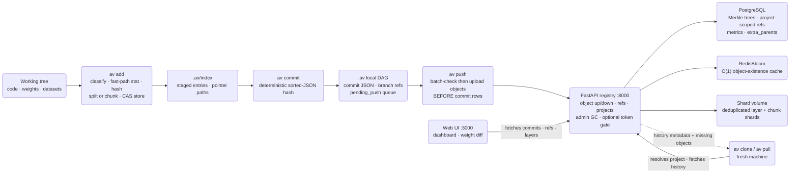
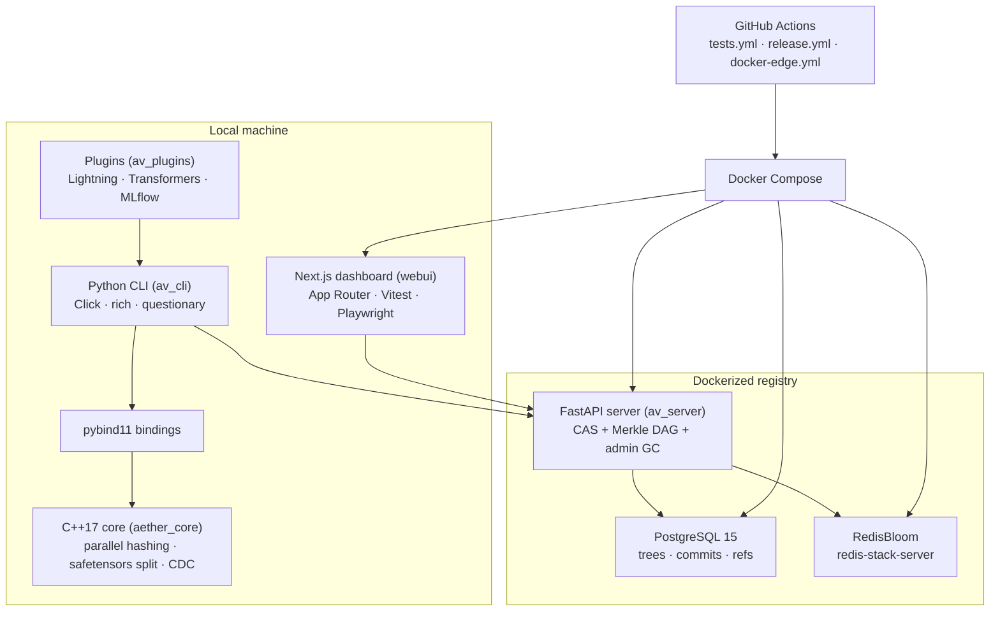

# Aether-Vault Architecture

Describes the system as it exists today — what each subsystem guarantees, the exact files and functions involved, and what remains open. When this document and the code disagree, the code wins and this file owes a patch. Operational tasks live in [infrastructure.md](infrastructure.md); build history lives in [CHANGELOG.md](CHANGELOG.md).

## Objective

Aether-Vault is Git-like, content-addressed version control plus a registry for machine-learning work: models, datasets, and code versioned together in one atomic commit. A commit is a single immutable snapshot of all three — the Holy Trinity — so a checkout reproduces an experiment's script, its weights, and its data pointers simultaneously, which is the reproducibility gap that bolting Git LFS or DVC onto a plain repo leaves open.

Throughput comes from a C++17 core (`src/core.cpp`, shipped as the `aether_core` extension) bound into Python via pybind11. The core hashes multi-gigabyte files in parallel across a thread pool, parses `.safetensors` into per-layer shards, and runs content-defined chunking over opaque checkpoints — work that dominates commit time and therefore belongs below the interpreter, not in it. Python owns everything users touch: the Click-based `av` CLI, the FastAPI registry server, and the framework plugins.

Storage is deduplicated by construction. Every artifact reduces to SHA-256-addressed objects in a local content-addressable store under `.av/objects/`, and every commit is a flat tree of `{rel_path: {hash, size, type, layers, chunks}}` entries referencing those objects. Identical layers across checkpoint epochs, identical chunks across fine-tune saves, and identical datasets across experiments store once — locally and on the registry alike.

The registry multiplies that property across machines: one Dockerized FastAPI service backed by PostgreSQL and RedisBloom serves any number of independent repositories, each carrying its own auto-generated `project_id`. Commits, branches, and metrics stay attributable per project even though the object store is deliberately shared and deduplicated across all of them — refs are namespaced `<project_id>/<branch>` precisely so two projects never see each other's history. A repo repoints at a different registry with `av config --remote-url`; the default remains `http://localhost:8000`.

## System Flow

One pass through the system, working tree to registry and back:

The loop closes: a teammate on a fresh machine runs `av clone <project>`, receives the full commit graph as cheap metadata plus the default branch's materialized files, and their own commits land back in the same project because the clone inherits the source `project_id`.

Two properties of this flow deserve emphasis. First, the expensive steps — hashing, splitting, chunking — all happen client-side against local disk, so the registry stays a thin coordinator: it verifies nothing cryptographically, it stores what content-addressing already proves. Second, the flow degrades gracefully in one direction only: everything up through the local DAG works with the registry switched off, and the registry-facing steps resume exactly where they left off thanks to the pending_push queue. There is no mode where a commit succeeds locally but corrupts remotely.

Reading order for a newcomer: Objective, then System Flow, then the Staging and Commit Contracts together (they form one pipeline), then Remote Sync and Merge (they form the collaboration layer), with the remaining contracts standing more independently.

## Tech Stack

The stack splits at the pybind11 boundary: everything left of it is compiled, everything right of it is interpreted. `Click` owns the command surface, `rich` owns terminal presentation, and `questionary` owns interactive prompts (`av init`'s mode selection, auth prompts). The webui talks to the registry directly from the browser — the CLI never proxies dashboard traffic.

CI mirrors the runtime split as five jobs in `.github/workflows/tests.yml`: the core suite on Windows, plugin tests with framework extras on Linux, webui Vitest units, server tests against live Postgres/Redis service containers, and a full webui-e2e job running Playwright against the real compose topology. A pull request that touches CLI, C++, server, and dashboard at once exercises all five.

## Module Map

- `python/av_cli/`: the `av` command surface and every local concern, split (v1.1.1 hardening) so no file is a monolith:
  - `main.py` — thin compat shell: cli group construction + registration order (= `av --help` order), the PEP 562 lazy `VaultClient`, and the two monkeypatch-target owners (`_find_source_root`, `_update_readme_test_badge`) plus re-exports of the historical namespace surface.
  - `core.py` — shared multi-consumer helpers: config/root/logging, staging (`stage_one_file`, avignore), CAS restore machinery (`materialize_file`, `_materialize_tree`, `_collect_dirty_paths`), pending-push trio, `upload_commit_objects`, `_finalize_commit`, meta/hash helpers.
  - command modules — `cmd_repo.py` (init/update), `cmd_staging.py` (config/add/file/unstage/status), `cmd_history.py` (commit/branch/checkout/log/stash/list-meta/push), `cmd_sync.py` (clone/pull/merge), `cmd_auth.py` (Protected-mode tokens + per-user add-user/list-users/remove-user), `cmd_maintenance.py` (doctor/gc), `cmd_devtools.py` (test/benchmark/badge), `cmd_integrations.py` (graph/handoff/webui/plugin imports).
  - feature modules — `index.py` (`Index`), `merge.py` (pure algorithms), `sync.py` (clone/pull primitives), `history.py` (log walking/rendering), `attributes.py` (`.avattributes` directives), `client.py` (`VaultClient`), `pointer.py`, `fsutil.py`, `handoff.py`, `repl.py`, `docker_runtime.py`, `update_check.py`, `speedcheck.py`, `signing.py` (ed25519 commit signatures, v1.2.2).
  - agent-facing command groups — `cmd_diff.py`, `cmd_context.py`, `cmd_run.py` (+ SDK), `cmd_env.py` (snapshot/replay incl. top-level `av replay` alias), `cmd_policy.py`, `cmd_watch.py`, `cmd_registry.py` (export/restore/keygen/attest/verify), `cmd_webhooks.py`, `cmd_audit.py` (v1.2.2 audit-trail query).
- `python/av_server/`: the FastAPI CAS registry — `server.py` (routes, GC, auth middleware, CORS, rate limiting), `models.py` (SQLAlchemy schema incl. `extra_parents`/`chunks`), `database.py` (Alembic runner), `migrations/` (versioned schema chain), `rate_limit.py` (fixed-window limiter), `redis_cache.py`, `storage.py` (`CASStorage`).
- `python/av_plugins/`: optional Lightning/Transformers/MLflow callbacks that drive the CLI in-process via `_shared.py`.
- `src/`: the C++17 performance core — `core.cpp` (safetensors split + CDC chunker + parallel hashing), `sha256.cpp`, `thread_pool.h`; bound as the `aether_core` pybind11 extension.
- `webui/`: Next.js App Router dashboard — sidebar tabs, Weight Diff, TokenGate, Vitest unit tests, Playwright E2E under `webui/e2e/`.
- `tests/`: roughly 330-test suite across 20 files — CLI, core bindings, server live-stack, sync, merge, plugins.
- `benchmarks/`: nine cross-tool benchmarks against Git LFS, DVC, and MLflow — one file per benchmark, plus `tool_runner.py` and `fixtures.py`.
- `scripts/`: checkout-local developer utilities, notably `scripts/check_eager_annotations.py`.
- `.github/workflows/`: CI (`tests.yml`, five test jobs), the tagged-release pipeline (`release.yml`), GHCR edge images (`docker-edge.yml`).
- `development/`: phase-by-phase [CHANGELOG.md](CHANGELOG.md), the [Probleme.md](Probleme.md) audit log, captured benchmarks, these documents.

## Staging Contract

Staging turns arbitrary working-tree files into content-addressed objects plus index entries. One function owns the whole decision chain — `python/av_cli/core.py::stage_one_file()` — and `av add`'s per-file loop is just iteration around it. The same function is reused verbatim by `av stash push`, so shelving never reimplements staging logic.

Classification happens first, via `python/av_cli/index.py::Index.classify_file()`: a fixed extension whitelist (`.py`, `.json`, `.yaml`, `.yml`, `.toml`, `.cfg`, `.md`, `.txt`) yields `code`; anything else is an `artifact`. Type only affects pointer-file behavior and lineage reporting — both types live in the same CAS.

The cheap short-circuit comes before any hashing: when the recorded size and mtime match the file's current stat, staging returns immediately. `python/av_cli/core.py::compare_meta_safe()` backs this, and repeated `av add .` runs on an unchanged tree cost no I/O beyond stat calls. An unstage operation deliberately writes `mtime_ns=0`, which never matches a real stat, so unstaged-but-committed files correctly report as modified again.

Artifacts above the LFS threshold — default 50 MB via the `lfs_threshold_mb` config key, changed with `av config <N>` — get structure-aware storage, in priority order:

1. **Layer split** — `.safetensors` files go through `aether_core.split_and_hash_safetensors`, producing one shard per tensor layer plus an `__header__` pseudo-layer holding the header bytes, so unchanged layers dedup across checkpoint epochs and single layers can be fetched alone.
2. **CDC chunking** — files matching the `CHUNKABLE_EXTS` set go through `aether_core.chunk_and_hash_file`: gear-hash rolling cut points with min 512 KB, avg 2 MB, max 8 MB. The max is a soft cap of `max + min − 1` because a cut is only taken when at least `min_chunk` bytes remain after it — the tail never becomes a sliver. `CHUNKABLE_EXTS` (v1.2.5, broadened from 8 to 15): `.pt .pth .ckpt .npz .h5 .hdf5 .pb .msgpack .bin .onnx .model .arrow .feather .pkl .pickle` — uncompressed/block-structured formats where a local edit only shifts nearby chunks. Compressed/columnar containers (`.parquet`, `.zip`/`.gz`/`.tar`/`.7z`) are deliberately excluded by default — an edit there usually rewrites the whole compressed stream, so CDC boundaries wouldn't survive it — but are reachable per-glob via the `chunk` `.avattributes` flag when a repo owner has verified their export path is safe.
3. **Whole-file blob** — anything that did not split or chunk stores as one object.

Per-path overrides come from `.avattributes`, parsed by `python/av_cli/attributes.py::flags_for()` with fnmatch globs and last-match-wins semantics: `no-chunk` forces a file down the whole-file path, `chunk` (v1.2.5) force-enables CDC for a glob outside `CHUNKABLE_EXTS` (`no-chunk` wins when both are on the same matching line), `no-layer-split` keeps a safetensors file unsplit. Both splits fall back to whole-file on any exception rather than failing the stage.

Determinism is a dedup invariant, not a nicety: the gear table in `src/core.cpp` is generated from splitmix64 with a fixed seed, so identical bytes produce identical chunk boundaries — and therefore identical chunk hashes — on every machine and every version. A nondeterministic chunker would silently break cross-version dedup and make pushed histories unreconstructable.

Threshold-crossing artifacts additionally get a pointer file written into the working tree — `<path>.av-pointer`, generated by `python/av_cli/pointer.py::create_pointer()` in a versioned `version aether-vault-pointer v1` text format carrying the hash and original size — so repositories stay browsable while payloads live in `.av/objects/`.

| Strategy | Trigger | Stored objects | Whole-file blob? |
|---|---|---|---|
| Whole-file | Code type, or artifact at/below threshold, or override flags | One object under `.av/objects/<hash[:2]>/<hash[2:]>/` | Yes |
| Layer split | `.safetensors` above threshold without `no-layer-split` | Per-layer shards plus `__header__` shard | No |
| CDC chunks | `.pt`/`.pth`/`.ckpt` above threshold without `no-chunk` | Gear-hash-delimited chunks, 512 KB min / 2 MB avg / 8 MB soft max | No |

Directory staging via `av add .` skips anything matching `.avignore` (gitignore-style, one glob per line; scaffolded by `av file --avignore`) and already-existing `.av-pointer` files are never re-staged as content. Every staging decision is observable: `av status` reports staged, modified, deleted, and untracked paths from the same index entries `stage_one_file()` writes. When pointers drift out of sync with their objects — interrupted runs, manual deletes — `av doctor --fix` re-links orphaned `.av-pointer` files, downloading from the registry when the object exists only there, and anything unrecoverable surfaces as a `[WARN]` rather than being fabricated.

| Situation | Behavior |
|---|---|
| Content unchanged since last stage (size + mtime match) | No-op — no hash, no copy |
| Code file | Whole-file blob, no pointer |
| Artifact below threshold | Whole-file blob, no pointer |
| Artifact above threshold, split/chunk succeeds | Shards + pointer file replaces working-tree path in the index's view |
| Split/chunk raises | Logged warning, whole-file fallback |
| Native core unavailable | Whole-file fallback for thresholded artifacts too — staging never hard-fails on a missing extension |

**Stop:** benchmark #4 shows no-op `av status`/`av add` around 15x slower than Git LFS — interpreter startup and import cost dominate. Open finding, documented in `development/BENCHMARKS.md`, not hidden.

## Commit Contract

A commit records the staged snapshot into the local DAG. The tree is flat — `{rel_path: {hash, size, type, layers, chunks}}` — with no directory nesting to reconstruct; absence of a path means the file was deleted relative to the parent.

The commit hash is deterministic: SHA-256 over sorted JSON of the payload, and the payload includes `project_id`. That inclusion is deliberate collision safety — two different projects committing byte-identical trees still produce distinct hashes, so histories can never alias each other on a shared registry. Sorted keys mean the same logical commit hashes identically regardless of dict insertion order.

Parents resolve from the HEAD ref at commit time. Persistence is atomic in a specific order: the commit JSON lands in `.av/commits/` first (temp file plus replace, via `python/av_cli/fsutil.py::atomic_write_json()`), and only then does the branch ref move. A crash between the two steps leaves an orphaned commit object — recoverable, garbage — never a ref pointing at nothing.

Creation has exactly one path: `python/av_cli/core.py::_finalize_commit()` handles hash computation, persist, ref advance, and remote push-or-queue for both plain `av commit` and successful `av merge`. There is no second writer, which is why merges inherit offline resilience for free. Commits optionally carry ML metadata in the same payload — `--tag` labels and `--metric key=value` pairs — so metrics ride the commit rather than a side channel.

Push ordering is a hard rule enforced inside `_finalize_commit()`: `python/av_cli/core.py::upload_commit_objects()` first batch-checks which objects the server already has (one `POST /sync/batch-objects` round trip via `python/av_cli/client.py::VaultClient.batch_check_objects()`) and uploads only the missing ones through an 8-worker pool, and only then does `VaultClient.push_commit()` send the commit row. Order matters because server tree rows reference object hashes — a commit arriving before its objects would be a dangling snapshot.

Unreachability never loses a commit. When the registry is unreachable, the commit stays local and enters the `.av/pending_push` queue (`python/av_cli/core.py::queue_pending_push()`); `av push` and every subsequent commit retry it via `flush_pending_push()`.

Server-side, `push_commit()` defends itself against hostile or oversized payloads with early request-size guards in `python/av_server/server.py` — caps on tree entries (100,000), metrics (1,000), tags (200), message length (20,000), and tag length (200) — and ref names pass a strict regex (`validate_ref_name()`) because refs become filesystem paths in the storage fallback; traversal attempts like `..` components are rejected at the door.

| Commit-time outcome | Result |
|---|---|
| Registry reachable | Objects uploaded, commit row pushed, ref advanced remotely |
| Registry unreachable | Commit persisted locally, queued in `.av/pending_push`, user informed |
| 401 from a Protected registry | Identical to unreachability — queued, retried after `av auth set-token` |
| Nothing staged or nothing changed | No commit created; reports nothing to commit instead of an empty duplicate |

**Stop:** `AuthenticationError` is treated exactly like unreachability — queued and retried, never dropped. A wrong or missing token must never convert a finished local commit into a lost one; the user fixes auth with `av auth set-token` and the queue drains afterward.

## Remote Sync Contract

Sync is the team surface: clone brings a project to a fresh machine, pull moves an existing one forward, and both are built on the same primitives in `python/av_cli/sync.py`.

Clone resolves its target against `/api/projects` in three passes — exact `project_id`, exact `project_name`, then unique name prefix — implemented in `python/av_cli/sync.py::resolve_project()`. Ambiguity is an error listing the candidates; no match lists what IS available, so a typo'd clone tells you what exists.

| Resolution pass | Match condition | Failure mode |
|---|---|---|
| Exact id | `project_id` equals the argument verbatim | Falls through to name passes |
| Exact name | One `project_name` equals the argument | Multiple matches → ambiguity error |
| Unique prefix | One project name startswith the argument | Zero matches → lists every known project |

History arrives as paginated `/api/commits?include_layers=true` batches (500 per page, `fetch_project_commits()`), fully resolved trees included, which makes clones offline-self-sufficient: `av log`, `av handoff`, and metadata-level inspection all work with the registry switched off. Only the default branch's tip materializes objects initially — chosen by `pick_default_branch()` as main, then master, then alphabetically first, deterministic when a project has no conventional default — and older versions lazy-download on first checkout via `ensure_objects_local()`, which batch-checks the whole tree in one round trip and downloads only genuinely missing shards.

Cloned repositories inherit the source project's `project_id`. This is what makes collaboration converge: pushes from either copy attribute to one project on the registry, and refs stay namespaced `<project_id>/<branch>`.

Pull is deliberately fast-forward-only. The walk in `av pull` follows the remote chain from its tip, storing every new commit locally as it goes (`write_fetched_commit()`), and fast-forwarding is permitted only when the local tip is a strict ancestor of the remote tip — checked by `python/av_cli/sync.py::is_ancestor()`, which walks parent chains and follows every parent edge, so it is merge-aware. Joining the walked chain somewhere below the local tip is explicitly not enough; a repo with unpushed local commits would otherwise have them silently overwritten.

| Pull situation | Behavior |
|---|---|
| Remote tip equals local tip | Already up to date — no-op |
| Local branch has no commits yet | Fast-forward onto the remote tip |
| Local tip is a strict ancestor of remote tip | Fast-forward, after the dirty-tree guard |
| Histories diverged | Fetched commits stored locally; prints the exact resolution `av merge <remote-tip>` |
| HEAD detached | Refuses — check out a branch before pulling |
| Referenced remote commit missing | Errors naming the missing hash rather than materializing a partial history |

Divergence is not an error state — it is a handoff. The fetched commits stay on disk and the command prints the exact resolution: `av merge <remote-tip>`.

Both commands refuse to run over a dirty working tree, guarded by `python/av_cli/core.py::_collect_dirty_paths()`, unless `--force` is passed; `av stash` is the non-destructive alternative.

**Stop:** pull walks `parents[0]` for chain-following after normalization reconstructs the full parents array — first-parent traversal. Sufficient for fast-forward detection today but worth revisiting if criss-cross merge topologies become common.

## Merge Contract

Merge semantics are pure algorithms with I/O kept out, living entirely in `python/av_cli/merge.py` — unit-testable in isolation by `tests/test_merge.py` and reusable by any future UI that wants merge preview.

The merge base comes from `find_merge_base()`: a two-phase walk that collects ALL of ours' ancestors into a set (stack DFS), then BFS theirs' ancestors in generation order — the first node present in ours' set is the nearest common ancestor. Every parent edge is followed, not just `parents[0]`, so it is correct on histories that already contain merges.

Tree merging is `three_way_tree_merge()` over the flat trees, per path:

| Base vs ours vs theirs | Outcome |
|---|---|
| ours == theirs | Take it (both agree, including both deleted) |
| base == ours | Theirs changed it — take theirs (add, change, or delete) |
| base == theirs | Ours changed it — keep ours |
| otherwise | Both changed differently — CONFLICT |

Entries compare by FULL dict equality, so a layer re-split that leaves content identical still reads as unchanged. Absence counts as deletion on that side. Conflicts belong to the caller: `av merge` aborts before touching anything unless `--ours` or `--theirs` resolves it. Content-level line merging is intentionally out of scope — versioned payloads are binary artifacts, and an honest abort beats a corrupt merge.

A successful non-fast-forward merge creates a real two-parent commit through the same `_finalize_commit()` path as ordinary commits; `--no-ff` forces that shape even when a fast-forward would do. The wire format is asymmetric by schema evolution, not by design taste: the server stores `parents[0]` in `parent_hash` and the remainder in `extra_parents` as JSON (`python/av_server/models.py::DBCommit.extra_parents`), and read endpoints reconstruct the full parents array via `python/av_server/server.py::_full_parents()` — so clients always see a complete `parents` list.

**Resolved:** the webui commit graph used to render `parent_hash` only, making merge commits appear linear. It now draws one edge per parent from the reconstructed `parents` array (lane inheritance follows the first parent), so merges fork on screen; see `webui/src/components/CommitGraph.tsx::buildGraph`.

## Restore Contract

Every working-tree write funnels through one function: `python/av_cli/main.py::_materialize_tree()`. Checkout, clone, pull, and merge all call it; none of them maintain a second materialization path. It writes the target tree's files (downloading missing objects from the registry when only the remote has them), removes files present in the old tree but absent from the target one, and re-stats after materializing so the index reflects fresh mtimes — meaning `av status` reads clean right after a switch instead of reporting phantom modifications.

| Caller | Tree it hands to `_materialize_tree()` |
|---|---|
| `av checkout` | The target branch tip's or resolved commit's tree |
| `av clone` | The default branch tip's tree, into a fresh repository |
| `av pull` | The remote tip's tree, post-fast-forward |
| `av merge` | The merged tree computed by `three_way_tree_merge()` |

Checkout accepts branch names, full commit hashes, or unique hash prefixes (the 7-character short form `av commit` prints); an ambiguous prefix is rejected with a request for more characters rather than guessed at. The dirty-tree guard from the Remote Sync Contract applies here identically — checkout refuses to overwrite uncommitted changes unless `--force` discards them, with `av stash` as the non-destructive route.

Legacy tolerance exists on the read side only: older commits shaped `{"code": {...}, "artifacts": {...}}` are normalized into the flat form when loaded, so pre-flat-format repositories keep checking out. New writes are always flat; the legacy branch exists so old data stays readable, not to preserve two writers.

## Garbage Collection Contract

Registry-side GC is mark-and-sweep over Merkle trees, triggered by `POST /api/admin/gc` — normally via `av gc` — and implemented in `python/av_server/server.py::run_garbage_collection()`.

| Phase | What happens |
|---|---|
| Mark | Load all `DBTree` rows once; traverse from every commit's root tree in memory, collecting object, layer, AND chunk hashes as alive |
| Sweep DB | Delete unreferenced `DBObject` rows (grace-period protected) then dead tree rows, batched at 500 |
| Sweep files | Purge orphaned shard files off the event loop, comparing `st_mtime` against the grace cutoff |
| Rebuild | Recreate the RedisBloom filter from surviving hashes |

Marking loads all `DBTree` rows once and traverses in memory (`_collect_alive_in_memory()`), avoiding the N+1-per-tree-node pattern the first implementation had. The alive set includes each entry's `object_hash` AND every layer hash AND every chunk hash — chunk shards are objects exactly like layer shards, and missing them would reap pieces a chunked checkpoint needs to reassemble.

Sweeping respects a grace period: `GC_GRACE_SECONDS = 3600` protects objects younger than one hour even when unreferenced, closing the race where a client uploads shards first and the commit row lands second — without the grace window, a GC running inside that gap deletes live in-flight objects. Deletes batch at `_GC_DELETE_BATCH = 500` rows to stay well under asyncpg's bind-parameter ceiling. Physical shard files sweep off the event loop, and the bloom filter rebuilds from surviving hashes at the end.

GC is manual by design — there is no background sweeper. Operators trigger it via `av gc` after large deletions or abandoned pushes; operational cadence guidance lives in [infrastructure.md](infrastructure.md).

**Verified:** the grace-period epoch math pins `tzinfo=utc` before calling `.timestamp()` — naive-datetime timestamps interpret host-local time and either never sweep or sweep early depending on the host's UTC offset. The comment block in `run_garbage_collection()` preserves that failure history deliberately.

## Auth Token Contract

Protected mode is optional and off by default: unset `AV_API_TOKEN` AND `AV_AUTH_USERS` means every route behaves anonymously. Both credential sources read once at process start (`python/av_server/server.py`, module level) because every `av auth ...` command writes `.env` and restarts the service — a fresh process always picks changes up, so per-request reads buy nothing.

Two credential sources, one middleware:

- `AV_API_TOKEN` — the owner's shared secret (the original single-key mode, unchanged). Resolves to the identity `owner`.
- `AV_AUTH_USERS` — JSON map `{username: token}` of per-user tokens (`av auth add-user/list-users/remove-user`). Invalid JSON fails startup loudly rather than silently looking like Anonymous mode. Each entry resolves to its username.

The single `require_token` middleware resolves Bearer tokens through both sources with `secrets.compare_digest` (owner checked first), stores the resolved username on `request.state.username`, and exempts exactly five paths:

| Exempt path | Why it stays open |
|---|---|
| `/api/health` | Docker healthchecks and the CLI's reachability probes depend on credential-free checks — gating it would make a freshly-protected server look permanently down to the very code restarting it. Liveness only: DB-free, always green, and (a pre-existing, now-fixed staleness) reports the real installed package version instead of a hardcoded string. |
| `/api/ready` (v1.2.5) | Readiness, not liveness — checks DB connectivity, Redis, and `AV_DATA_DIR` writability, returning 503 with per-check detail on failure. Same auth-exemption rationale as `/api/health` (compose healthchecks and restart logic must reach it credential-free), but it is allowed to go red when the container is genuinely unusable — that's the whole point of separating it from `/api/health`, which never does. |
| `/docs` | Swagger/ReDoc cannot attach the custom Bearer header; they expose API shape, not data |
| `/openapi.json` | Same rationale as `/docs` |
| `/redoc` | Same rationale as `/docs` |

Everything else — reads included — requires a valid credential once Protected mode is on.

**Author attribution:** `push_commit` stamps `request.state.username` as the commit author whenever the client sent the default `anonymous` author; an explicit client-set author (`AV_AUTHOR`) is never overwritten — scripts own their attribution. Anonymous mode has no identity, so authors pass through verbatim.

Client side: `python/av_cli/client.py::VaultClient` raises `AuthenticationError` on any 401; the CLI catches it centrally (the custom `_AuthRetryGroup`), prompts interactively, saves, and asks for a re-run — or queues the work when it can. Per-user tokens ride the exact same client path (`av auth set-token <personal-token>` in a teammate's repo). The webui wraps everything in `TokenGate`, which accepts a one-time `?av_token=` query parameter appended by `av webui`, saves it to localStorage, and strips it from the URL immediately on mount.

## Transport Hardening Contract

Two middleware layers harden the transport; both are env-configurable and default to safe values.

**CORS** is locked to the webui's origin by default (`AV_CORS_ORIGINS`, comma-separated; `*` reopens everything explicitly for genuinely open deployments). The historical `allow_origins=["*"]` let any page a developer visited fire requests at a reachable registry — drive-by GC/uploads.

**Rate limiting** (`python/av_server/rate_limit.py`) is a fixed-window counter keyed per client-host and bucket class, with an injectable clock so tests never sleep:

| Bucket | Default | Rationale |
|---|---|---|
| `gc` (`POST /api/admin/gc`) | `10/minute` (`AV_RATE_LIMIT_GC`) | Destructive, historically unguarded, anonymous-by-default — the one endpoint a hard cap must always protect |
| `default` (all other `/api/*`) | disabled (`AV_RATE_LIMIT_DEFAULT`) | Legitimate clients burst — 8-worker object uploads, thousand-file commits; fixed caps would false-positive. Operators opt in per deployment |

Exemptions mirror auth exactly (health + docs routes). Responses are `429` JSON with a `Retry-After` header. The check-and-increment is synchronous with no awaits inside, so it is atomic under asyncio interleaving without locks.

**Verified:** unit tests cover parse/allow/deny/rollover/per-key isolation with a fake clock (`tests/test_rate_limit.py`, no server needed); live assertions prove the GC 429 burst-block, data-plane pass-through, and CORS origin lock (`tests/test_server.py`, Docker-stack skip pattern).

## Web UI Contract

The dashboard is a Next.js App Router application under `webui/src/app`, talking straight to the registry API. The API base URL bakes in at build time via the `NEXT_PUBLIC_API_URL` argument (the compose file passes `http://localhost:8000`), so a registry behind a proxy needs a rebuild, not just a config change. Sidebar tabs: Dashboard, Commits, Branches, Metrics, Storage, Weight Diff, Projects. Project selection persists in localStorage and scopes every panel.

Panel responsibilities, each backed by the same `/api` surface the CLI uses:

- **Dashboard** — stats bar, SVG commit DAG, branch/metrics/commit-log teasers at a glance.
- **Commits** — paginated, searchable log with click-to-expand rows showing the full file tree and an added/removed/changed diff vs the parent commit.
- **Branches** — full tip details, commits-ahead-of-main counts, expand-to-branch-rows, and a branch-from-here action.
- **Metrics** — per-metric show/hide chart plus a commit-by-metric table and single-branch comparison.
- **Storage** — store-wide object/size stats, file-type breakdown, largest tracked files, approximate dedup ratio from the latest snapshot.

Weight Diff is the distinctive panel: a client-side per-layer heatmap built from `include_layers` commit data (logic in `webui/src/lib/diffWeights.ts`), with the `__header__` pseudo-layer filtered out since headers are metadata rather than weights. Two checkpoints drag into comparison slots; drift charts ride alongside. Because diffing happens client-side from already-fetched layer manifests, no server-side diff endpoint exists to maintain.

Auth surfaces through `TokenGate` (one-time `?av_token=` handoff, described in Auth Token Contract). Polling cadence defaults to 15 seconds via `webui/src/hooks/useDashboard.ts::useDashboard()` — live enough to feel current during training runs, cheap enough to leave open.

**Note (updated v1.2.2):** the WEBUI commit graph now draws one edge per parent (see the Merge Contract's resolved note). The Runs tab gained an expandable detail view: parent-lineage chain, linked commits with messages and a metrics table, and a semantic summary composed client-side from the last two linked commits' trees (`webui/src/lib/runDetail.ts` — deliberately no new server endpoint). The `av graph` OBSIDIAN export still walks `parent_hash` only, so merge diamonds render linear in generated vaults — tracked limitation, low priority because Obsidian's own graph view is the primary consumption surface there.

## Plugin Contract

Optional framework callbacks — Lightning, Transformers, MLflow — auto-stage and auto-commit checkpoints during training. Heavyweight frameworks import lazily inside their plugin modules, so installing `aether-vault` never pays for torch unless a callback actually runs.

| Module | Framework | Surface |
|---|---|---|
| `python/av_plugins/lightning.py` | PyTorch Lightning | Live `Trainer` callback + `import_checkpoint` backfill |
| `python/av_plugins/transformers.py` | HuggingFace Transformers | Live `TrainerCallback` + `import_checkpoint` backfill |
| `python/av_plugins/mlflow.py` | MLflow | `import_run` backfill (requires the `[mlflow]` extra) |
| `python/av_plugins/_shared.py` | all | The in-process CLI bridge every plugin routes through |

Plugins drive add/commit through the INTERNAL SEAM since v1.2.2: `_shared.py::commit_scoped()`
delegates to `core.commit_scoped_paths()` — the same function agent tooling uses — which
stages via `stage_one_file` directly (no chdir, no CLI invocation) and funnels into
`commit_staged` → `_finalize_commit`. Scoped-commit semantics are unchanged: isolation
without destroying the change-detection baseline (#38/#71), missing-path tolerance (#76),
AV_RUN_ID flow via `core.resolve_run_id()` (v1.2.5: explicit > `AV_RUN_ID` env >
`.av/run.json` state — the one precedence rule shared with `av commit`/`av watch`; before
this, three call sites silently disagreed, and `av watch`'s auto-commits weren't tagged
under the active run at all). Training-end flush is `_shared.push_pending()` (v1.2.5,
delegates to `core.flush_pending_push()` directly) — as of v1.2.5 no plugin has any
remaining chdir or in-process CLI invocation; `run_av()`/`build_metric_args()` are
deprecated shims kept one release for external callers.

**Scoped commits (v1.1.9, seam v1.2.2):** every plugin add+commit pair (callbacks AND import backfills) runs through the scoping seam, which isolates one commit without destroying the change-detection baseline: staging runs against the untouched index, the scope is computed as exactly what that staging touched (new keys, changed content, staged transitions), committed through the real single code path, and everything else merges back with its staged flag untouched — an import or checkpoint commit therefore never sweeps unrelated human-staged files into its tree (Probleme.md #38), and unchanged re-imports stay "Nothing to commit" no-ops (Probleme.md #71). Plain `av commit` keeps full-snapshot semantics; only machine-driven plugin events are scoped.

Callbacks commit with the current step or epoch as the message, attach numeric training metrics as first-class metrics, and flush a final `av push` when training ends — so an interrupted run still leaves every intermediate checkpoint committed and queued. `dataset_paths` stages once at training start, tagged `dataset`, because there is no reliable way to auto-detect a dataset's on-disk path from a generic `Dataset`/`DataLoader` object; opt-in beats wrong-guess.

Backfill runs through matching import paths, each available as both a Python function and a CLI command: `av import-lightning`, `av import-transformers`, `av import-mlflow`. Imports read metrics found alongside the checkpoint (Lightning's `callback_metrics`, Transformers' `trainer_state.json` log history, MLflow's own run metrics), tag commits `lightning-import` / `transformers-import` / `mlflow-import`, and re-importing unchanged content is a no-op.

## Release Contract

Versions come from setuptools-scm reading git tags — no version string is hand-maintained. Tagging `vX.Y.Z` and pushing the tag fires `.github/workflows/release.yml` (which also supports manual `workflow_dispatch` for dry runs):

1. `cibuildwheel` builds wheels for cp310–cp314 across Windows/Linux/macOS, plus an sdist job.
2. PyPI publishes via trusted publishing — OIDC, `environment: pypi`, no long-lived token.
3. A GitHub Release appears with auto-generated notes and every wheel/sdist attached; curated long-form notes link back to [CHANGELOG.md](CHANGELOG.md).
4. GHCR receives ONE consolidated **engine image** (`ghcr.io/leon1706-lol/aether-vault-engine`) tagged `:latest` + the version tag. Since v1.2.2 the image is multi-stage (py-builder → Node 20 web-builder → runtime with BOTH Python and Node) and runs ALL subservices in ONE container dispatched by `AV_ENGINE_ROLE` (`all` | `server` | `webui`, supervised by `docker/engine-entrypoint.sh`). For one transition cycle the SAME image is also pushed under the historical `aether-vault-server`/`aether-vault-webui` names; the entrypoint auto-detects the legacy per-service role from container env (`DATABASE_URL` set → server-only; `NEXT_PUBLIC_API_URL` without it → webui-only), so pre-1.2.2 pinned compose files keep working unchanged. **The aliases are deprecated now and are removed in the next release** — pinned installs should move to the engine name.

Installed users pick releases up through `av update`; opted-in silent auto-update re-checks at process exit. `av update --docker` is the separate, opt-in path for the local backend images — restarting a running container is disruptive, so it never rides along with a plain version check; it pulls only the canonical engine image. `docker-edge.yml` pushes `:edge` engine images (+ aliases) on pushes to `master` touching code paths, between tagged releases.

Semver and deprecation policy live in [`../VERSIONING.md`](../VERSIONING.md): MAJOR breaks the CLI, `.av/` format, or API surface; MINOR is additive including new optional response fields; PATCH is safe. Deprecations get at least one full MINOR grace window and never vanish inside a PATCH; database schema changes are owned by Alembic migrations applied automatically at server startup.

**Resolved:** `docker-edge.yml` used to trigger on `main`, but this repo's default branch has always been `master` — so edge images never fired. Reconciled to `[master]` in the v1.1.8 cycle; `:edge` now tracks every code-path push.

**Resolved:** wheels shipped cp310–cp314 since Phase 46 (cibuildwheel matrix), matching the dev environment's Python 3.14.

**Resolved:** the two-image split topology (separate `aether-vault-server` and `aether-vault-webui` containers) was consolidated into the single engine image/container in v1.2.2 — see above for the alias transition contract.

## Runs Contract (v1.2.0)

A Run is the first-class grouping for one training effort. Storage: `runs` +
`run_commits` (migration `0002`). Creation is idempotent by client-generated UUID;
pushes referencing an UNKNOWN run lazily create it in `created` state — ordering between
agents never fails a push. `metrics_summary` keeps the latest value per metric, refreshed
on every linked commit. Client surface: `av run start/finish/list/show`, `AV_RUN_ID`,
SDK `repo.runs`. Commits auto-tag `run:<id>` (tags remain part of the hashed payload).

## Events & Webhooks Contract (v1.2.0, delivery ledger v1.2.2)

`events` is append-only; the autoincrement id IS the resumable cursor
(`GET /api/events?since=<id>&project_id=&kinds=&wait=<secs>`, ascending, bounded limit).
Kinds today: commit · ref · run · gc · webhook_test. Webhooks POST the raw JSON body with
`X-AV-Event-Id/-Kind/X-AV-Signature: hex(hmac-sha256(secret, body))`; secrets live in the
registry (signing requirement) and are never returned (masked listings only). Zero active hooks ⇒
zero background work. Retention: `AV_EVENT_RETENTION_DAYS` (default 30) swept during GC,
plus manual `DELETE /api/events?before_days=N`.

**Webhook delivery ledger (v1.2.2, migration `0003`):** every fan-out attempt persists a
`webhook_deliveries` row BEFORE its POST (`pending`) and updates it after
(`delivered`/`failed`); failed rows carry `next_retry_at` and are re-driven by the server's
startup+interval retry worker until `AV_WEBHOOK_MAX_ATTEMPTS` (default 5) exhausts into
`dead`. Rows snapshot the event's kind/payload/project so retries reconstruct the
byte-identical signed body even after the source event is retention-swept; rows ride the
mutation's own transaction so rolled-back mutations leave no phantom records.
Observability: `GET /api/admin/webhook-deliveries?status&webhook_id&limit&offset`.

## Signed Commits Contract (v1.2.2)

Optional per-repo ed25519 signing ("tamper evidence, not a trust network" — see SECURITY.md).
`av registry keygen` generates `.av/keys/signing.pem` (0600) + `.pub` via the `[sign]`
extra; when a key exists, `_finalize_commit` auto-signs AFTER hash computation: canonical
bytes = sorted-keys JSON of the payload minus `signature`, with the timestamp normalized to
one UTC rendering (naive/aware/Z spellings of the same instant MUST verify identically —
the registry echoes naive UTC). The signature blob `{algo, public_key, sig}` rides commits
verbatim, persists in `commits.signature` (0003), and survives clone/pull so `av verify
<hash>` works on any copy: signature-first, legacy HMAC attest-tag fallback, honest UNSIGNED
verdict (exit 0 — unsigned commits are valid). Signing never blocks or fails a commit.

**Key management (v1.2.5):** `av registry keys list/fingerprint/rotate` — fingerprint is
`sha256(raw pubkey)[:16 hex]` in `xxxx:xxxx:xxxx:xxxx` form (golden-fixture tested). Rotate
archives the current keypair under `.av/keys/archive/<fingerprint>/` (never deletes it —
old commits keep verifying via their embedded public key) and generates a fresh active
key. `av registry export-signature <hash> [--out FILE]` produces a standalone,
portable signature record (adds `canonical_sha256` + `fingerprint`) for
`av registry verify <hash> --signature FILE` — detached verification needs only the
commit content and the record, no local config or registry access.

## Env Snapshot Contract (v1.2.2, `snapshot_version: 2` v1.2.5)

A snapshot's id IS `sha256(canonical bytes)`. Since v1.2.5 (`snapshot_version: 2`),
canonical bytes = compact sorted-keys JSON of ONLY `{snapshot_version, env}` — `env`
holds reproducibility-relevant identity (python, os family, curated pins, seeds, CUDA
*toolkit* version, a configurable critical-env-var set); machine-specific `observed`
context (GPU model, driver version, hostname, conda env name, interpreter path,
`captured_at`) is captured but deliberately excluded from the hash, so two equivalent
environments on DIFFERENT machines/OSes produce the SAME id (the golden cross-machine
fixtures in `tests/test_env_snapshot.py`, run across every CI matrix leg, are the
determinism proof). Top-level flat fields (`python`, `pins`, `seeds`,
`cuda_visible_devices`) are kept for backward compatibility with every existing reader.
Legacy (no `snapshot_version`) snapshots hash exactly as before (whole dict minus
`captured_at`) — ids are only comparable within one `snapshot_version`.

Snapshots upload through the NORMAL object flow at push; commits carry
`env_snapshot_id` in the hashed payload; the server persists it on commits AND back-fills
linked runs on first link (first-link wins). Readers: `av env replay [target]` /
top-level `av replay <run-id|commit-hash|snapshot-id>` resolve from local CAS or registry;
`.avh.replay.snapshot_id` carries the pointer into agent context memory. `av env replay`
flags (v1.2.5): `--validate` resolves every pin via `pip install --dry-run` without
installing (exit 15 on any unresolvable pin); `--execute` now always uses
`sys.executable -m pip` (previously a bare `pip` string, which could silently resolve to
the wrong interpreter) and accepts `--target-venv PATH` (create-if-absent) or
`--conda-env NAME`; `--dockerfile` renders a multi-stage, non-root Dockerfile and accepts
`--cuda TAG` (nvidia/cuda base) and `--out FILE`.

## Audit Trail Contract (v1.2.2)

Every mutating API call writes `audit_log(username, action, project_id, details,
status_code)` — the status code captures the HTTP outcome ("did it land?"), not just the
attempt. Read surface: `GET /api/admin/audit?action&project_id&since&until&limit&offset`
(invalid timestamps → 422), CLI `av audit list`. Retention: `AV_AUDIT_RETENTION_DAYS`
(default 90) swept during GC plus manual prune endpoint.

## Semantic Diff Contract (v1.2.0, dedup_efficiency v1.2.2, chunks.status v1.2.5)

`python/av_cli/semdiff.py::diff_trees(old_tree, new_tree)` is pure: added/removed/changed,
per-model layer movement (count/pct/largest movers), chunk reuse ratio across CDC-chunked
files (+ `chunks.dedup_efficiency` = reused/(reused+new), None when no chunks — flows into
`.avh.semantic_summary`; `chunks.status` (v1.2.5) is a sibling field ALWAYS present as
`"measured"`/`"no_chunks"`, so consumers get a stable field to branch on without a
null-check on the float — `None` stays meaningful as "no signal", not "0%"), dataset
classification (extension+name heuristics), byte totals, and a one-sentence human
summary. Consumers: `av diff`, `.avh.semantic_summary`, WebUI expanded commits and the
v1.2.2 run-detail panel (client-side re-composition in `webui/src/lib/runDetail.ts`). The
dict shape is additive-only by policy.

## .avh v2 — Agent Context Memory Contract (v1.2.0)

`handoff.avh` carries `$schema` + `avh_version:"2.0"`, legacy v1 keys (never removed),
and: `lineage{run_id,parent_run_ids,code_pointer{git_remote,git_sha,dirty}}`,
`semantic_summary`, `replay{pins,seeds,cuda,commands,snapshot_id}`, and
`context_memory{notes[],metrics_history_tail[]}` — notes are APPEND-ONLY in
`.av/context/memory.jsonl` (`av context note`) and survive every regeneration.
Readers must tolerate unknown sections; writers must run `validate_handoff()` in CI paths.

## Promotion Policy Contract (v1.2.0, `require_signature` v1.2.5)

Policies live in `.av/policies.json`: `{branch: {metric, op∈{<,<=,>,>=},
baseline_ref|threshold, require_signature}}` — `require_signature` (v1.2.5, additive) is
usable standalone (no `metric` required) as a pure signature gate, checked BEFORE any
metric comparison so a denial reports "unsigned", not a misleading metric mismatch.
Enforcement points: `av merge` (current branch armed → deny, exit 16, unless --force) and
`av promote CANDIDATE --into BRANCH` (authoritative eval — merge-side check intentionally
bypassed there to avoid comparing the baseline against itself). Enforcement is
CLIENT-SIDE v1; server-side authz is enterprise-tier.

## Testing And Verification Map

| Surface | Test file(s) | Notes |
|---|---|---|
| CLI behaviors | `tests/test_cli.py`, `tests/test_cli_commands.py` | Command-level behavior incl. staging/commit flows |
| Clone/pull sync | `tests/test_sync.py` | End-to-end against an in-process fake registry (`FakeRemoteClient` serving reads from a live source repo) |
| Merge | `tests/test_merge.py` | Pure algorithm tests plus CLI-level merge behavior |
| C++ bindings | `tests/test_core.py` | `aether_core` hashing, split, chunking through pybind11 |
| Server live stack | `tests/test_server.py` | Real-wire tests against live Postgres + Redis; lazy skip on TCP reachability (not `importorskip`); includes two-repo E2E |
| HTTP client layer | `tests/test_client.py` | `VaultClient` behavior incl. error mapping |
| Registry primitives | `tests/test_registry.py` | Ref namespacing and project-scoped lookups |
| Stash / fs utilities / repl / graph / ui | `tests/test_stash.py`, `tests/test_fsutil.py`, `tests/test_repl.py`, `tests/test_graph.py`, `tests/test_ui.py` | Supporting-surface coverage |
| Runtime plumbing | `tests/test_docker_runtime.py`, `tests/test_update_check.py`, `tests/test_speedcheck.py`, `tests/test_tool_runner.py`, `tests/test_dependency_guards.py` | Container control, update checks, speed budgets, benchmark tool runner, optional-dependency guards |
| Plugins | `tests/test_plugins.py` | Callback + import paths with framework extras installed; v1.2.2 seam-parity tests (seam vs SDK vs CLI, AV_RUN_ID + metrics flow) |
| Signed commits | `tests/test_signing.py` | Keygen/roundtrip/tamper/unsigned-ok + canonical-bytes golden fixtures + verify CLI; skips without the `[sign]` extra (CI plugin job installs it) |
| Dataset CDC matrix | `tests/test_dataset_cdc.py` | Boundary stability/determinism across every CHUNKABLE_EXT + `.avattributes` enforcement matrix |
| V1.2.2 units | `tests/test_v122.py` | dedup_efficiency→.avh flow, avh schema-file validation path, audit-list param contract |
| Agent surface (v1.2.0) | `tests/test_v120.py`, `tests/test_av_sdk.py`, `tests/test_semdiff.py`, `tests/test_webhooks_cli.py` | Envelope/exit codes, SDK seam, semdiff math, webhooks CLI |
| Perf gate | `tests/test_perf_gate.py` | speedcheck synthetic probes, median-of-N (v1.2.5) vs. per-class budgets — CPU 2×, disk 3× (+1.5× more on Windows); fails only when the median AND ≥2/N samples exceed budget; `AV_PERF_BUDGET_MULTIPLIER` escape hatch; incl. semdiff, commit_staged, compute_status, log probes |
| Web UI units | `webui/` Vitest suite (`npm test`) | Components plus pure logic incl. `diffWeights` and `runDetail` (lineage chain + client-side tree-diff summary) |
| Web UI browser E2E | `webui/e2e/*.spec.ts` (Playwright, CI `webui-e2e`) | Seeded live stack: dashboard, weight-diff, and Protected-mode token gate |
| Product E2E scenarios | `scripts/e2e_scenario.sh` (CI `e2e-suite`) | Real CLI ↔ real server: merge collaboration, offline drain, legacy-volume upgrade, per-user auth attribution/revocation, zero-grace GC, SDK loop, event reactiveness, promotion policy, signed roundtrip (J), audit query (K) |
| Engine image | CI `e2e-engine-smoke` (Phase I) | Builds the consolidated image; proves role=all / role=server / legacy auto-detect / role=webui dispatch + dual healthchecks |
| Packaging install smoke | CI `smoke-wheel-linux` / `smoke-sdist-windows` | Built artifacts installed into clean venvs; offline CLI roundtrip per OS |
| Cross-version compat | `.github/workflows/nightly.yml` | Full suite on py3.11–3.13 nightly + pre-release dispatch |
| Web UI lint + typecheck | `npm run lint` (`next lint --max-warnings 0`), `npm run typecheck` (`tsc --noEmit`) | CI steps in the webui-tests job; `.eslintrc.json` extends `next/core-web-vitals` |
| Web UI E2E | `webui/e2e/dashboard.spec.ts`, `webui/e2e/weight-diff.spec.ts` | Playwright against a real compose stack, seeded by `webui/e2e/seed_data.py` |
| Cross-tool performance | `benchmarks/` | Nine benchmarks vs Git LFS / DVC / MLflow; captured numbers in `development/BENCHMARKS.md` |
| Schema chain | `tests/test_migrations.py` + live assertions in `tests/test_server.py` | Static chain/DDL checks run everywhere; upgrade + legacy-heal paths need Postgres |

CI parity has one bespoke guard: `scripts/check_eager_annotations.py` scans for annotations referencing names imported later in the file, resolving the command modules' shared-prelude star-imports (`from .core import *`) so public core names don't false-positive. The trap it guards: on Python ≤ 3.12 annotations evaluate eagerly at def time, so an annotation-before-import dies with `NameError` at collection — but on 3.14 (PEP 649 deferred annotations) the bug is invisible locally and explodes only in CI's 3.10 runners. Exactly that broke `tests/test_merge.py` in GitHub Actions once; see [Probleme.md](Probleme.md).

Two collection-side facts keep every invocation style working: `pyproject.toml` sets `[tool.pytest.ini_options] pythonpath = ["."]`, and `tests/conftest.py` owns shared fixtures plus the end-of-run skip-summary hook (skips-by-design print their bucket and the exact `docker compose up` command instead of a bare count). The pythonpath line was itself a CI fix — one entry covering every job instead of per-workflow churn.

Environment expectations for the live-server tier: `tests/test_server.py` skips cleanly when Postgres/Redis are unreachable (env vars `AV_TEST_DATABASE_URL` / `AV_TEST_REDIS_URL`), the CI `server-tests` job provisions both as service containers, and bare-metal uvicorn jobs must export a writable `AV_DATA_DIR` — the failure story behind that last one is in [infrastructure.md](infrastructure.md).
