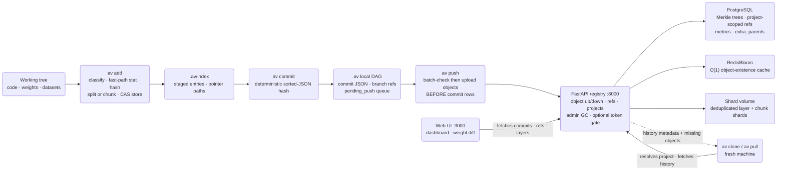
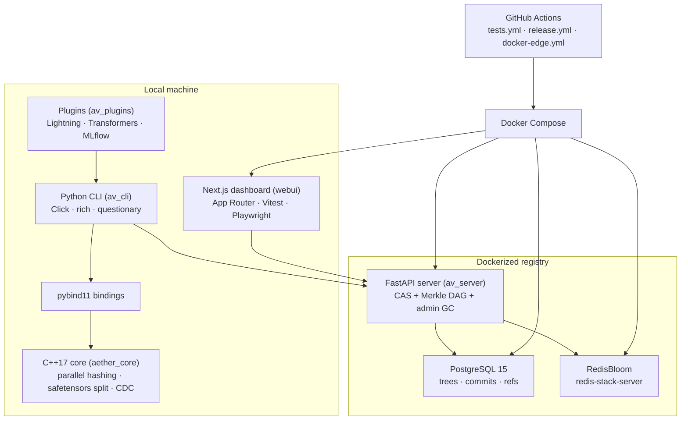

# Aether-Vault Architecture

Describes the system as it exists today — what each subsystem guarantees, the exact files and functions involved, and what remains open. When this document and the code disagree, the code wins and this file owes a patch. Operational tasks live in [infrastructure.md](infrastructure.md); build history lives in [CHANGELOG.md](CHANGELOG.md).

## Objective

Aether-Vault is Git-like, content-addressed version control plus a registry for machine-learning work: models, datasets, and code versioned together in one atomic commit. A commit is a single immutable snapshot of all three — the Holy Trinity — so a checkout reproduces an experiment's script, its weights, and its data pointers simultaneously, which is the reproducibility gap that bolting Git LFS or DVC onto a plain repo leaves open.

Throughput comes from a C++17 core (`src/core.cpp`, shipped as the `aether_core` extension) bound into Python via pybind11. The core hashes multi-gigabyte files in parallel across a thread pool, parses `.safetensors` into per-layer shards, and runs content-defined chunking over opaque checkpoints — work that dominates commit time and therefore belongs below the interpreter, not in it. Python owns everything users touch: the Click-based `av` CLI, the FastAPI registry server, and the framework plugins.

Storage is deduplicated by construction. Every artifact reduces to SHA-256-addressed objects in a local content-addressable store under `.av/objects/`, and every commit is a flat tree of `{rel_path: {hash, size, type, layers, chunks}}` entries referencing those objects. Identical layers across checkpoint epochs, identical chunks across fine-tune saves, and identical datasets across experiments store once — locally and on the registry alike.

The registry multiplies that property across machines: one Dockerized FastAPI service backed by PostgreSQL and RedisBloom serves any number of independent repositories, each carrying its own auto-generated `project_id`. Commits, branches, and metrics stay attributable per project even though the object store is deliberately shared and deduplicated across all of them — refs are namespaced `<project_id>/<branch>` precisely so two projects never see each other's history. A repo repoints at a different registry with `av config --remote-url`; the default remains `http://localhost:8000`.

## System Flow

One pass through the system, working tree to registry and back:

The loop closes: a teammate on a fresh machine runs `av clone <project>`, receives the full commit graph as cheap metadata plus the default branch's materialized files, and their own commits land back in the same project because the clone inherits the source `project_id`.

Two properties of this flow deserve emphasis. First, the expensive steps — hashing, splitting, chunking — all happen client-side against local disk, so the registry stays a thin coordinator: it verifies nothing cryptographically, it stores what content-addressing already proves. Second, the flow degrades gracefully in one direction only: everything up through the local DAG works with the registry switched off, and the registry-facing steps resume exactly where they left off thanks to the pending_push queue. There is no mode where a commit succeeds locally but corrupts remotely.

Reading order for a newcomer: Objective, then System Flow, then the Staging and Commit Contracts together (they form one pipeline), then Remote Sync and Merge (they form the collaboration layer), with the remaining contracts standing more independently.

## Tech Stack

The stack splits at the pybind11 boundary: everything left of it is compiled, everything right of it is interpreted. `Click` owns the command surface, `rich` owns terminal presentation, and `questionary` owns interactive prompts (`av init`'s mode selection, auth prompts). The webui talks to the registry directly from the browser — the CLI never proxies dashboard traffic.

CI mirrors the runtime split as five jobs in `.github/workflows/tests.yml`: the core suite on Windows, plugin tests with framework extras on Linux, webui Vitest units, server tests against live Postgres/Redis service containers, and a full webui-e2e job running Playwright against the real compose topology. A pull request that touches CLI, C++, server, and dashboard at once exercises all five.

## Module Map

- `python/av_cli/`: the `av` command surface and every local concern, split (v1.1.1 hardening) so no file is a monolith:
  - `main.py` — thin compat shell: cli group construction + registration order (= `av --help` order), the PEP 562 lazy `VaultClient`, and the two monkeypatch-target owners (`_find_source_root`, `_update_readme_test_badge`) plus re-exports of the historical namespace surface.
  - `core.py` — shared multi-consumer helpers: config/root/logging, staging (`stage_one_file`, avignore), CAS restore machinery (`materialize_file`, `_materialize_tree`, `_collect_dirty_paths`), pending-push trio, `upload_commit_objects`, `_finalize_commit`, meta/hash helpers.
  - command modules — `cmd_repo.py` (init/update), `cmd_staging.py` (config/add/file/unstage/status), `cmd_history.py` (commit/branch/checkout/log/stash/list-meta/push), `cmd_sync.py` (clone/pull/merge), `cmd_auth.py` (Protected-mode tokens + per-user add-user/list-users/remove-user), `cmd_maintenance.py` (doctor/gc), `cmd_devtools.py` (test/benchmark/badge), `cmd_integrations.py` (graph/handoff/webui/plugin imports).
  - feature modules — `index.py` (`Index`), `merge.py` (pure algorithms), `sync.py` (clone/pull primitives), `history.py` (log walking/rendering), `attributes.py` (`.avattributes` directives), `client.py` (`VaultClient`), `pointer.py`, `fsutil.py`, `handoff.py`, `repl.py`, `docker_runtime.py`, `update_check.py`, `speedcheck.py`, `signing.py` (ed25519 commit signatures, v1.2.2).
  - agent-facing command groups — `cmd_diff.py`, `cmd_context.py`, `cmd_run.py` (+ SDK), `cmd_env.py` (snapshot/replay incl. top-level `av replay` alias), `cmd_policy.py`, `cmd_watch.py`, `cmd_registry.py` (export/restore/keygen/attest/verify), `cmd_webhooks.py`, `cmd_audit.py` (v1.2.2 audit-trail query).
- `python/av_server/`: the FastAPI CAS registry — `server.py` (routes, GC, auth middleware, CORS, rate limiting), `models.py` (SQLAlchemy schema incl. `extra_parents`/`chunks`), `database.py` (Alembic runner), `migrations/` (versioned schema chain), `rate_limit.py` (fixed-window limiter), `redis_cache.py`, `storage.py` (`CASStorage`).
- `python/av_plugins/`: optional Lightning/Transformers/MLflow callbacks that drive the CLI in-process via `_shared.py`.
- `src/`: the C++17 performance core — `core.cpp` (safetensors split + CDC chunker + parallel hashing), `sha256.cpp`, `thread_pool.h`; bound as the `aether_core` pybind11 extension.
- `webui/`: Next.js App Router dashboard — sidebar tabs, Weight Diff, TokenGate, Vitest unit tests, Playwright E2E under `webui/e2e/`.
- `tests/`: roughly 330-test suite across 20 files — CLI, core bindings, server live-stack, sync, merge, plugins.
- `benchmarks/`: nine cross-tool benchmarks against Git LFS, DVC, and MLflow — one file per benchmark, plus `tool_runner.py` and `fixtures.py`.
- `scripts/`: checkout-local developer utilities, notably `scripts/check_eager_annotations.py`.
- `.github/workflows/`: CI (`tests.yml`, five test jobs), the tagged-release pipeline (`release.yml`), GHCR edge images (`docker-edge.yml`).
- `development/`: phase-by-phase [CHANGELOG.md](CHANGELOG.md), the [Probleme.md](Probleme.md) audit log, captured benchmarks, these documents.

## Staging Contract

Staging turns arbitrary working-tree files into content-addressed objects plus index entries. One function owns the whole decision chain — `python/av_cli/core.py::stage_one_file()` — and `av add`'s per-file loop is just iteration around it. The same function is reused verbatim by `av stash push`, so shelving never reimplements staging logic.

Classification happens first, via `python/av_cli/index.py::Index.classify_file()`: a fixed extension whitelist (`.py`, `.json`, `.yaml`, `.yml`, `.toml`, `.cfg`, `.md`, `.txt`) yields `code`; anything else is an `artifact`. Type only affects pointer-file behavior and lineage reporting — both types live in the same CAS.

The cheap short-circuit comes before any hashing: when the recorded size and mtime match the file's current stat, staging returns immediately. `python/av_cli/core.py::compare_meta_safe()` backs this, and repeated `av add .` runs on an unchanged tree cost no I/O beyond stat calls. An unstage operation deliberately writes `mtime_ns=0`, which never matches a real stat, so unstaged-but-committed files correctly report as modified again.

Artifacts above the LFS threshold — default 50 MB via the `lfs_threshold_mb` config key, changed with `av config <N>` — get structure-aware storage, in priority order:

1. **Layer split** — `.safetensors` files go through `aether_core.split_and_hash_safetensors`, producing one shard per tensor layer plus an `__header__` pseudo-layer holding the header bytes, so unchanged layers dedup across checkpoint epochs and single layers can be fetched alone.
2. **CDC chunking** — files matching the `CHUNKABLE_EXTS` set go through `aether_core.chunk_and_hash_file`: gear-hash rolling cut points with min 512 KB, avg 2 MB, max 8 MB. The max is a soft cap of `max + min − 1` because a cut is only taken when at least `min_chunk` bytes remain after it — the tail never becomes a sliver. `CHUNKABLE_EXTS` (v1.2.5, broadened from 8 to 15): `.pt .pth .ckpt .npz .h5 .hdf5 .pb .msgpack .bin .onnx .model .arrow .feather .pkl .pickle` — uncompressed/block-structured formats where a local edit only shifts nearby chunks. Compressed/columnar containers (`.parquet`, `.zip`/`.gz`/`.tar`/`.7z`) are deliberately excluded by default — an edit there usually rewrites the whole compressed stream, so CDC boundaries wouldn't survive it — but are reachable per-glob via the `chunk` `.avattributes` flag when a repo owner has verified their export path is safe.
3. **Whole-file blob** — anything that did not split or chunk stores as one object.

Per-path overrides come from `.avattributes`, parsed by `python/av_cli/attributes.py::flags_for()` with fnmatch globs and last-match-wins semantics: `no-chunk` forces a file down the whole-file path, `chunk` (v1.2.5) force-enables CDC for a glob outside `CHUNKABLE_EXTS` (`no-chunk` wins when both are on the same matching line), `no-layer-split` keeps a safetensors file unsplit. Both splits fall back to whole-file on any exception rather than failing the stage.

Determinism is a dedup invariant, not a nicety: the gear table in `src/core.cpp` is generated from splitmix64 with a fixed seed, so identical bytes produce identical chunk boundaries — and therefore identical chunk hashes — on every machine and every version. A nondeterministic chunker would silently break cross-version dedup and make pushed histories unreconstructable.

Threshold-crossing artifacts additionally get a pointer file written into the working tree — `<path>.av-pointer`, generated by `python/av_cli/pointer.py::create_pointer()` in a versioned `version aether-vault-pointer v1` text format carrying the hash and original size — so repositories stay browsable while payloads live in `.av/objects/`.

| Strategy | Trigger | Stored objects | Whole-file blob? |
|---|---|---|---|
| Whole-file | Code type, or artifact at/below threshold, or override flags | One object under `.av/objects/<hash[:2]>/<hash[2:]>/` | Yes |
| Layer split | `.safetensors` above threshold without `no-layer-split` | Per-layer shards plus `__header__` shard | No |
| CDC chunks | `.pt`/`.pth`/`.ckpt` above threshold without `no-chunk` | Gear-hash-delimited chunks, 512 KB min / 2 MB avg / 8 MB soft max | No |

Directory staging via `av add .` skips anything matching `.avignore` (gitignore-style, one glob per line; scaffolded by `av file --avignore`) and already-existing `.av-pointer` files are never re-staged as content. Every staging decision is observable: `av status` reports staged, modified, deleted, and untracked paths from the same index entries `stage_one_file()` writes. When pointers drift out of sync with their objects — interrupted runs, manual deletes — `av doctor --fix` re-links orphaned `.av-pointer` files, downloading from the registry when the object exists only there, and anything unrecoverable surfaces as a `[WARN]` rather than being fabricated.

| Situation | Behavior |
|---|---|
| Content unchanged since last stage (size + mtime match) | No-op — no hash, no copy |
| Code file | Whole-file blob, no pointer |
| Artifact below threshold | Whole-file blob, no pointer |
| Artifact above threshold, split/chunk succeeds | Shards + pointer file replaces working-tree path in the index's view |
| Split/chunk raises | Logged warning, whole-file fallback |
| Native core unavailable | Whole-file fallback for thresholded artifacts too — staging never hard-fails on a missing extension |

**Stop:** benchmark #4 shows no-op `av status`/`av add` around 15x slower than Git LFS — interpreter startup and import cost dominate. Open finding, documented in `development/BENCHMARKS.md`, not hidden.

## Commit Contract

A commit records the staged snapshot into the local DAG. The tree is flat — `{rel_path: {hash, size, type, layers, chunks}}` — with no directory nesting to reconstruct; absence of a path means the file was deleted relative to the parent.

The commit hash is deterministic: SHA-256 over sorted JSON of the payload, and the payload includes `project_id`. That inclusion is deliberate collision safety — two different projects committing byte-identical trees still produce distinct hashes, so histories can never alias each other on a shared registry. Sorted keys mean the same logical commit hashes identically regardless of dict insertion order.

Parents resolve from the HEAD ref at commit time. Persistence is atomic in a specific order: the commit JSON lands in `.av/commits/` first (temp file plus replace, via `python/av_cli/fsutil.py::atomic_write_json()`), and only then does the branch ref move. A crash between the two steps leaves an orphaned commit object — recoverable, garbage — never a ref pointing at nothing.

Creation has exactly one path: `python/av_cli/core.py::_finalize_commit()` handles hash computation, persist, ref advance, and remote push-or-queue for both plain `av commit` and successful `av merge`. There is no second writer, which is why merges inherit offline resilience for free. Commits optionally carry ML metadata in the same payload — `--tag` labels and `--metric key=value` pairs — so metrics ride the commit rather than a side channel.

Push ordering is a hard rule enforced inside `_finalize_commit()`: `python/av_cli/core.py::upload_commit_objects()` first batch-checks which objects the server already has (one `POST /sync/batch-objects` round trip via `python/av_cli/client.py::VaultClient.batch_check_objects()`) and uploads only the missing ones through an 8-worker pool, and only then does `VaultClient.push_commit()` send the commit row. Order matters because server tree rows reference object hashes — a commit arriving before its objects would be a dangling snapshot.

Unreachability never loses a commit. When the registry is unreachable, the commit stays local and enters the `.av/pending_push` queue (`python/av_cli/core.py::queue_pending_push()`); `av push` and every subsequent commit retry it via `flush_pending_push()`.

Every ref push carries compare-and-swap (`expected_hash`, the pre-commit tip) — this is unconditional, not opt-in or scoped to "protected" branches: any ref race (two agents' commits landing concurrently) is detected server-side (409) rather than silently overwritten, and a losing race queues via the same `.av/pending_push` path as unreachability (v1.2.5). Since v1.3.0 that race also attributes the winning commit to its run (when known, via `core.py::tip_run_id()`) and carries the same `remediation` (`av pull` then `av push`) in both `error.data.ref_race` and the human-text output — matching what `av pull`'s divergence message and `av merge`'s conflict message already did.

Server-side, `push_commit()` defends itself against hostile or oversized payloads with early request-size guards in `python/av_server/server.py` — caps on tree entries (100,000), metrics (1,000), tags (200), message length (20,000), and tag length (200) — and ref names pass a strict regex (`validate_ref_name()`) because refs become filesystem paths in the storage fallback; traversal attempts like `..` components are rejected at the door.

| Commit-time outcome | Result |
|---|---|
| Registry reachable | Objects uploaded, commit row pushed, ref advanced remotely |
| Registry unreachable | Commit persisted locally, queued in `.av/pending_push`, user informed |
| 401 from a Protected registry | Identical to unreachability — queued, retried after `av auth set-token` |
| Nothing staged or nothing changed | No commit created; reports nothing to commit instead of an empty duplicate |

**Stop:** `AuthenticationError` is treated exactly like unreachability — queued and retried, never dropped. A wrong or missing token must never convert a finished local commit into a lost one; the user fixes auth with `av auth set-token` and the queue drains afterward.

## Remote Sync Contract

Sync is the team surface: clone brings a project to a fresh machine, pull moves an existing one forward, and both are built on the same primitives in `python/av_cli/sync.py`.

Clone resolves its target against `/api/projects` in three passes — exact `project_id`, exact `project_name`, then unique name prefix — implemented in `python/av_cli/sync.py::resolve_project()`. Ambiguity is an error listing the candidates; no match lists what IS available, so a typo'd clone tells you what exists.

| Resolution pass | Match condition | Failure mode |
|---|---|---|
| Exact id | `project_id` equals the argument verbatim | Falls through to name passes |
| Exact name | One `project_name` equals the argument | Multiple matches → ambiguity error |
| Unique prefix | One project name startswith the argument | Zero matches → lists every known project |

History arrives as paginated `/api/commits?include_layers=true` batches (500 per page, `fetch_project_commits()`), fully resolved trees included, which makes clones offline-self-sufficient: `av log`, `av handoff`, and metadata-level inspection all work with the registry switched off. Only the default branch's tip materializes objects initially — chosen by `pick_default_branch()` as main, then master, then alphabetically first, deterministic when a project has no conventional default — and older versions lazy-download on first checkout via `ensure_objects_local()`, which batch-checks the whole tree in one round trip and downloads only genuinely missing shards.

Cloned repositories inherit the source project's `project_id`. This is what makes collaboration converge: pushes from either copy attribute to one project on the registry, and refs stay namespaced `<project_id>/<branch>`.

Pull is deliberately fast-forward-only. The walk in `av pull` follows the remote chain from its tip, storing every new commit locally as it goes (`write_fetched_commit()`), and fast-forwarding is permitted only when the local tip is a strict ancestor of the remote tip — checked by `python/av_cli/sync.py::is_ancestor()`, which walks parent chains and follows every parent edge, so it is merge-aware. Joining the walked chain somewhere below the local tip is explicitly not enough; a repo with unpushed local commits would otherwise have them silently overwritten.

| Pull situation | Behavior |
|---|---|
| Remote tip equals local tip | Already up to date — no-op |
| Local branch has no commits yet | Fast-forward onto the remote tip |
| Local tip is a strict ancestor of remote tip | Fast-forward, after the dirty-tree guard |
| Histories diverged | Fetched commits stored locally; prints the exact resolution `av merge <remote-tip>` |
| HEAD detached | Refuses — check out a branch before pulling |
| Referenced remote commit missing | Errors naming the missing hash rather than materializing a partial history |

Divergence is not an error state — it is a handoff. The fetched commits stay on disk and the command prints the exact resolution: `av merge <remote-tip>`.

Both commands refuse to run over a dirty working tree, guarded by `python/av_cli/core.py::_collect_dirty_paths()`, unless `--force` is passed; `av stash` is the non-destructive alternative.

**Stop:** pull walks `parents[0]` for chain-following after normalization reconstructs the full parents array — first-parent traversal. Sufficient for fast-forward detection today but worth revisiting if criss-cross merge topologies become common.

## Merge Contract

Merge semantics are pure algorithms with I/O kept out, living entirely in `python/av_cli/merge.py` — unit-testable in isolation by `tests/test_merge.py` and reusable by any future UI that wants merge preview.

The merge base comes from `find_merge_base()`: a two-phase walk that collects ALL of ours' ancestors into a set (stack DFS), then BFS theirs' ancestors in generation order — the first node present in ours' set is the nearest common ancestor. Every parent edge is followed, not just `parents[0]`, so it is correct on histories that already contain merges.

Tree merging is `three_way_tree_merge()` over the flat trees, per path:

| Base vs ours vs theirs | Outcome |
|---|---|
| ours == theirs | Take it (both agree, including both deleted) |
| base == ours | Theirs changed it — take theirs (add, change, or delete) |
| base == theirs | Ours changed it — keep ours |
| otherwise | Both changed differently — CONFLICT |

Entries compare by FULL dict equality, so a layer re-split that leaves content identical still reads as unchanged. Absence counts as deletion on that side. Conflicts belong to the caller: `av merge` aborts before touching anything unless `--ours` or `--theirs` resolves it. Content-level line merging is intentionally out of scope — versioned payloads are binary artifacts, and an honest abort beats a corrupt merge.

A conflict attributes both tips to their runs (when known) and always writes a structured report to `.av/last_conflict.json` (`--conflict-report PATH` for an additional copy) — same fields (`conflicts`, `ours`/`theirs`, `*_run_id`, `remediation`) in the file, the human-text output, and `error.data` under `--output json`, so no surface has to re-derive what another already computed (v1.3.0).

A successful non-fast-forward merge creates a real two-parent commit through the same `_finalize_commit()` path as ordinary commits; `--no-ff` forces that shape even when a fast-forward would do. The wire format is asymmetric by schema evolution, not by design taste: the server stores `parents[0]` in `parent_hash` and the remainder in `extra_parents` as JSON (`python/av_server/models.py::DBCommit.extra_parents`), and read endpoints reconstruct the full parents array via `python/av_server/server.py::_full_parents()` — so clients always see a complete `parents` list.

**Resolved:** the webui commit graph used to render `parent_hash` only, making merge commits appear linear. It now draws one edge per parent from the reconstructed `parents` array (lane inheritance follows the first parent), so merges fork on screen; see `webui/src/components/CommitGraph.tsx::buildGraph`.

## Restore Contract

Every working-tree write funnels through one function: `python/av_cli/main.py::_materialize_tree()`. Checkout, clone, pull, and merge all call it; none of them maintain a second materialization path. It writes the target tree's files (downloading missing objects from the registry when only the remote has them), removes files present in the old tree but absent from the target one, and re-stats after materializing so the index reflects fresh mtimes — meaning `av status` reads clean right after a switch instead of reporting phantom modifications.

| Caller | Tree it hands to `_materialize_tree()` |
|---|---|
| `av checkout` | The target branch tip's or resolved commit's tree |
| `av clone` | The default branch tip's tree, into a fresh repository |
| `av pull` | The remote tip's tree, post-fast-forward |
| `av merge` | The merged tree computed by `three_way_tree_merge()` |

Checkout accepts branch names, full commit hashes, or unique hash prefixes (the 7-character short form `av commit` prints); an ambiguous prefix is rejected with a request for more characters rather than guessed at. The dirty-tree guard from the Remote Sync Contract applies here identically — checkout refuses to overwrite uncommitted changes unless `--force` discards them, with `av stash` as the non-destructive route.

Legacy tolerance exists on the read side only: older commits shaped `{"code": {...}, "artifacts": {...}}` are normalized into the flat form when loaded, so pre-flat-format repositories keep checking out. New writes are always flat; the legacy branch exists so old data stays readable, not to preserve two writers.

## Garbage Collection Contract

Registry-side GC is mark-and-sweep over Merkle trees, triggered by `POST /api/admin/gc` — normally via `av gc` — and implemented in `python/av_server/server.py::run_garbage_collection()`.

| Phase | What happens |
|---|---|
| Mark | Load all `DBTree` rows once; traverse from every commit's root tree in memory, collecting object, layer, AND chunk hashes as alive |
| Sweep DB | Delete unreferenced `DBObject` rows (grace-period protected) then dead tree rows, batched at 500 |
| Sweep files | Purge orphaned shard files off the event loop, comparing `st_mtime` against the grace cutoff |
| Rebuild | Recreate the RedisBloom filter from surviving hashes |

Marking loads all `DBTree` rows once and traverses in memory (`_collect_alive_in_memory()`), avoiding the N+1-per-tree-node pattern the first implementation had. The alive set includes each entry's `object_hash` AND every layer hash AND every chunk hash — chunk shards are objects exactly like layer shards, and missing them would reap pieces a chunked checkpoint needs to reassemble.

Sweeping respects a grace period: `GC_GRACE_SECONDS = 3600` protects objects younger than one hour even when unreferenced, closing the race where a client uploads shards first and the commit row lands second — without the grace window, a GC running inside that gap deletes live in-flight objects. Deletes batch at `_GC_DELETE_BATCH = 500` rows to stay well under asyncpg's bind-parameter ceiling. Physical shard files sweep off the event loop, and the bloom filter rebuilds from surviving hashes at the end.

GC is manual by design — there is no background sweeper. Operators trigger it via `av gc` after large deletions or abandoned pushes; operational cadence guidance lives in [infrastructure.md](infrastructure.md).

**Verified:** the grace-period epoch math pins `tzinfo=utc` before calling `.timestamp()` — naive-datetime timestamps interpret host-local time and either never sweep or sweep early depending on the host's UTC offset. The comment block in `run_garbage_collection()` preserves that failure history deliberately.

## Auth Token Contract

Protected mode is optional and off by default: unset `AV_API_TOKEN` AND `AV_AUTH_USERS` means every route behaves anonymously. Both credential sources read once at process start (`python/av_server/server.py`, module level) because every `av auth ...` command writes `.env` and restarts the service — a fresh process always picks changes up, so per-request reads buy nothing.

Two credential sources, one middleware:

- `AV_API_TOKEN` — the owner's shared secret (the original single-key mode, unchanged). Resolves to the identity `owner`.
- `AV_AUTH_USERS` — JSON map `{username: token}` of per-user tokens (`av auth add-user/list-users/remove-user`). Invalid JSON fails startup loudly rather than silently looking like Anonymous mode. Each entry resolves to its username.

The single `require_token` middleware resolves Bearer tokens through both sources with `secrets.compare_digest` (owner checked first), stores the resolved username on `request.state.username`, and exempts exactly five paths:

| Exempt path | Why it stays open |
|---|---|
| `/api/health` | Docker healthchecks and the CLI's reachability probes depend on credential-free checks — gating it would make a freshly-protected server look permanently down to the very code restarting it. Liveness only: DB-free, always green, and (a pre-existing, now-fixed staleness) reports the real installed package version instead of a hardcoded string. |
| `/api/ready` (v1.2.5) | Readiness, not liveness — checks DB connectivity, Redis, and `AV_DATA_DIR` writability, returning 503 with per-check detail on failure. Same auth-exemption rationale as `/api/health` (compose healthchecks and restart logic must reach it credential-free), but it is allowed to go red when the container is genuinely unusable — that's the whole point of separating it from `/api/health`, which never does. |
| `/docs` | Swagger/ReDoc cannot attach the custom Bearer header; they expose API shape, not data |
| `/openapi.json` | Same rationale as `/docs` |
| `/redoc` | Same rationale as `/docs` |

Everything else — reads included — requires a valid credential once Protected mode is on.

**Author attribution:** `push_commit` stamps `request.state.username` as the commit author whenever the client sent the default `anonymous` author; an explicit client-set author (`AV_AUTHOR`) is never overwritten — scripts own their attribution. Anonymous mode has no identity, so authors pass through verbatim.

Client side: `python/av_cli/client.py::VaultClient` raises `AuthenticationError` on any 401; the CLI catches it centrally (the custom `_AuthRetryGroup`), prompts interactively, saves, and asks for a re-run — or queues the work when it can. Per-user tokens ride the exact same client path (`av auth set-token <personal-token>` in a teammate's repo). The webui wraps everything in `TokenGate`, which accepts a one-time `?av_token=` query parameter appended by `av webui`, saves it to localStorage, and strips it from the URL immediately on mount.

### Token scopes (v1.3.1)

An `AV_AUTH_USERS` entry may additionally carry `"scopes": [str, ...]` (`av auth add-user
NAME TOKEN --scope <s>`, repeatable). Absence — every entry that predates this feature,
every bare-string entry, and the owner's `AV_API_TOKEN` itself — resolves to the
unrestricted wildcard `["*"]` (`server.py::_scopes_for_identity`), so this is purely
additive: no existing deployment loses access to anything it could already reach.
`require_token` resolves `request.state.scopes` alongside `request.state.username`
(unconditionally, in the same pass); a route opts into a scope check by adding
`Depends(require_scope("<scope>"))`.

This is the one deliberate amendment to this file's historical framing that "enforcement
is CLIENT-SIDE v1; server-side authz is enterprise-tier" (see the Promotion Policy
Contract below): that statement remains true for the metric/signature promotion gates
introduced in v1.2.0/v1.2.5, which stay client-side by design. It is no longer true
project-wide — the held-out eval vault, improver promotion, and policy-pack publication
introduced in v1.3.1 are enforced server-side via scopes, because a client-side-only gate
cannot protect an eval suite from the very agent being scored against it. A `require_scope`
denial is a `403` with `{"error": "scope_denied", "required_scope": "<scope>"}`, distinct
from `require_token`'s `401` (the caller authenticated fine; they lack one permission),
audited as `scope.denied`, and surfaced by the CLI as exit code 20 wherever a call site
maps it (see docs/for-agents.md's exit-code table).

**Verified:** stack-free unit tests (`tests/test_scopes.py`) cover scopes parsing
(additive, omitted-when-absent), `_scopes_for_identity`'s default-to-wildcard behavior,
and `require_scope()`'s allow/deny/audit logic against a stub session — no Postgres
needed. Live end-to-end 403s are proven in `tests/test_server.py` once a real route
declares a scope requirement (v1.3.1 R1/R2).

## Transport Hardening Contract

Two middleware layers harden the transport; both are env-configurable and default to safe values.

**CORS** is locked to the webui's origin by default (`AV_CORS_ORIGINS`, comma-separated; `*` reopens everything explicitly for genuinely open deployments). The historical `allow_origins=["*"]` let any page a developer visited fire requests at a reachable registry — drive-by GC/uploads.

**Rate limiting** (`python/av_server/rate_limit.py`) is a fixed-window counter keyed per client-host and bucket class, with an injectable clock so tests never sleep:

| Bucket | Default | Rationale |
|---|---|---|
| `gc` (`POST /api/admin/gc`) | `10/minute` (`AV_RATE_LIMIT_GC`) | Destructive, historically unguarded, anonymous-by-default — the one endpoint a hard cap must always protect |
| `default` (all other `/api/*`) | disabled (`AV_RATE_LIMIT_DEFAULT`) | Legitimate clients burst — 8-worker object uploads, thousand-file commits; fixed caps would false-positive. Operators opt in per deployment |

Exemptions mirror auth exactly (health + docs routes). Responses are `429` JSON with a `Retry-After` header. The check-and-increment is synchronous with no awaits inside, so it is atomic under asyncio interleaving without locks.

**Verified:** unit tests cover parse/allow/deny/rollover/per-key isolation with a fake clock (`tests/test_rate_limit.py`, no server needed); live assertions prove the GC 429 burst-block, data-plane pass-through, and CORS origin lock (`tests/test_server.py`, Docker-stack skip pattern).

## Web UI Contract

The dashboard is a Next.js App Router application under `webui/src/app`, talking straight to the registry API. The API base URL bakes in at build time via the `NEXT_PUBLIC_API_URL` argument (the compose file passes `http://localhost:8000`), so a registry behind a proxy needs a rebuild, not just a config change. Sidebar tabs: Dashboard, Commits, Branches, Metrics, Storage, Weight Diff, Projects, Runs, Improver, Regression. Project selection persists in localStorage and scopes every panel.

**Improver / Regression tabs (v1.3.1, RSI R6, WP-35/WP-38):** `ImproverPanel` (lineage +
pending self-edits, from `GET /api/improvers`/`GET /api/change-sets`) and
`RegressionPanel` (improver churn by change-set status, the anomaly event feed via
`GET /api/events?kinds=anomaly`, and an embedded `CanaryPanel` showing pass/fail trend
from `GET /api/canary-results`) are the WebUI counterparts of `av improver`/`av canary`
and the server-side anomaly detectors (see this file's "Improver Artifact" and "Anomaly
Alerts" contract sections). `CanaryPanel` is a standalone, independently-testable
component (matching the plan's naming) embedded inside the Regression tab rather than
given its own top-level sidebar destination — one small status widget didn't warrant a
fourth new tab. All three fetch functions live in `webui/src/lib/api.ts` alongside every
other panel's, following the same typed-response convention.

Panel responsibilities, each backed by the same `/api` surface the CLI uses:

- **Dashboard** — stats bar, SVG commit DAG, branch/metrics/commit-log teasers at a glance.
- **Commits** — paginated, searchable log with click-to-expand rows showing the full file tree and an added/removed/changed diff vs the parent commit.
- **Branches** — full tip details, commits-ahead-of-main counts, expand-to-branch-rows, and a branch-from-here action.
- **Metrics** — per-metric show/hide chart plus a commit-by-metric table and single-branch comparison.
- **Storage** — store-wide object/size stats, file-type breakdown, largest tracked files, approximate dedup ratio from the latest snapshot.

Weight Diff is the distinctive panel: a client-side per-layer heatmap built from `include_layers` commit data (logic in `webui/src/lib/diffWeights.ts`), with the `__header__` pseudo-layer filtered out since headers are metadata rather than weights. Two checkpoints drag into comparison slots; drift charts ride alongside. Because diffing happens client-side from already-fetched layer manifests, no server-side diff endpoint exists to maintain.

Auth surfaces through `TokenGate` (one-time `?av_token=` handoff, described in Auth Token Contract). Polling cadence defaults to 15 seconds via `webui/src/hooks/useDashboard.ts::useDashboard()` — live enough to feel current during training runs, cheap enough to leave open.

**Note (updated v1.2.2):** the WEBUI commit graph now draws one edge per parent (see the Merge Contract's resolved note). The Runs tab gained an expandable detail view: parent-lineage chain, linked commits with messages and a metrics table, and a semantic summary composed client-side from the last two linked commits' trees (`webui/src/lib/runDetail.ts` — deliberately no new server endpoint). The `av graph` OBSIDIAN export still walks `parent_hash` only, so merge diamonds render linear in generated vaults — tracked limitation, low priority because Obsidian's own graph view is the primary consumption surface there.

## Plugin Contract

Optional framework callbacks — Lightning, Transformers, MLflow — auto-stage and auto-commit checkpoints during training. Heavyweight frameworks import lazily inside their plugin modules, so installing `aether-vault` never pays for torch unless a callback actually runs.

| Module | Framework | Surface |
|---|---|---|
| `python/av_plugins/lightning.py` | PyTorch Lightning | Live `Trainer` callback + `import_checkpoint` backfill |
| `python/av_plugins/transformers.py` | HuggingFace Transformers | Live `TrainerCallback` + `import_checkpoint` backfill |
| `python/av_plugins/mlflow.py` | MLflow | `import_run` backfill (requires the `[mlflow]` extra) |
| `python/av_plugins/_shared.py` | all | The in-process CLI bridge every plugin routes through |

Plugins drive add/commit through the INTERNAL SEAM since v1.2.2: `_shared.py::commit_scoped()`
delegates to `core.commit_scoped_paths()` — the same function agent tooling uses — which
stages via `stage_one_file` directly (no chdir, no CLI invocation) and funnels into
`commit_staged` → `_finalize_commit`. Scoped-commit semantics are unchanged: isolation
without destroying the change-detection baseline (#38/#71), missing-path tolerance (#76),
AV_RUN_ID flow via `core.resolve_run_id()` (v1.2.5: explicit > `AV_RUN_ID` env >
`.av/run.json` state — the one precedence rule shared with `av commit`/`av watch`; before
this, three call sites silently disagreed, and `av watch`'s auto-commits weren't tagged
under the active run at all). Training-end flush is `_shared.push_pending()` (v1.2.5,
delegates to `core.flush_pending_push()` directly) — as of v1.2.5 no plugin has any
remaining chdir or in-process CLI invocation. `run_av()`/`build_metric_args()` were
deprecated shims kept for external callers through one release's grace window
(VERSIONING.md); that window closed at v1.3.0 and both are removed from the package
entirely — `mlflow.py::import_run()`'s `repo_root` argument became required in the same
release (its `resolve_repo_root(Path.cwd())` fallback was this package's one remaining
`Path.cwd()` use, and every other plugin entry point already required an explicit root).

**Scoped commits (v1.1.9, seam v1.2.2):** every plugin add+commit pair (callbacks AND import backfills) runs through the scoping seam, which isolates one commit without destroying the change-detection baseline: staging runs against the untouched index, the scope is computed as exactly what that staging touched (new keys, changed content, staged transitions), committed through the real single code path, and everything else merges back with its staged flag untouched — an import or checkpoint commit therefore never sweeps unrelated human-staged files into its tree (Probleme.md #38), and unchanged re-imports stay "Nothing to commit" no-ops (Probleme.md #71). Plain `av commit` keeps full-snapshot semantics; only machine-driven plugin events are scoped.

Callbacks commit with the current step or epoch as the message, attach numeric training metrics as first-class metrics, and flush a final `av push` when training ends — so an interrupted run still leaves every intermediate checkpoint committed and queued. `dataset_paths` stages once at training start, tagged `dataset`, because there is no reliable way to auto-detect a dataset's on-disk path from a generic `Dataset`/`DataLoader` object; opt-in beats wrong-guess.

Backfill runs through matching import paths, each available as both a Python function and a CLI command: `av import-lightning`, `av import-transformers`, `av import-mlflow`. Imports read metrics found alongside the checkpoint (Lightning's `callback_metrics`, Transformers' `trainer_state.json` log history, MLflow's own run metrics), tag commits `lightning-import` / `transformers-import` / `mlflow-import`, and re-importing unchanged content is a no-op.

## Release Contract

Versions come from setuptools-scm reading git tags — no version string is hand-maintained. Tagging `vX.Y.Z` and pushing the tag fires `.github/workflows/release.yml` (which also supports manual `workflow_dispatch` for dry runs):

1. `cibuildwheel` builds wheels for cp310–cp314 across Windows/Linux/macOS, plus an sdist job.
2. PyPI publishes via trusted publishing — OIDC, `environment: pypi`, no long-lived token.
3. A GitHub Release appears with auto-generated notes and every wheel/sdist attached; curated long-form notes link back to [CHANGELOG.md](CHANGELOG.md).
4. GHCR receives ONE consolidated **engine image** (`ghcr.io/leon1706-lol/aether-vault-engine`) tagged `:latest` + the version tag. Since v1.2.2 the image is multi-stage (py-builder → Node 20 web-builder → runtime with BOTH Python and Node) and runs ALL subservices in ONE container dispatched by `AV_ENGINE_ROLE` (`all` | `server` | `webui`, supervised by `docker/engine-entrypoint.sh`). For one transition cycle the SAME image is also pushed under the historical `aether-vault-server`/`aether-vault-webui` names; the entrypoint auto-detects the legacy per-service role from container env (`DATABASE_URL` set → server-only; `NEXT_PUBLIC_API_URL` without it → webui-only), so pre-1.2.2 pinned compose files keep working unchanged. **The aliases are deprecated now and are removed in the next release** — pinned installs should move to the engine name.

Installed users pick releases up through `av update`; opted-in silent auto-update re-checks at process exit. `av update --docker` is the separate, opt-in path for the local backend images — restarting a running container is disruptive, so it never rides along with a plain version check; it pulls only the canonical engine image. `docker-edge.yml` pushes `:edge` engine images (+ aliases) on pushes to `master` touching code paths, between tagged releases.

Semver and deprecation policy live in [`../VERSIONING.md`](../VERSIONING.md): MAJOR breaks the CLI, `.av/` format, or API surface; MINOR is additive including new optional response fields; PATCH is safe. Deprecations get at least one full MINOR grace window and never vanish inside a PATCH; database schema changes are owned by Alembic migrations applied automatically at server startup.

**Resolved:** `docker-edge.yml` used to trigger on `main`, but this repo's default branch has always been `master` — so edge images never fired. Reconciled to `[master]` in the v1.1.8 cycle; `:edge` now tracks every code-path push.

**Resolved:** wheels shipped cp310–cp314 since Phase 46 (cibuildwheel matrix), matching the dev environment's Python 3.14.

**Resolved:** the two-image split topology (separate `aether-vault-server` and `aether-vault-webui` containers) was consolidated into the single engine image/container in v1.2.2 — see above for the alias transition contract.

## Runs Contract (v1.2.0)

A Run is the first-class grouping for one training effort. Storage: `runs` +
`run_commits` (migration `0002`). Creation is idempotent by client-generated UUID;
pushes referencing an UNKNOWN run lazily create it in `created` state — ordering between
agents never fails a push. `metrics_summary` keeps the latest value per metric, refreshed
on every linked commit. Client surface: `av run start/finish/list/show`, `AV_RUN_ID`,
SDK `repo.runs`. Commits auto-tag `run:<id>` (tags remain part of the hashed payload).
Published schema: `av_cli/schemas/run-1.0.schema.json` — see `docs/contracts.md`.

**Uncapped history (v1.3.0, migration `0005`):** `GET /api/runs/{id}/summary` bounds its
inline `commits`/`lineage` copies (`_RUN_SUMMARY_MAX_COMMITS`/`_MAX_LINEAGE_DEPTH`) —
bounded response size for the common case, never a silent drop (it reports
`total_commits` vs. what it actually returned). `GET /api/runs/{id}/metrics` (cursor on
`(run_commits.created_at, commit_hash)`, oldest-linked-first) and
`GET /api/runs/{id}/lineage` (cursor on a resume-from run id, depth-bounded per page) are
the uncapped complements for a WebUI chart or an agent that wants everything.
`runs.policy_outcome` (JSON: `{decision, rule, at}`) records the most recent
`av promote`/merge policy decision for the run's active commit —
`POST /api/runs/{id}/policy-outcome`, called by `cmd_policy.py::_report_policy_outcome()`
as best-effort telemetry right after `enforce_policy()`/`promote()` decide (never a gate
itself; a reporting failure never blocks the promotion). Surfaced on `_run_to_dict()`
(so both `GET /api/runs/{id}` and `/summary`'s `run` field carry it) and as a badge in the
WebUI's run-detail panel.

## Events & Webhooks Contract (v1.2.0, delivery ledger v1.2.2)

`events` is append-only; the autoincrement id IS the resumable cursor
(`GET /api/events?since=<id>&project_id=&kinds=&run_id=&wait=<secs>`, ascending, bounded
limit). `run_id` (v1.3.0) matches events whose payload carries that run — `commit` and
`run` kind events today; a kind with no run_id in its payload never matches, same as an
unknown project/kind narrows to nothing rather than erroring. The response also carries
`gap`/`oldest_id` (v1.3.0): `gap: true` when `since` predates this project's oldest
retained event id (swept by `AV_EVENT_RETENTION_DAYS`) — a resuming consumer can tell
"I fell behind and missed events" apart from "there's simply nothing new yet", which a
stale cursor used to make silently indistinguishable. Kinds today: commit · ref · run ·
gc · webhook_test, plus the v1.3.1 RSI additions — improver · change_set · policy ·
canary · freeze · eval · review · blackboard · sandbox · **anomaly** (see this file's
"Anomaly Alerts Contract" section). Webhooks POST the raw JSON body with
`X-AV-Event-Id/-Kind/X-AV-Signature: hex(hmac-sha256(secret, body))`; secrets live in the
registry (signing requirement) and are never returned (masked listings only). Zero active hooks ⇒
zero background work. Retention: `AV_EVENT_RETENTION_DAYS` (default 30) swept during GC,
plus manual `DELETE /api/events?before_days=N`. Published schemas:
`av_cli/schemas/event-1.0.schema.json` (one row of `data.events`) and
`av_cli/schemas/webhook-payload-1.0.schema.json` (the signed delivery body) — see
`docs/contracts.md`.

**Webhook delivery ledger (v1.2.2, migration `0003`):** every fan-out attempt persists a
`webhook_deliveries` row BEFORE its POST (`pending`) and updates it after
(`delivered`/`failed`); failed rows carry `next_retry_at` and are re-driven by the server's
startup+interval retry worker until `AV_WEBHOOK_MAX_ATTEMPTS` (default 5) exhausts into
`dead`. Rows snapshot the event's kind/payload/project so retries reconstruct the
byte-identical signed body even after the source event is retention-swept; rows ride the
mutation's own transaction so rolled-back mutations leave no phantom records.
Observability: `GET /api/admin/webhook-deliveries?status&webhook_id&limit&offset`.

**Delivery guarantees (v1.3.0, proven under a real multi-endpoint backlog by
`tests/test_server.py::test_webhook_backlog_delivers_all_in_order_without_starving_healthy_hook`):**
at-least-once per hook — a delivery is `delivered`, retried on schedule, or eventually
`dead`-lettered, never silently dropped. Delivery order per hook matches event creation
order (ledger ids are monotonic). One endpoint stuck failing (`poison`) dead-letters on
its own exponential-backoff schedule without delaying or skipping deliveries to any
other webhook subscribed to the same events — proven at backlog scale (20 concurrent
commits fan out to two hooks), not just a single event. `av webhooks show/deliveries`
and `POST /api/admin/webhook-deliveries/{id}/replay` reflect the ledger's real state at
any point during an in-flight backlog, not only once it drains.

## Registry Export/Restore Contract (v1.2.0, resume + real round-trip proof v1.3.0)

`av registry export OUT_DIR [--project]` walks the registry's public API (commits paged,
refs, runs, then every object hash referenced in any exported tree's files/layers/chunks)
into a portable archive; every object is hash-re-verified during download.
`av registry restore ARCHIVE_DIR` re-ingests in push order (objects → commits → refs);
duplicate hashes land as idempotent 409s, so restoring into an already-populated registry
is safe. Both commands show a progress bar over their item loop (suppressed under
`--output json`) and track completed items in `ARCHIVE_DIR/.state.json`, so a killed
export/restore resumes instead of re-downloading/re-uploading everything (`--resume` is
the default; `--no-resume` forces a full pass — always safe either way, since every
write is already idempotent). **v1.3.0 fixes:** a missing `import pathlib` meant every
real invocation of both commands raised `NameError` immediately — no test had ever driven
either through the real CLI until `tests/test_server.py::test_registry_export_restore_round_trip`
(live-registry-gated) closed that gap; both also now call `client.server_available()`
first instead of letting an unreachable server surface as an unhandled
`requests.exceptions.ConnectionError` traceback.

## Signed Commits Contract (v1.2.2)

Optional per-repo ed25519 signing ("tamper evidence, not a trust network" — see SECURITY.md).
`av registry keygen` generates `.av/keys/signing.pem` (0600) + `.pub` via the `[sign]`
extra; when a key exists, `_finalize_commit` auto-signs AFTER hash computation: canonical
bytes = sorted-keys JSON of the payload minus `signature`, with the timestamp normalized to
one UTC rendering (naive/aware/Z spellings of the same instant MUST verify identically —
the registry echoes naive UTC). The signature blob `{algo, public_key, sig}` rides commits
verbatim, persists in `commits.signature` (0003), and survives clone/pull so `av verify
<hash>` works on any copy: signature-first, legacy HMAC attest-tag fallback, honest UNSIGNED
verdict (exit 0 — unsigned commits are valid). Signing never blocks or fails a commit.

**Key management (v1.2.5):** `av registry keys list/fingerprint/rotate` — fingerprint is
`sha256(raw pubkey)[:16 hex]` in `xxxx:xxxx:xxxx:xxxx` form (golden-fixture tested). Rotate
archives the current keypair under `.av/keys/archive/<fingerprint>/` (never deletes it —
old commits keep verifying via their embedded public key) and generates a fresh active
key. `av registry export-signature <hash> [--out FILE]` produces a standalone,
portable signature record (adds `canonical_sha256` + `fingerprint`) for
`av registry verify <hash> --signature FILE` — detached verification needs only the
commit content and the record, no local config or registry access.

## Env Snapshot Contract (v1.2.2, `snapshot_version: 2` v1.2.5)

A snapshot's id IS `sha256(canonical bytes)`. Since v1.2.5 (`snapshot_version: 2`),
canonical bytes = compact sorted-keys JSON of ONLY `{snapshot_version, env}` — `env`
holds reproducibility-relevant identity (python, os family, curated pins, seeds, CUDA
*toolkit* version, a configurable critical-env-var set); machine-specific `observed`
context (GPU model, driver version, hostname, conda env name, interpreter path,
`captured_at`) is captured but deliberately excluded from the hash, so two equivalent
environments on DIFFERENT machines/OSes produce the SAME id (the golden cross-machine
fixtures in `tests/test_env_snapshot.py`, run across every CI matrix leg, are the
determinism proof). Top-level flat fields (`python`, `pins`, `seeds`,
`cuda_visible_devices`) are kept for backward compatibility with every existing reader.
Legacy (no `snapshot_version`) snapshots hash exactly as before (whole dict minus
`captured_at`) — ids are only comparable within one `snapshot_version`.

Snapshots upload through the NORMAL object flow at push; commits carry
`env_snapshot_id` in the hashed payload; the server persists it on commits AND back-fills
linked runs on first link (first-link wins). Readers: `av env replay [target]` /
top-level `av replay <run-id|commit-hash|snapshot-id>` resolve from local CAS or registry;
`.avh.replay.snapshot_id` carries the pointer into agent context memory. `av env replay`
flags (v1.2.5): `--validate` resolves every pin via `pip install --dry-run` without
installing (exit 15 on any unresolvable pin); `--execute` now always uses
`sys.executable -m pip` (previously a bare `pip` string, which could silently resolve to
the wrong interpreter) and accepts `--target-venv PATH` (create-if-absent) or
`--conda-env NAME`; `--dockerfile` renders a multi-stage, non-root Dockerfile and accepts
`--cuda TAG` (nvidia/cuda base) and `--out FILE`.

## Audit Trail Contract (v1.2.2)

Every mutating API call writes `audit_log(username, action, project_id, details,
status_code)` — the status code captures the HTTP outcome ("did it land?"), not just the
attempt. Read surface: `GET /api/admin/audit?action&project_id&since&until&limit&offset`
(invalid timestamps → 422), CLI `av audit list`. Retention: `AV_AUDIT_RETENTION_DAYS`
(default 90) swept during GC plus manual prune endpoint.

## Semantic Diff Contract (v1.2.0, dedup_efficiency v1.2.2, chunks.status v1.2.5, byte-level fields + server parity v1.3.0)

`python/av_cli/semdiff.py::diff_trees(old_tree, new_tree)` is pure: added/removed/changed,
per-model layer movement (count/pct/largest movers, plus v1.3.0's `bytes_changed`/
`bytes_total`/`pct_bytes` — a byte-weighted view that deliberately diverges from the
count-based `pct` when layer sizes vary, so "half the layers changed" and "half the
storage changed" stay answerable independently), chunk reuse ratio across CDC-chunked
files (+ `chunks.dedup_efficiency` = reused/(reused+new), None when no chunks — flows into
`.avh.semantic_summary`; `chunks.status` (v1.2.5) is a sibling field ALWAYS present as
`"measured"`/`"no_chunks"`, so consumers get a stable field to branch on without a
null-check on the float — `None` stays meaningful as "no signal", not "0%"; v1.3.0 adds
the byte-weighted siblings `chunks.reused_bytes`/`new_bytes`/`dedup_efficiency_bytes`),
dataset classification (extension+name heuristics), byte totals, and a one-sentence human
summary. Consumers: `av diff`, `.avh.semantic_summary`, WebUI expanded commits and the
v1.2.2 run-detail panel (client-side re-composition in `webui/src/lib/runDetail.ts`). The
dict shape is additive-only by policy. Published schema (v1.3.0):
`av_cli/schemas/semdiff-1.0.schema.json` — see `docs/contracts.md`.

**Server-side parity (v1.3.0):** `server.py::_summarize_tree_diff()` independently
re-implements the FULL schema above (models/chunks/datasets, not just files/totals like
before) — it deliberately never imports `av_cli` (the server package ships and deploys
standalone), so the two implementations are proven identical on identical input by a
shared golden-fixture test
(`tests/test_server.py::test_server_side_summary_matches_client_side_semdiff_on_the_same_trees`)
rather than by sharing code. Feeds both `GET /api/runs/{id}/summary`'s
`semantic_summary` and the new `GET /api/commits/{base}/diff/{target}` (arbitrary
two-commit compare, not just a run's two most recent linked commits — feeds the WebUI's
weight-diff arbitrary-hash compare).

## .avh v2 — Agent Context Memory Contract (v1.2.0)

`handoff.avh` carries `$schema` + `avh_version:"2.0"`, legacy v1 keys (never removed),
and: `lineage{run_id,parent_run_ids,code_pointer{git_remote,git_sha,dirty}}`,
`semantic_summary`, `replay{pins,seeds,cuda,commands,snapshot_id}`, and
`context_memory{notes[],metrics_history_tail[]}` — notes are APPEND-ONLY in
`.av/context/memory.jsonl` (`av context note`) and survive every regeneration.
Readers must tolerate unknown sections; writers must run `validate_handoff()` in CI paths.
Published schema: `av_cli/schemas/avh-2.0.schema.json` — see `docs/contracts.md`.

## Promotion Policy Contract (v1.2.0, `require_signature` v1.2.5, `--dry-run` + outcome reporting v1.3.0)

Policies live in `.av/policies.json`: `{branch: {metric, op∈{<,<=,>,>=},
baseline_ref|threshold, require_signature}}` — `require_signature` (v1.2.5, additive) is
usable standalone (no `metric` required) as a pure signature gate, checked BEFORE any
metric comparison so a denial reports "unsigned", not a misleading metric mismatch.
Enforcement points: `av merge` (current branch armed → deny, exit 16, unless --force) and
`av promote CANDIDATE --into BRANCH` (authoritative eval — merge-side check intentionally
bypassed there to avoid comparing the baseline against itself). Enforcement is
CLIENT-SIDE v1; server-side authz is enterprise-tier. Worked examples (metric gate,
signature gate, combined): `examples/policies/`, loaded by tests so they can't rot.

`av promote --dry-run` (v1.3.0) evaluates and reports `data.decision`
(`allow`/`deny`) plus the deciding rule, touching nothing — exits 0 for BOTH decisions
(a script branches on `data`, not the exit code). Every REAL (non-dry-run) decision also
reports to `POST /api/runs/{id}/policy-outcome` for the active run (best-effort,
never blocks the promotion — see the Runs Contract section above). `promote`'s own JSON
envelope for a landing (allowed, non-dry-run) promotion is emitted AFTER the merge lands,
folding in the merge result under `data.merge` — the nested `merge` invocation's own
stdout is captured, not let through directly, specifically so one `av promote` call never
prints two top-level JSON objects (Probleme #114/#115).

## Improver Artifact Contract (v1.3.1, RSI R1, migration 0006)

An improver version is the agent's OWN stack (code paths, prompt files, tool schemas, a
policy-pack pointer) — content-addressed exactly like an env snapshot: canonical
sorted-keys JSON → sha256 id → CAS object (`python/av_cli/casobj.py`, generalizing
`core.py::canonical_env_bytes`/`env_snapshot_id`) → uploaded through the normal object
flow → a lightweight server index row (`improver_versions`: `id`, `project_id`,
`manifest_object_id`, `parent_id`, no FK on `parent_id` — same shallow/out-of-order-write
rationale as `commits.parent_hash`/`runs.parent_run_id`). `GET /api/improvers/{id}/lineage`
is the parent-chain walk, byte-for-byte the same depth/cursor/cycle-guard shape as
`GET /api/runs/{id}/lineage`. Client surface: `av improver register/init/list/show/
lineage/current/use`; local state is `.av/improver/current` (the active pointer, a plain
text file — same idiom as `.av/HEAD`) and `.av/improver/last_good` (written by `apply`,
read by `rollback`).

**Self-edit proposals (`change_sets`, todo.md A.3/A.4):** `av improver propose --diff FILE
--rationale TEXT --risk low|medium|high` is a CAS object (diff + rationale + risk) indexed
server-side with an explicit state machine — `proposed → approved|rejected`,
`approved → applied|rejected`, `applied → rolled_back` — enforced by
`POST /api/change-sets/{id}/status` (`_CHANGE_SET_TRANSITIONS`, `server.py`); an illegal
jump (e.g. straight to `applied`) is a 422, not a silent overwrite, so `av improver apply`
can never apply something nobody approved (`av improver review ID --approve|--reject`).
`av improver apply ID` mints the NEXT improver version (parented on the change set's
`improver_id`), marks the change set `applied`, records the previous pointer as
`.av/improver/last_good`, and advances `.av/improver/current`. Scope note: this records
the version/lineage transition and its audit trail; executing a diff's content inside an
isolated sandbox is `av sandbox run` (R5, todo.md G.29) — a future step can run that
first and then call `apply` to make the result official. `av improver rollback [--to ID]`
is the one-command undo: resets `.av/improver/current`, defaulting to `last_good`.

## Dual-Gate Promotion Contract (v1.3.1, RSI R1)

Aether-Vault now has TWO independent promotion gates, deliberately living in separate
files rather than one merged envelope:

| Gate | Command | Rule file | Enforcement |
|---|---|---|---|
| Model | `av promote` | `.av/policies.json` | Client-side (unchanged since v1.2.0) |
| Improver | `av improver promote` | `.av/improver_policy.json` | Client-side evaluation + server-side scope on the artifacts it reads |

They were considered as one `policy_version: 2` envelope and rejected: every existing
model-gate reader (`enforce_policy()`, `promote()`, `av policy set/list/remove`) does
`load_policies(repo_root).get(branch)` directly on the top-level dict — folding improver
rules in would have been a breaking change to a shape `tests/test_v120.py` already pins,
for no functional benefit. `.av/improver_policy.json` is `{branch: {require_canaries:
bool, require_signature: bool}}`, evaluated by `av improver promote [CANDIDATE] --into
BRANCH [--dry-run] [--force]` — same `--dry-run` contract as the model gate (exits 0 for
BOTH decisions; a script branches on `data.decision`, never the exit code).
`require_canaries` checks `GET /api/canary-results` for the MOST RECENT result on the
candidate improver (`av canary run` populates it — see below); `require_signature` fetches
the candidate's manifest object and verifies it via `casobj.verify_object()`. A real
(non-dry-run) landing writes `.av/improver/promoted/<branch>` = the candidate id — the
improver-side analogue of a model branch ref, though nothing else currently reads it
(a future WebUI/CLI surface can). Denial exits 16 (`policy_denied`, shared with the model
gate — this is the SAME kind of decision, just over a different artifact).

## Signed Policy Pack Contract (v1.3.1, RSI R1: todo.md C.13/I.39)

A policy pack is a PUBLISHED SNAPSHOT of some policy state (typically `.av/policies.json`
and/or `.av/improver_policy.json`, though `av policy pack publish` accepts any JSON
document) on an append-only, hash-chained log — the promotion-rule analogue of signed
commits. `av policy pack publish FILE [--sign/--no-sign]`: the document is optionally
signed with this repo's ed25519 key (`casobj.sign_object`, generalizing
`signing.sign_payload` — see `casobj.py`'s module docstring for why the generic canonical
form doesn't need commit-signing's timestamp-echo normalization), written to the CAS,
uploaded, then `POST /api/policy-packs` computes `chain_hash =
sha256(f"{prev_id or ''}:{object_id}")` server-side — each pack cryptographically commits
to its predecessor, so the SEQUENCE of promotion-rule changes is tamper-evident, not just
each pack's own signature. `prev_id` defaults to the project's current tip
(`GET /api/policy-packs/latest`). There is deliberately no PUT/DELETE route for
`policy_packs` — publishing a new pack is the only mutation, which is what "append-only"
actually means here. `av policy pack show/log/verify` read the chain and (verify) confirm
both the recomputed `chain_hash` and the embedded signature. `POST /api/policy-packs`
requires the `policy:write` scope server-side (see Token scopes, above) — this is one of
the routes the client-side/server-side authz split now genuinely differs on.

## Capability Canary Contract (v1.3.1, RSI R1: todo.md B.9/C.14)

A canary suite is a small, fixed set of metric-threshold checks that must not regress —
`{"checks": [{"name", "metric", "op", "threshold"}, ...]}`, evaluated against the CURRENT
HEAD commit's metrics using `cmd_policy.py`'s own `_OPS`/comparison primitives (reused,
not reimplemented). `av canary register NAME FILE` content-addresses the suite and records
`name -> object_id` in `.av/canaries.json`; `av canary run NAME [--improver ID]` evaluates
it locally and, when an improver id is known and the registry is reachable, reports the
result via `POST /api/canary-results` (`canary_results`: `project_id`, `improver_id`,
`suite_object_id`, `passed`, `details`, best-effort — a failed report never fails the
canary run itself, mirroring `_report_policy_outcome`'s telemetry-only contract). This is
the v1.3.1 scope: a canary that needs to actually EXECUTE arbitrary code (a held-out
benchmark script, a full eval harness) is `av sandbox run` (R5) reporting through this
exact same endpoint — the check-evaluation path here and the sandboxed-execution path
there converge on one result shape.

## Project Freeze Contract (v1.3.1, RSI R1: todo.md C.15/I.40)

Global per-project kill-switch, scoped PRECISELY per todo.md C.15 ("no promotes, no
self-edits, only read + rollback") — not a blanket gate over every CLI invocation.
`freeze_guard()` (`cmd_freeze.py`) is called explicitly from exactly the promotion/self-
edit gate commands: `av promote`, `av improver register/propose/apply`, `av policy pack
publish`. It is deliberately NOT wired into `_AuthRetryGroup.invoke()` as a hook over
every command — those specific gate commands already talk to the registry (promotion and
publishing are inherently online operations), so the freeze check adds no network round
trip to a path that didn't already have one, whereas `av commit`/`av add`/`av status` must
stay instant and fully offline-capable (AGENTS.md non-negotiable #3). `av improver
rollback` and `av freeze off` are exempt by construction — neither calls `freeze_guard()`,
so an incident response is never blocked by the incident it's responding to.

State is server-authoritative (`project_freeze`: `project_id`, `frozen`, `reason`,
`frozen_by`, `frozen_at`) — `GET /api/freeze/{project_id}` is unauthenticated-scope (any
reachable caller can check), `POST /api/freeze/{project_id}` requires the `admin` scope
so a compromised or rogue local client can't unfreeze by simply not calling
`freeze_guard()`. `project_frozen()` fails OPEN on an unreachable registry or missing
config — freeze is an explicit, online, opt-in gate that must never itself become a new
offline-resilience hazard; it does not (and cannot) stop a fully air-gapped client, which
is a documented, deliberate trade-off, the same kind the model policy gate's own
"client-side enforcement" already makes. `av incident rollback` composes `freeze on` +
`av improver rollback` in one command — freeze first, so nothing new can land while the
rollback itself is in flight.

## Eval Registry & Integrity Contract (v1.3.1, RSI R2, migration 0007)

A task/eval suite (`eval_suites`) is content-addressed exactly like an improver version —
`av eval register NAME FILE [--blind]` writes a CAS object, uploads it, and indexes it
server-side with `frozen`/`blind` flags. **Eval immutability locks (todo.md B.7):**
`PUT /api/eval/suites/{id}` (the only route that can change `object_id`/metadata) returns
`409` unconditionally once `frozen=true` — a training run cannot modify the eval it is
scored against, enforced server-side, not by convention. `av eval freeze ID` sets that
flag; there is no unfreeze route (freezing is one-way by design).

**The held-out eval vault (todo.md F.25) is the token-scope mechanism, not a separate
one:** `POST /api/eval/results` requires the `scorer` scope. Operationally this means
pointing the training agent's token at a project/token pair with no `scorer` scope and a
scorer's token at one that has it — the SAME `require_scope()` machinery introduced for
freeze/policy-pack routes (see Token scopes, above) is what makes the vault a vault, not a
new isolation mechanism. `av eval:write` similarly gates suite registration/freezing.

**Blind / delayed scoring (todo.md F.26):** a `blind` suite's results are created with
`revealed=False`; `GET /api/eval/results` redacts `score`/`details` to `null` (while still
reporting a result EXISTS) for any reader whose token lacks the `scorer` scope — the
agent sees its own training metrics live, the held-out score only after
`av eval reveal RESULT_ID` (also `scorer`-scoped). `_eval_result_to_dict(r, redact=...)` is
the single function both the redacted and full renderings go through, so there is exactly
one code path to audit for a leak, not two independently-maintained ones.

**External eval adapters (todo.md F.27):** `av eval adapter add NAME --command "..."`
registers a subprocess contract (`eval_adapters.command`, a JSON argv list) so a
benchmark's pass/fail can't be silently redefined by whatever happens to be checked into
the training repo at the time — `av eval adapter run NAME [--input FILE]` pipes JSON to
the adapter's stdin and requires JSON back on stdout with exit 0; a non-zero exit is
treated as a failed scoring, not swallowed.

**Reproducible scoring runs (todo.md F.28):** `av run start --kind scoring` requires BOTH
an env snapshot (`av env snapshot` first) and a pinned git revision
(`core.capture_code_pointer()` must find a real `git_sha`) — rejected with `validation`
(exit 15) up front rather than silently accepted and discovered irreproducible only when
someone actually needs to re-run the score. `kind ∈ {train, meta, scoring, eval}` rides
`runs.kind` (migration 0006); `scoring`/`eval` are the two kinds this contract cares about.

**Metric-gaming detection signals (todo.md B.10):** `av run integrity-check RUN_ID --suite
SUITE_ID` compares the run's `metrics_summary` (training-time metrics) against the most
recent REVEALED eval result for that suite+run, flags any metric whose relative gap
exceeds 20%, and reports the comparison via `POST /api/runs/{id}/integrity-signals` —
best-effort telemetry (`runs.integrity_signals`, migration 0007), never a gate, same
contract as `policy-outcome`. Two signals this cycle deliberately reports as explicit
`false`/`null` rather than guessing: `eval_only_improvement` (needs a training-metric time
series this one-shot comparison doesn't have) and `data_overlap` (needs eval suites to
declare the dataset object hashes they're built from, which isn't modeled yet) — an honest
"not yet computed" beats a fabricated zero that would look like a clean bill of health.

**Curriculum tasks (todo.md B.8):** `av task propose/list/accept/reject` — a lightweight
`proposed → accepted|rejected` record (`tasks`), independent of the eval-suite machinery
above; a task is a proposal for what to build an eval suite FOR, not a suite itself.

## Research Control Contract (v1.3.1, RSI R3, migration 0008)

**Experiment plans (todo.md D.16):** `av plan create/show/attach/validate` — a plan
(hypotheses, ablations, budget, stop rules) is a CAS object, same pattern as an improver
manifest; `validate` is a pure local structural check (no network) so an agent can sanity
a plan before ever registering it. `attach` (`POST /api/runs/{id}/plan`) is deliberately
usable both before AND after `av run start` — real planning happens both ways, and there
is no reason to force a plan to exist before a run can begin.

**Budget accounts (todo.md D.17):** `budgets` scopes to one run or a whole lineage
(`scope ∈ {"run","lineage"}`, `scope_ref` = a run id either way) with three independent
dimensions — compute seconds, storage bytes, steps — each an optional limit. `POST
/api/budgets/{id}/consume` increments usage counters via `SELECT ... FOR UPDATE` (same
serialization primitive `PUT /api/refs/{name}`'s compare-and-swap already uses) and reports
`exhausted`/`exceeded_dims` in the SAME response that recorded the spend — no separate
read-after-write that could race a second concurrent consumer of the same budget. `av
budget consume` records the spend UNCONDITIONALLY (a budget is spent, never refunded, and
the record must survive even when it turns out to be over the limit) and only then exits
**17** (`budget_exhausted`) via the normal `fail()` path — `ok:false`,
`error.code=="budget_exhausted"`, `error.data` carrying the full updated row so a caller
doesn't need a second round trip to see what was actually spent. This matches every other
non-zero exit code's `ok:false` contract; `unreachable_queued`'s exit-0-on-success shape
(queued work is a SAFE, complete outcome) is the one documented exception to it, not a
precedent this code follows.

**Branch exploration policy (todo.md D.18):** `av run branch-policy set/show/check` is
advisory-only by design — `.av/branch_policy.json` (`{branch_if, merge_if, abandon_if}`,
each `{metric, op, threshold}`, reusing `cmd_policy.py`'s own `_OPS` comparison table) is
evaluated against a run's LIVE `metrics_summary` and returns a recommendation
(`abandon` > `merge` > `branch` > `continue`, most consequential first), but never itself
branches, merges, or stops anything — those remain separate, deliberate calls
(`av branch`, `av merge`, `av run stop`). A recommendation engine that could silently
abandon a promising run on its own would be a worse failure mode than one that sometimes
has to be told twice.

**Auto-stop conditions (todo.md D.19):** `av run auto-stop-check RUN_ID --metric NAME
[--stop]` is a one-shot check an external loop re-invokes periodically (`av watch`, a
scheduler, a cron) — not a daemon of its own. It reuses the EXISTING uncapped per-commit
metric series (`GET /api/runs/{id}/metrics`, v1.3.0) rather than tracking a second copy of
training history anywhere, and checks three conditions in priority order: `nan` (any
NaN value ever reported), `divergence` (the latest value is worse than the best-seen value
by more than `--divergence-factor` × the best value's own scale — scale floors at 1.0 so a
loss that legitimately bottomed out near zero doesn't make every later point look
divergent), `plateau` (no improvement over the best-seen-before-the-tail across the last
`--patience` points). `--stop` (default off — report-only) calls the same
`POST /api/runs/{id}/stop` the scheduler hooks below use.

**Scheduler hooks (todo.md D.20):** `POST /api/runs/{id}/stop` sets `status="stopped"` —
deliberately a THIRD terminal state alongside `"completed"`/`"failed"`, so a lineage query
can tell "the training genuinely failed" apart from "something outside the run (a
scheduler, an auto-stop check) decided to end it," with `stop_reason` recording why.
`GET /api/scheduler/queue` is a purpose-named `status=="running"` listing (same row shape
as `GET /api/runs`) so an external bandit/scheduler doesn't have to guess which generic
endpoint models "what's currently in flight." No new event kind: a stop rides the
existing `run` event kind's `action` field, so anything already polling
`GET /api/events?kinds=run` sees it for free.

## Multi-Agent & Strategy Memory Contract (v1.3.1, RSI R4, migration 0009)

**Causal run graphs (todo.md E.21):** `av lineage link --cause-type change_set|commit
--cause REF --metric NAME [--delta X] [--verified]` records an explicit, agent-authored
(or independently verified) claim — "this change caused that metric delta" — beyond the
bare `parent_run_id` pointer lineage already had. `causal_links` is a flat, append-only
log (`av lineage show [--cause REF]` filters it); nothing currently computes these
automatically, matching the todo.md wording ("agent-authored + optional verified").

**Strategy memory (todo.md E.22):** `av strategy add TECHNIQUE --outcome
worked|failed|inconclusive [--hyperparameters JSON] [--data-mix JSON] [--run ID]...` is a
searchable record beyond `.avh`'s per-repo context-memory notes — `av strategy search
[--technique] [--outcome] [--q SUBSTRING]` queries across the whole project, not just the
current checkout. `q` does a simple case-insensitive substring match over `technique`
(`ilike`) rather than a full-text engine — the searchable store this item asks for, sized
for a table an agent skims, not one it fuzzy-searches at scale.

**Distilled lessons (todo.md E.23):** `av lessons update FILE` publishes a new CAS-object
version of the project's "what we believe now" document; `av lessons show` resolves the
latest by `created_at`, same `/latest` pattern as policy packs (migration 0006) minus the
hash-chain — lessons revise freely, they are not a tamper-evident policy log. `runs.lessons_id`
(this run's agent read this version before starting) exists in the schema for a future
`av run start --require-lessons-read` warn-don't-block check; not yet wired into `av run
start` itself this cycle — an honest scope note, not a silent gap (the column is real, the
CLI enforcement is the one todo.md E.23 sub-item this pass left for the wrap-up docs to
name explicitly rather than build speculatively into an already-large `run start`).

**Cross-run search (todo.md E.24):** `av search runs --metric NAME --direction up|down
[--min-delta X]` — e.g. "all runs where eval_acc rose after the change that produced
them." Deterministic and structured (fixed query parameters, not a free-text/LLM query
grammar): `GET /api/search/runs` scans one project's runs (bounded at 500, newest-first)
and compares each to its PARENT run's latest value for the same metric — no external
index, no vector store, exactly the shape needed at the scale this tool targets.

**Reviewer gate + critiques (todo.md H.34/H.35):** `av review approve|reject TARGET_ID
[--target-type change_set|improver]` requires the `review` scope AND rejects a
self-review (the target's own proposer) with 422 — "another agent (or human) must
approve" is an enforced server-side fact, not a client-side convention. `reviews` and
`critiques` both use a `target_type`/`target_id` pair (not a `change_set_id` column) so
the SAME review/critique mechanism covers both an in-flight change set AND the improver
version that eventually gets promoted — `av improver promote`'s `require_review` policy
checks `GET /api/reviews?target_type=improver&target_id=<candidate>` and
`GET /api/critiques?target_type=improver&target_id=<candidate>&status=open` directly
against the CANDIDATE, regardless of which change set (if any) produced it. A denial from
`require_review` specifically exits **19** (`review_required`), not 16 — "nobody has
signed off yet" needs a different remediation than "the metrics/signature don't qualify."
`av critique resolve ID` (anyone) vs. `av critique waive ID --resolution TEXT` (the
`review` scope only) are deliberately different verbs: waiving means the objection STANDS
but is overridden, always audited (`critique.waived`), never a silent bypass.

**Shared blackboard (todo.md H.36):** `av blackboard post CLAIM [--evidence type:ref]...`
/ `list [--status]` / `resolve ID` — a durable claim store beyond the ordered event
stream, for hypotheses that outlive any single event (`evidence` is a flat
`[{"type","ref"}]` list, not a foreign-keyed join, matching this schema's shallow-write
convention throughout).

## Sandbox Execution Contract (v1.3.1, RSI R5, migration 0010)

**Sandbox executor (todo.md G.29):** `python/av_cli/sandbox/` defines one driver
protocol (`base.py::SandboxDriver` — `submit`/`status`/`cancel`/`logs`) resolved by name
via `get_driver(name, repo_root)`. `local` (`drivers/local.py`) is deliberately
**synchronous** — it runs the real command inside `submit()` via `subprocess.run()` and
persists the terminal result to `.av/sandbox/jobs/<job_id>.json`; `docker`
(`drivers/docker.py`) is **asynchronous**, starting a detached container
(`docker run -d --name av-sandbox-<job_id>`) that `status()`/`cancel()`/`logs()`
re-query by name from a later, separate CLI invocation. A bare subprocess PID is not a
safe handle to re-attach to days later (PIDs recycle); a container name, Kubernetes pod,
or Slurm job name are real backend-tracked handles, which is why only `local` collapses
submit-and-wait into one call — see `base.py`'s module docstring for the full reasoning.
`av sandbox run/status/cancel/logs` is the CLI surface; jobs are best-effort reported to
`sandbox_jobs` (`POST/GET /api/sandbox/jobs`) after the local operation completes, never
blocking it — a reporting failure never masks or reverses a real sandbox result.

**Tool permission manifests (todo.md G.30):** a per-improver-version allowlist CAS object
(`sandbox/manifest.py`) — `{"writable_paths": [glob,...], "network": "none"|"bridge",
"network_destinations": [...], "gpu": bool}` — stored locally at
`.av/tool_manifests/<improver_id>.json` and optionally published to `tool_manifests`
(`POST /api/tool-manifests`, `improver:write` scope). `load_manifest()` fails **closed**:
a missing manifest resolves to `DEFAULT_MANIFEST` (no writable paths, no network, no GPU),
matching this project's freeze/scope convention of denying by default rather than
allowing. `verify_spec_against_manifest(spec, manifest)` is the ONE place a `JobSpec` is
checked against its manifest — `cmd_sandbox.py::sandbox_run()` calls it before
`get_driver(...).submit(spec)`, so a violation aborts before any driver ever runs
anything; no driver re-implements the parsing, each only enforces what it is actually
capable of (`docker`'s `--network none` is a real, binary block; `local` cannot sandbox
network access without extra OS tooling this project doesn't depend on, which
`drivers/local.py`'s own docstring says plainly rather than implying a guarantee it can't
keep). `av tools manifest show/set/verify` — `verify` is a pure dry-run that touches
nothing, letting an agent check a prospective job against a manifest before ever
submitting it.

**Deterministic action replay (todo.md G.31):** `.av/actions.jsonl`
(`python/av_cli/actionlog.py::log_action()`) is an append-only per-decision log — the same
shape `.avh`'s `.av/context/memory.jsonl` already established for free-text agent notes,
applied here to structured `{"ts","actor","action","details","command"}` entries instead.
`publish_action_log()` content-addresses the full log (the same CAS pattern every other
RSI artifact uses) and posts it to `action_logs` (`POST /api/action-logs`). `av
replay-actions <run-id|log-id>` fetches the log (by id directly, or by resolving a run's
recorded action-log id), prints the recorded action sequence, and — with `--execute` —
re-runs each entry's recorded `command` through the **local driver only** (a fixed safety
default, not configurable per-invocation) comparing exit codes against what was originally
recorded, so replay can prove a training agent's non-training DECISIONS were reproducible,
not just its training code.

**Resource controller integration (todo.md G.32):** `drivers/kubernetes.py`
(`kubectl apply -f -` / `get pod -o jsonpath` / `delete pod --now` / `logs`) and
`drivers/slurm.py` (`sbatch` a generated batch script / `squeue --name` falling back to
`sacct --name` for completed jobs / `scancel --name`) implement the identical protocol,
addressed by the same `av-sandbox-<job_id>` name Slurm and Kubernetes jobs share with
Docker's container-naming convention. Both are proven by contract tests against a faked
`subprocess.run` (`tests/test_sandbox_drivers.py`, mirroring `tests/test_docker_runtime.py`'s
established fake-subprocess pattern) — command construction and status-string parsing are
real, exercised code; no live cluster is required or assumed. `av sandbox queue` lists
`sandbox_jobs` server-side across drivers, giving an external scheduler one place to see
what's in flight regardless of which backend is running it.

**Migration 0010** adds `sandbox_jobs`, `tool_manifests`, and `action_logs` — no columns on
any existing table, since a sandbox job, manifest, or action log is always independently
addressable and never mandatory context for a run the way `runs.plan_id`/`runs.budget_id`
were in R3.

## RSI SDK Surface Contract (v1.3.1, RSI R6, WP-37)

`av_sdk.Repo` gained one method per WRITE operation an autonomous loop actually needs to
ACT on its own self-improvement cycle: `improver_register/propose/review/apply/rollback/
promote/show/lineage/current/use`, `canary_run`, `freeze_status/set`, `eval_show/freeze/
score/reveal`, `budget_set/show/consume`, `plan_create/attach`, `review_submit`,
`critique_add/finalize`, `lessons_update/show`, `blackboard_post/resolve`, `strategy_add`,
`lineage_link`, `search_runs`, `sandbox_run/status`, `tool_manifest_set`. Each raises the
matching typed `SDKError` subclass (`ScopeDeniedError`, `BudgetExhaustedError`,
`ReviewRequiredError`, …) rather than a bare exit code, continuing the pattern
`av_sdk/exceptions.py` already established for the substrate surfaces.

**Single code path, with one necessary exception.** Every method reuses the SAME plain
(non-click) data/decision functions the CLI commands themselves call, wherever a command
module had already factored that logic out of its click function body independently of
this work (`current_improver_id`, `_evaluate_improver_policy`, `project_frozen`,
`latest_canary_passed`, `_hash_paths`, `_report_job`/`_report_status`, every `casobj.*`
function) — this is `commit_staged()`'s single-code-path principle applied to the RSI
surfaces. **Found live while writing this section's own tests**
(`tests/test_av_sdk_rsi.py`): a handful of those "already-factored-out" helpers
(`_transition`, `_set_freeze`, `freeze_guard`) still call the CLI's `fail()`, which raises
a bare `SystemExit` — correct for a click command (the whole process is expected to exit
with that code) but wrong for a library call, which must raise something the caller can
catch. `improver_review()`/the internal transition inside `improver_apply()`/`freeze_set()`
reimplement that one request-plus-typed-error step inline instead (a few lines each),
while still sharing every actual DECISION function (`_evaluate_improver_policy`,
`project_frozen`) with the CLI. `Repo._freeze_guard()`/`Repo._transition_change_set()` are
the SDK-side, typed-error equivalents of `cmd_freeze.py::freeze_guard()`/
`cmd_improver.py::_transition()` for exactly this reason — not a duplicate for its own
sake, but the boundary where "raise for the caller to catch" and "exit the process" must
diverge.

**Scope decision, documented rather than silently cut:** pure list/search/show-many
endpoints (`av improver list`, `av task list`, `av strategy search`, `av eval adapter
list`, etc.) are NOT mirrored on `Repo` — each is one `GET` with no decision logic, no
more discoverable through the SDK than `av ... list` itself, and thirty near-identical
passthrough methods would add class surface for negative real value. An agent that needs
one reaches it via `self._client()` directly or the CLI. `av improver policy set/list/
remove` (local-only config, never a network call) is CLI/SDK-`self._client()`-only for the
same reason.

**The two pre-existing SDK/CLI divergences this closes:** `run_start()` never captured
`code_pointer` (fixed earlier in this cycle via `core.capture_code_pointer()`, R1);
`context_note()` omitted `run_id`, unlike `cmd_context.py::note()` (which has always
stamped it via `resolve_run_id()`) — fixed here, and `tests/test_av_sdk.py`'s parity test
(which had pinned the WRONG, incomplete shape) corrected alongside it.

## Anomaly Alerts Contract (v1.3.1, RSI R6, WP-36, todo.md I.38)

Four server-side detectors, each emitting a `kind="anomaly"` event (payload always
carries a `"type"` discriminator) ALONGSIDE whatever event the mutation already emits —
`server.py::_emit_event()`'s existing webhook fan-out is the ONLY delivery path; a
monitoring hook subscribes to `kinds=anomaly` to get a low-noise security/regression feed
without filtering the full event stream itself. No new table, no new delivery mechanism.

| Type | Trigger | Detector |
|---|---|---|
| `metric_jump` | A metric present in both a commit and its parent changed by ≥ `AV_ANOMALY_METRIC_JUMP_RATIO`x (default 3.0) | `_detect_metric_jump()`, called from `POST /api/commits` |
| `mass_rewrite` | ≥ `AV_ANOMALY_MASS_REWRITE_FILES` (default 200) files added/removed/changed vs. the parent commit's tree | Same call site, reusing `_summarize_tree_diff()` (the Run Summary endpoint's own tree-diff function — one implementation, not a second one) |
| `policy_change` | Any policy pack publish, in either direction (tightened or loosened) | `POST /api/policy-packs`, alongside its existing `kind="policy"` event |
| `auth_spike` | ≥ `AV_ANOMALY_AUTH_SPIKE_THRESHOLD` (default 5) auth failures for the same identifier within `AV_ANOMALY_AUTH_SPIKE_WINDOW_SECS` (default 60s) | `require_token`'s 401 branch (keyed by client host — no identity resolved yet) and `require_scope()`'s 403 branch (keyed by the resolved identity) |

**Detectors never fail the mutation they're inspecting** — `_detect_commit_anomalies()`
wraps its own body in a bare `except Exception` (logged, not raised): a detector bug must
never turn into a failed commit. The auth-spike counter (`_AUTH_FAILURE_WINDOW`) defaults
to **in-process** — a single-process best-effort "this process just saw a burst" signal,
not a durable security record (the audit log via `_audit()` already *is* the durable
per-denial record; this only decides when a BURST of denials is itself worth one
dedicated event). **v1.3.2 update**: under N replicas the in-process counter is wrong by
construction (each replica sees only its own share of the burst) — `AV_AUTH_SPIKE_BACKEND=redis`
(default `memory`, byte-identical to this original design) switches to a Redis-backed
atomic counter for exactly that topology; see the HA Contract below. The window clears
the moment it trips, so one burst raises exactly one anomaly rather than one per
subsequent failure — a consumer wanting a per-request feed already has the audit log for
that.

**Stop:** `mass_rewrite`'s file-count-based heuristic and `metric_jump`'s fixed ratio are
both context-free (a canary suite's own thresholds are far more precise, per-metric
signals — this is a cheap, dependency-free coarse net over train/eval commits that never
went through a canary at all). No statistical baseline/rolling-average model backs
either; tightening them from a fixed constant to something adaptive is future work, not
attempted this cycle.

## Identity & Session Contract (v1.3.2, migration 0011)

Identity moves from a `.env` JSON blob (`AV_API_TOKEN`/`AV_AUTH_USERS`, still fully
supported, unchanged) into the database — `tenants`/`users`/`user_identities`/`groups`/
`roles`/`role_bindings`/`api_tokens`/`sessions`/`sso_providers` (migration `0011`, 6
built-in roles seeded with `tenant_id=NULL`/`builtin=True`). `identity.py::Principal` is
the one resolved-identity object every code path downstream uses; `resolve_db_token()`/
`resolve_session()` look up `sha256(token)` against `api_tokens`/`sessions` — the raw
credential is NEVER stored, only its hash. A small TTL cache (`AUTH_CACHE_TTL_SECS`,
default 30s) avoids a DB round trip on every request; a revoked token can still
authenticate on a replica that already cached it until that TTL expires (documented
residual risk, `development/threat-model.md` T17).

**Additive by construction**: an unconfigured deployment (no DB tokens ever minted) is
byte-identical to pre-v1.3.2 — `.env`-based auth resolves first and is untouched;
`identity.py` only activates for a bearer value that doesn't match `AV_API_TOKEN`/
`AV_AUTH_USERS` and DOES hash-match a live `api_tokens`/`sessions` row.

**Verified:** `tests/test_rbac.py` (all 5 resolution paths, cache TTL/invalidation),
live 403/revocation proofs in `tests/test_server.py::TestApiTokens`.

## RBAC Contract (v1.3.2)

`require_scope()` (v1.3.0, unchanged) keeps working exactly as before — every existing
call site, every existing token. `identity.Principal.scopes` for a DB-backed token is the
UNION of the token's own explicit `scopes` and every permission granted by its
`role_bindings` (tenant-scoped or project-scoped). Remote admin surface: `/api/tenants*`,
`/api/users*`, `/api/roles*`, `/api/role-bindings*`, `/api/tokens*` (all `admin`-scoped),
and the CLI groups `av tenant`/`av user`/`av role`/`av token` — the thing that removes
"you need shell access to the Docker host to add a user," which the OSS `av auth` path
still requires by design.

Six previously-UNSCOPED admin routes (`POST /api/admin/gc`, `GET`/`DELETE
/api/admin/audit`, `/api/admin/audit/export`, `/api/admin/webhook-deliveries*`) now
require `admin` — a real, pre-existing gap closed this pass, additive-safe because a
token with no explicit `scopes` still resolves to `["*"]` (the same trick v1.3.1's own
scope rollout used, so no already-working token loses access).

**Verified:** `tests/test_server.py::TestTenantsUsersRoles`/`TestApiTokens` (live, real
Postgres) — role-binding-derived permissions, token-explicit-scope permissions, revoked/
suspended-user cascades, `test_admin_routes_still_open_for_legacy_tokens`.

## Tenancy Isolation Contract (v1.3.2, migrations 0012–0015)

Master switch: `AV_TENANCY_ENFORCE` (server env var, default `0`) — off, every route
behaves exactly as pre-v1.3.2, no exceptions. Three independent layers when on:

1. **Application guard** — `_enforce_project_tenant`, a GLOBAL FastAPI dependency
   (`app = FastAPI(..., dependencies=[Depends(_enforce_project_tenant)])`) rather than a
   per-route one — chosen after finding live that `BaseHTTPMiddleware` sees an EMPTY
   `request.path_params` before routing (so it can't resolve a path-parameter
   `project_id` there), while a global dependency runs after routing with path params
   populated. Unknown project + write → claimed for the caller's tenant (first writer
   owns it, preserving `av init`'s zero-ceremony flow). Known project, foreign tenant,
   write → `403 tenant_denied` (exit 22) — never a silent 404, which would risk losing
   staged work under offline-resilience semantics. Known project, foreign tenant, read →
   bare `404` (a 403 would be an enumeration oracle).
2. **Postgres row-level security** — the backstop for a route that forgets its own
   guard. `tenant_id = COALESCE(NULLIF(current_setting('app.tenant_id', true), ''),
   '<default-tenant-uuid>')` on every RLS-enabled table (fail-CLOSED: an unset GUC reads
   as the default tenant, never "no filter"). The GUC is re-applied via a SQLAlchemy
   `after_begin` listener — NOT a one-shot `SET LOCAL` at session creation — because a
   single HTTP request can open more than one Postgres transaction (`update_ref`'s
   lost-race commit-and-raise, `prune_audit_log`'s two commits), and a one-shot `SET
   LOCAL` would silently stop applying after the first of those.
3. **The `av_app` non-superuser role (migration `0015`)** — the reason layer 2 is a REAL
   backstop and not just a documented aspiration. Postgres unconditionally exempts
   SUPERUSERS from row-level security, `FORCE ROW LEVEL SECURITY` included — and
   `av_user` (this repo's own `docker-compose.yml` role) is one, simply because the
   official `postgres` image grants superuser to whatever `POSTGRES_USER` names.
   `AV_APP_DATABASE_URL` (optional, additive) routes ordinary request-serving sessions
   through `av_app` instead — granted exactly SELECT/INSERT/UPDATE/DELETE, nothing more.
   Migrations and the two legitimately cross-tenant background workers
   (`_webhook_retry_worker`, `run_garbage_collection`) keep using `DATABASE_URL`/
   `av_user` (DDL rights, and the GUC-based `app.bypass_rls` escape hatch — a software
   boundary, not a second Postgres role, since a real managed Postgres app user won't
   always hold `CREATEROLE`). **Live-verified**, not just unit-tested: a raw SQL probe
   connected AS `av_app` with only `app.tenant_id` set, no application code involved at
   all, sees exactly one tenant's rows — see `tests/test_server.py::TestHardTenancy::
   test_rls_actually_filters_now_for_the_non_superuser_role`.

**Known, explicitly out of scope this pass**: per-tenant CAS object storage
isolation — migration `0014` widens `objects`/`trees`' primary keys to include
`tenant_id` (the schema prerequisite), but physical per-tenant storage separation and a
per-tenant Bloom filter are NOT built; cross-tenant content-addressed deduplication still
happens today (`AV_CAS_ISOLATION=shared`, the only mode that exists). Building the
storage-separation half without ALSO fixing the global existence-check/Bloom-filter/GC
sweep together risked real data loss (tenant B's upload silently skipped because tenant
A's identical-content object already "exists" globally) — see that migration's own
docstring.

**Verified:** `tests/test_server.py::TestHardTenancy` (5 live tests against real
Postgres, two real tenants provisioned via the real `/api/tenants`+`/api/tokens` routes,
not fixture shortcuts) plus `tests/test_tenancy_coverage.py` (static: the dependency is
genuinely global, takes no eager DB param so `/api/health` stays DB-free, and
`AV_TENANCY_ENFORCE` defaults off).

## High Availability Contract (v1.3.2)

Three in-process-state hazards fixed, each opt-in (default `memory`, byte-identical to
pre-v1.3.2 under N=1 replica):

| Hazard | Fix | Flag |
|---|---|---|
| Webhook retry worker double-delivers the same due row across replicas | `.with_for_update(skip_locked=True)` on the due-deliveries claim query (the same pattern the ref-update path already uses) | Always on (no flag — a correctness fix, not a trade-off) |
| Rate limiter enforces its configured limit N× under N replicas (each has its own in-process dict) | `RedisWindowRateLimiter` — one atomic `INCR`+`EXPIRE` Lua script, fails OPEN on a Redis error (same posture as the Bloom filter's own fail-open design) | `AV_RATE_LIMIT_BACKEND=redis` |
| Auth-spike counter is per-process, so a distributed burst never trips the threshold | Same Lua-script counter pattern | `AV_AUTH_SPIKE_BACKEND=redis` |

`docker-compose.ha.yml` — nginx least-conn LB (passive health checks via `max_fails`/
`fail_timeout`; OSS nginx has no active-check module, stated plainly rather than implied)
in front of 2 stateless engine replicas, a real Postgres primary + streaming-replica
(`pg_basebackup -R`, genuine hot standby — not a second independent database), and a
Redis primary + replica. `scripts/ha_drill.sh` is the real, locally-run proof: concurrent
pushes through the LB, `docker kill` one replica mid-batch, assert zero failed pushes;
a webhook target that fails its first 2 attempts proves EXACTLY 3 total deliveries across
both replicas' retry-worker loops (not 4+, which would mean `SKIP LOCKED` regressed); 20
rapid requests against a `6/minute` limit prove the Redis backend caps at 6 successes
total, not up to 12 (2 replicas × 6).

A Helm chart (`deploy/helm/aether-vault/`) ships alongside — `helm template | kubeconform
-strict` schema-verified (CI job `helm-lint`) across 4 representative value
permutations, honestly labeled as NOT drilled against a real running cluster (a stated
scope decision, not an oversight — see the chart's own README).

**Verified:** `scripts/ha_drill.sh` (real, run locally against the actual HA compose
topology — not simulated) plus `tests/test_rate_limit.py`'s `RedisWindowRateLimiter`
suite (7 tests against a fake async Redis client).

## Backup & Disaster Recovery Contract (v1.3.2)

`av admin backup create/verify/restore` (`cmd_admin.py`) — `pg_dump -Fc` + a gzip'd CAS
objects tar + a `backup-manifest-1.0` manifest (sha256/bytes of both parts, alembic head,
tenant list, approximate row counts via `pg_stat_user_tables.n_live_tup`, never a
COUNT(*) sweep). Deliberately requires an EXPLICIT `--database-url`/`--db-container` —
no auto-detection of "the local docker stack" the way `av auth` does, because an
auto-detecting DESTRUCTIVE command (`restore` can overwrite a real database) is exactly
the incident class this repo hit once already (see `development/CHANGELOG.md` Phase 60).
`restore` refuses a non-empty target without `--force`, then runs the same schema-healing
path (`init_db()`'s own `_apply_schema`) the server's own boot uses, so a backup taken on
an older migration chain still lands at the current build's head.

**Verified:** `scripts/e2e_scenario.sh` Phase U (gated `AV_E2E_DR=1`) — a REAL destroy
(`DROP SCHEMA public CASCADE` + wiping the CAS directory) and restore, asserting the
pre-destruction commit and its ref both read back byte-identical, with the actual
wall-clock restore time printed as this run's measured RTO. `tests/test_cmd_admin.py`
covers argument validation, manifest tamper-detection, and the force-refusal contract
with mocked subprocess calls (no Postgres/Docker needed for that layer). See
[`docs/dr.md`](../docs/dr.md) for the measured-RTO/stated-RPO distinction.

## Audit Log Hash-Chain Contract (v1.3.3, WP-32, migration 0016)

Makes `SECURITY.md`'s audit-logging claim true. `audit_log` gains `chain_hash` (NOT
NULL) and `signature` (nullable). Unlike `policy_packs`' `prev_id`+`chain_hash` (a
CLIENT-chosen previous pack), audit rows have no `prev_id` column at all — they chain
purely by `id`'s own natural monotonic order (an autoincrement primary key), computed
by `audit_chain.compute_chain_hash(prev_hash, ts, username, action, project_id,
status_code, details)` — a canonical, sort-keyed JSON hash, one function shared by the
migration's historical backfill and the runtime listener so the two formulas can never
drift apart.

**Populated entirely by a `before_flush` listener** (`database.py::_chain_audit_log`),
never by `_audit()`'s ~60 call sites themselves — the same "populate automatically
without touching call sites" pattern `_populate_tenant_id` already established.
`_audit()`'s only change is stamping a transient `_chain_seq` counter onto each new row
at CREATION time, so multiple audit rows added within the SAME flush (a handful of
routes audit twice in one request) chain against each other in the order they were
actually created — `session.new` itself has no ordering guarantee.

**Concurrency, solved explicitly, not left implicit.** Two concurrent requests both
auditing at once could otherwise both read the same "last chain_hash" and both compute a
hash chained from it — a genuine fork, reasoned through before writing the listener, not
after finding it broken. `pg_advisory_xact_lock` (transaction-scoped, auto-released at
commit/rollback) serializes ONLY that narrow read-then-chain-then-insert sequence across
concurrent transactions; nothing else in either transaction is affected.

**Historical backfill, and its honest limit.** Migration `0016` computes a real
chain_hash for every pre-existing row by walking the table in `id` order — not a
null/placeholder value. This does NOT and CANNOT prove a pre-existing row wasn't already
tampered with before the migration ran (no retroactive backfill can prove that, for any
scheme) — what it DOES establish is a complete, gap-free chain across the WHOLE table
from that point forward, old rows included. A legacy volume adopted straight to head
(never walking through `0016` itself) gets the identical backfill via
`database.py::_heal_audit_chain_hash`, which reuses the SAME `compute_chain_hash`.

**Signing is optional and additive** (`audit_signing.py`, deliberately SEPARATE from
`av_cli/signing.py`'s per-repo commit-signing keys — this is one server-wide keypair,
not one per repo). `AV_AUDIT_SIGNING_KEY_PATH` unset (default): every row's `signature`
stays NULL, chain verification is unaffected. Set: the server generates a keypair on
first boot (never regenerates over an existing one) and signs every new row's
chain_hash. `GET /api/admin/audit/verify` (± `since_id` for incremental re-checks) walks
the chain and reports the first break plus how many present signatures verify against
`GET /api/admin/audit/public-key`; `av audit verify` is the CLI surface, and
`av audit verify --export FILE` verifies OFFLINE from a local export — genuine
independent verification using ONLY `av_server.audit_chain`'s dependency-free formula,
never asking the server to grade its own homework.

**Verified:** `tests/test_server.py::TestAuditChain`/`TestAuditSigning` (live, real
Postgres) — an untampered chain verifies ok, a directly-tampered row is caught at the
exact broken id, two audit rows written in the SAME flush still chain correctly, and a
configured signing key produces signatures that verify against the published public key.

## Metrics Contract (v1.3.3, WP-35)

`GET /api/metrics` — hand-rolled Prometheus text exposition, the same "no new
dependency" judgment call `rate_limit.py` already made for its own limiter
(`metrics.py`). `admin`-scoped like every other observability route in this file; a
Prometheus scrape config points `bearer_token`/`bearer_token_file` at an admin-scoped
token from `av token create`.

**Registered as the OUTERMOST middleware layer, deliberately** — `collect_metrics` is
the LAST `@app.middleware("http")` registration in `server.py`, and Starlette applies
these in REVERSE registration order (registration order documented at server.py's own
"auth → CORS → rate limit" comment; runtime order is the reverse). Being outermost means
it observes EVERY request end to end: a 429 from the rate limiter, a 401 from
`require_token`, and every real route response all get timed and counted — a metrics
layer that only saw successful routed requests would silently miss exactly the failure
modes an operator most wants visibility into. It reads `response.status_code` and
`request.scope.get("route")` (populated by Starlette's router DURING `call_next()`,
visible by the time it returns) but never touches a header or the body, so it cannot
interact with the auth/CORS header-ordering fragility this file's own comment already
flags — purely read-only bookkeeping.

Exposes: `av_http_requests_total` (by method/path-template/status-class),
`av_http_request_duration_seconds` (a 9-bucket histogram), `av_requests_by_tenant_total`
(only once a request's tenant is resolved), `av_webhook_queue_depth` (a live snapshot,
not a counter), and `av_db_pool_checked_out` per pool. **Per-process only, honestly** —
like the in-process rate limiter's own documented N-replica caveat, a real multi-replica
deployment scrapes each replica independently; this file makes no attempt to aggregate
across replicas. See `docs/slo.md` for what this does and does not yet back.

**Verified:** `tests/test_server.py::TestMetrics` (live) — the endpoint renders valid
Prometheus text, correctly counts a known number of requests by path/status, and reports
webhook queue depth and DB pool state.

## Per-Tenant CAS Isolation Contract (v1.3.3, WP-21)

Completes the schema prerequisite migration `0014` shipped (widening `objects`/`trees`'
primary keys to include `tenant_id`) with the actual feature: `AV_CAS_ISOLATION`
(`shared` default / `isolated`) controls whether tenants share one dedup domain or get
physically separate storage. **Shipped as one complete package, never partially** — the
design review that scoped migration `0014` explicitly flagged that shipping physical
separation WITHOUT also fixing the existence-check/Bloom-filter/GC-sweep pieces together
would be a real data-loss bug (a global "already exists" check silently skipping a
second tenant's upload); this contract is that complete package.

**Shared mode (default) is untouched, byte-for-byte.** Every existence check
(`upload_object`/`head_object`/`POST /api/sync/batch-objects`/`build_merkle_tree`/
`_object_exists`, the last one shared by ~10 RSI-artifact routes) stays completely
UNFILTERED by tenant — a global check across every tenant IS what "shared" means, and
every pre-v1.3.3 deployment already depends on it for cross-tenant dedup. The
`cas_tenant_id` each of these functions now threads through is simply `None` whenever
`AV_CAS_ISOLATION != "isolated"`, which every storage/cache method treats as "do exactly
what I always did."

**Isolated mode** resolves `_cas_tenant_id(request)` (the caller's real tenant,
`_principal(request).tenant_id or DEFAULT_TENANT_ID`) and threads it through:
- **Storage** (`storage.py`): `objects_dir/<tenant_id>/xx/yyyy...` instead of the flat
  `objects_dir/xx/yyyy...`. Reads check the tenant-scoped path FIRST, then fall back to
  the flat legacy path — an object uploaded before a deployment (or a specific upload)
  went isolated keeps serving with zero migration step, zero downtime.
- **Bloom filter** (`redis_cache.py`): a per-tenant filter name
  (`av:hash_filter:<tenant_id>`); existence checks consult the tenant's own filter first,
  then the global one (same legacy-fallback reasoning as storage).
- **DB existence checks**: every `select(DBObject)...where(hash==h)`-shaped query gains
  a `tenant_id` predicate — audited exhaustively, not spot-checked, across
  `upload_object`, `head_object`, `check_objects_batch`, `build_merkle_tree`'s
  tree-exists check, and `_object_exists` (and therefore every one of its callers:
  improver versions, change sets, policy packs, canary results, eval suites, plans,
  lessons, tool manifests, action logs).
- **GC** (`run_garbage_collection`): the mark phase ALWAYS computes per-tenant alive
  sets now (`alive_by_tenant`), regardless of mode — shared mode's dead-computation uses
  their UNION (mathematically identical to the pre-v1.3.3 flat computation, since a
  tenant's own commits only ever reference trees that SAME tenant fully wrote, per the
  single-materialization-path invariant); isolated mode's dead-computation uses each
  row's OWN tenant's alive set specifically. Using the union for isolated-mode dead-
  computation would be WRONG (could delete a row a different tenant still references);
  using per-tenant sets for shared-mode dead-computation would ALSO be wrong (shared
  mode's one DBObject row can be referenced by a tenant that isn't the row's own
  `tenant_id`, since shared-mode dedup means only the first uploader's row exists at
  all) — the two modes need genuinely different sweep logic, not a shared shortcut. The
  physical sweep walks BOTH the flat layout (against the flat union) and the
  tenant-scoped layout (against each tenant's own alive set) unconditionally — the
  tenant-scoped glob simply matches nothing on a deployment that's never used isolated
  mode.

**Consequence, stated honestly:** isolated mode loses cross-tenant deduplication
entirely — identical bytes held by *k* tenants are stored *k* times. Intra-tenant
dedup — the product's actual headline claim (identical layers across fine-tune epochs,
identical chunks across saves) — is completely unaffected in either mode.

**Verified:** `tests/test_server.py::TestPerTenantCAS` (live, real Postgres, two real
tenants) — identical content from two tenants both succeed (not a false 409) and stay
independently readable and HEAD-able; a SECOND upload of the same content by the SAME
tenant still correctly 409s (isolation doesn't weaken intra-tenant dedup); the two
tenants' files are physically separate paths on disk; a batch-objects check correctly
reports "missing" for a tenant that never uploaded the content; and — critically — a
control test with NO isolation fixture applied proves shared mode's global dedup 409 is
completely unchanged.

## SSO Contract (v1.3.3, WP-10–WP-16)

OIDC (authorization-code + PKCE) and SAML 2.0, converging on ONE shared provisioning path
(`sso_common.py::upsert_user_from_claims`/`issue_session`) so JIT provisioning, group→role
mapping, and session issuance exist once, not once per protocol. Each protocol's own
module (`sso_oidc.py`/`sso_saml.py`) does only protocol mechanics — claim extraction,
signature/replay validation — never policy.

- **`sso_providers.config`** (migration 0011's own table, unused until now) holds
  per-provider settings: `issuer`/`client_id`/`client_secret` (OIDC),
  `idp_metadata_url`/`idp_metadata_xml` (SAML), `claims` (email/name/groups attribute
  names), `jit_provisioning` (bool, default off), `group_role_map` (`{group_name:
  role_name}`). `client_secret` is Fernet-encrypted at rest (`sso_crypto.py`, keyed by
  `AV_SECRET_KEY`) — provider creation is REFUSED with a 422, not silently stored in
  plaintext, when a secret is present and no key is configured.
- **OIDC** (`sso_oidc.py`): `/login` builds a PKCE challenge + nonce, signs the round-trip
  state into an HMAC-SHA256 cookie (`AV_SECRET_KEY`-keyed, 10-minute TTL — no server-side
  session storage needed for the redirect itself). `/callback` validates cookie==query
  state, exchanges the code, and validates the ID token FULLY: signature against the IdP's
  live JWKS (`PyJWKClient`), issuer, audience, expiry, and nonce (replay protection for
  this specific attempt) — every one of these is independently exploitable if skipped, not
  a defense-in-depth nicety.
- **Device-code flow** (`device_flow.py`): a browser redirect is the wrong UX for a
  terminal (`av login`). Redis-backed (`av:device:*`, TTL'd), NOT a new DB table — a
  device code is inherently short-lived and ephemeral, the same shape this codebase
  already uses for the Bloom filter and rate-limit counters. Approval is single-use: a
  successful poll deletes the Redis record immediately, so a session token can never be
  collected twice even under a client retry.
- **SAML 2.0** (`sso_saml.py`, `pysaml2`, the optional `[saml]` extra — imported at
  MODULE level deliberately, so `server.py`'s `try/except ImportError` around mounting it
  is the ONLY place absence is handled; a deployment without the extra simply never has
  these routes mounted, a 404 not a crash). `parse_authn_request_response` gets signature
  verification, `NotBefore`/`NotOnOrAfter` conditions, and audience restriction FOR FREE
  from the library — the actual reason to use a real SAML library rather than hand-rolled
  XML parsing. `allow_unsolicited=True` supports IdP-initiated login (the common
  enterprise case — a user clicks a tile in their IdP's own dashboard, with no preceding
  SP AuthnRequest to correlate against), which means pysaml2 has no InResponseTo to key
  replay protection off of — a Redis-backed assertion-ID dedup (`SET NX`, the atomic
  test-and-set that makes it a real guard, not a check-then-set race) is this module's own
  addition on top.
- **JIT provisioning** is opt-in PER PROVIDER: off means an unknown (provider_id, subject)
  pair is rejected outright (`SsoProvisioningError("jit_disabled", ...)`) rather than
  silently creating a user — exactly the fail-closed default an enterprise buyer expects.
- **Group→role mapping** (`sync_groups_and_role_bindings`): mirrors the IdP's CURRENT
  group list onto `groups`/`group_members` wholesale on every login — a group the user is
  no longer in has its membership row removed immediately, which (see the RBAC fix below)
  means their effective permissions shrink on next resolution, not just their group list.

**A real, load-bearing fix shipped alongside this contract, not a new feature of it:**
`identity.py::_permissions_for_subject` never actually expanded through group membership
for a `subject_type == "user"` principal — `DBRoleBinding`'s own docstring always promised
"unions every binding's role's permissions that apply to the resolved subject", but a
group-typed binding was silently inert unless the SUBJECT resolving permissions was itself
the group (never true for an actual login). This made the entire group→role mapping above
— and SCIM's group sync below — inert by construction before this fix landed. Fixed by
adding a `subject_type == "user"` branch that additionally resolves through
`DBGroupMember` via a live subquery, so a group a user is removed from stops granting its
role's permissions on the very next request, with no separate role-binding cleanup needed.

**Verified:** `tests/test_server.py::TestGroupRoleBindingGrantsUserPermission` (live, real
Postgres) — a user with NO explicit scopes and NO direct role binding of their own
inherits `reviewer`'s permission entirely through a group SCIM put them in and a role
bound to that group; removing them from the group via SCIM's own PATCH immediately
revokes it. `TestSsoCrypto` — secret encrypt/decrypt/mask round trip, and a live proof
the plaintext secret never appears in the `sso_providers` row on disk. `TestDeviceFlow` —
create/approve/poll round trip and single-use collection. OIDC/SAML protocol handling
itself (PKCE, JWKS verification, SAML signature/conditions) is implemented and exercised
against this server's own routes; NOT yet driven end-to-end against a live external IdP
in this environment — see `VERSIONING.md`'s v1.3.3 section for the honest scope of that
gap.

## SCIM 2.0 Contract (v1.3.3, WP-17)

`/scim/v2/*` (RFC 7643/7644) — deliberately its own module (`scim.py`), imported at
module level (no optional dependency; it uses only core, already-required packages)
mounted the same defensive `try/except ImportError` way as `sso_saml.py` for consistency,
though that branch should never actually fire for this module.

- **Auth**: a dedicated `api_tokens` row carrying the `scim` scope (`av scim token
  create`) — a provisioning credential, deliberately separate from any human session.
  Resolved by the SAME `require_token` middleware/`Principal` machinery as every other
  scope in this codebase; `scim.py` does not reach back into `server.py` for this (would
  be a circular import, since `server.py` imports `scim.py` at the bottom of its own
  file) — it mirrors `require_scope()`'s exact wildcard/no-scopes-means-`"*"` posture
  locally instead.
- **Error envelope**: the SCIM standard shape
  (`urn:ietf:params:scim:api:messages:2.0:Error`), deliberately NOT this codebase's own
  `av` JSON envelope — a documented exemption from that convention, since SCIM is a
  foreign, versioned wire format an IdP parses by spec.
- **Deprovisioning is a suspend, never a hard delete** — both `PATCH {"active": false}`
  (the shape Okta/Entra actually send) and a literal `DELETE` — matching
  `server.py::suspend_user`'s own established convention: audit history and
  commit/run authorship attribution must survive a deprovisioned user. Sessions are
  revoked immediately either way, so a deprovision takes effect at once, not on next
  token expiry.
- **Idempotent-safe create**: a repeat `POST` for an existing `userName` returns 409
  `uniqueness`, never a silent duplicate or a silent 200 — the standard SCIM client
  behavior on 409 is to fall back to GET+PATCH, which is what makes an IdP's own retried
  provisioning sync converge on one row.
- **Filter support**: `<attr> eq "value"` only (`userName`, `externalId`, `emails.value`
  for Users; `displayName`, `externalId` for Groups) — the two attributes SCIM's own spec
  calls out as required-to-support, and what real IdPs actually send. Full SCIM filter
  grammar (`and`/`or`, `ne`/`co`/`sw`) is NOT implemented.
- **Audit coverage**: every mutating SCIM route calls a LOCAL `_audit()` helper (same
  shape as `server.py`'s own, duplicated rather than imported for the same circular-import
  reason as the scope check above) — `tests/test_audit_coverage.py`'s sweep, which looks
  for the literal `_audit(` substring in a mutating route's own source, covers these
  routes exactly like every other one in this codebase, not via a documented exemption.

**Verified:** `tests/test_server.py::TestScim` (live, real Postgres) — ServiceProviderConfig/
ResourceTypes discovery, User create/get/list/filter, 409-on-duplicate-create,
PATCH-active-false-suspends-not-deletes, PUT-reactivate, DELETE-suspends-not-deletes,
Group create/PATCH-add/PATCH-remove-members/delete, and scope enforcement (a
`read`-only token is denied). `TestGroupRoleBindingGrantsUserPermission` above is SCIM's
own most important integration proof — a group SCIM creates and populates actually grants
its bound role's permissions to its members, end to end.

## Testing And Verification Map

| Surface | Test file(s) | Notes |
|---|---|---|
| CLI behaviors | `tests/test_cli.py`, `tests/test_cli_commands.py` | Command-level behavior incl. staging/commit flows |
| Clone/pull sync | `tests/test_sync.py` | End-to-end against an in-process fake registry (`FakeRemoteClient` serving reads from a live source repo) |
| Merge | `tests/test_merge.py` | Pure algorithm tests plus CLI-level merge behavior |
| C++ bindings | `tests/test_core.py` | `aether_core` hashing, split, chunking through pybind11 |
| Server live stack | `tests/test_server.py` | Real-wire tests against live Postgres + Redis; lazy skip on TCP reachability (not `importorskip`); includes two-repo E2E |
| HTTP client layer | `tests/test_client.py` | `VaultClient` behavior incl. error mapping |
| Registry primitives | `tests/test_registry.py` | Ref namespacing and project-scoped lookups |
| Stash / fs utilities / repl / graph / ui | `tests/test_stash.py`, `tests/test_fsutil.py`, `tests/test_repl.py`, `tests/test_graph.py`, `tests/test_ui.py` | Supporting-surface coverage |
| Runtime plumbing | `tests/test_docker_runtime.py`, `tests/test_update_check.py`, `tests/test_speedcheck.py`, `tests/test_tool_runner.py`, `tests/test_dependency_guards.py` | Container control, update checks, speed budgets, benchmark tool runner, optional-dependency guards |
| Plugins | `tests/test_plugins.py` | Callback + import paths with framework extras installed; v1.2.2 seam-parity tests (seam vs SDK vs CLI, AV_RUN_ID + metrics flow) |
| Signed commits | `tests/test_signing.py` | Keygen/roundtrip/tamper/unsigned-ok + canonical-bytes golden fixtures + verify CLI; skips without the `[sign]` extra (CI plugin job installs it) |
| Dataset CDC matrix | `tests/test_dataset_cdc.py` | Boundary stability/determinism across every CHUNKABLE_EXT + `.avattributes` enforcement matrix |
| V1.2.2 units | `tests/test_v122.py` | dedup_efficiency→.avh flow, avh schema-file validation path, audit-list param contract |
| Agent surface (v1.2.0) | `tests/test_v120.py`, `tests/test_av_sdk.py`, `tests/test_semdiff.py`, `tests/test_webhooks_cli.py` | Envelope/exit codes, SDK seam, semdiff math, webhooks CLI |
| RSI R1 — CAS objects | `tests/test_casobj.py` | Canonicalization, id/round-trip, sign/verify, signing.py delegation guard |
| RSI R1 — improver lifecycle | `tests/test_improver.py` | register/list/show/lineage/current/use, propose→review→apply→rollback, dual-gate promote, in-memory fake registry |
| RSI R1 — canaries | `tests/test_canary.py` | Check evaluation against HEAD metrics (reuses `cmd_policy._OPS`), offline degrade-gracefully reporting |
| RSI R1 — freeze | `tests/test_freeze.py` | fail-open when unreachable, gate commands blocked/exempt, `av incident rollback` |
| RSI R1 — policy packs | `tests/test_policy_pack.py` | Chain-hash computation, publish/show/log/verify, freeze gating |
| RSI R1 — server routes (live) | `tests/test_server.py::TestImproverVersions/TestChangeSets/TestPolicyPacks/TestCanaryResults/TestProjectFreeze` | Idempotent create, 422s on unresolved object ids, the change-set transition state machine, chain-hash formula, scope 403s (`policy:write`/`admin`) |
| RSI R1 — scopes | `tests/test_scopes.py` | `_parse_auth_users` scopes parsing (additive), `_scopes_for_identity` defaults, `require_scope()` allow/deny/audit against a stub session |
| RSI R2 — eval registry | `tests/test_eval.py` | register/list/show/freeze, blind score+reveal, adapter add/list/run (subprocess contract, non-zero exit), scope denials |
| RSI R2 — curriculum tasks | `tests/test_task.py` | propose/list/accept/reject, status filtering |
| RSI R2 — run integrity | `tests/test_run_integrity.py` | `--kind scoring`'s env-snapshot+git-sha gate, `integrity-check`'s gap flagging and unrevealed-result exclusion |
| RSI R2 — server routes (live) | `tests/test_server.py::TestImproverVersions`…(R1 classes, see above) plus eval-suite/-result/-adapter/task route coverage to add alongside R2's live verification pass | Frozen-suite 409, `scorer`/`eval:write` 403s, blind-result redaction, adapter/task CRUD |
| RSI R3 — plans/budgets | `tests/test_plan_budget.py` | Plan validate/create/show/attach, budget set/show/attach/consume, exit-17 on exhaustion |
| RSI R3 — branch-policy/auto-stop/scheduler | `tests/test_run_scheduler.py` | Advisory branch-policy recommendation ordering, plateau/divergence/NaN detection (both minimize/maximize directions), scheduler queue listing |
| RSI R4 — reviewer gate + critiques | `tests/test_review.py` | Approve/reject, scope denial (403->20), self-review rejection, critique add/list/resolve/waive, terminal-state 409 |
| RSI R4 — lineage/search/strategy/lessons/blackboard | `tests/test_lineage_strategy_lessons_blackboard.py` | Causal link record/list, structured cross-run search, strategy add/search/show, lessons update/show (incl. none-published), blackboard post/list/resolve, malformed-evidence validation |
| RSI R4 — leaked-output regression guards | `tests/test_exit_codes.py::test_policy_denied_exits_16_json`, `tests/test_canary.py`/`tests/test_policy_pack.py`'s JSON-mode exit assertions | Locks in Probleme #131's fix: no command may leak text after its JSON envelope, or disagree between text/JSON mode on an exit code, on a DENY/FAIL outcome specifically |
| RSI R5 — sandbox protocol + manifests | `tests/test_sandbox.py` | Manifest load/save/corrupt-fallback, `verify_spec_against_manifest` mount/network/gpu escalation checks, `get_driver` resolution for all four names + unknown-name rejection |
| RSI R5 — sandbox drivers | `tests/test_sandbox_drivers.py` | `local` via real subprocess (success/failure/timeout/cancel/status-replay); `docker`/`kubernetes`/`slurm` via fake-subprocess contract tests (command construction, status parsing, cancel-only-when-running) — no daemon or cluster required |
| RSI R5 — CLI + action replay | `tests/test_action_replay.py` | `av sandbox run/status/cancel/logs/queue`, `av tools manifest show/set/verify` (incl. `--publish`), `actionlog.py` round-trip, `av replay-actions` incl. `--execute` |
| RSI R5 — server routes (live) | `tests/test_server.py` (sandbox-jobs/tool-manifests/action-logs routes) | `improver:write`-scoped mutations, id-lookup 404s |
| RSI R6 — SDK surface | `tests/test_av_sdk_rsi.py` | Full propose→review→apply→canary→promote(deny)→review→promote(allow)→rollback→lessons loop via `av_sdk.Repo` alone; typed-error assertions for `budget_exhausted`/`review_required`/`unreachable_queued`; critique resolve/waive; freeze status/set |
| RSI R6 — reference loop | `tests/test_rsi_loop.py` | Runs `examples/rsi_loop/agent.py::run_rsi_loop()` stack-free against an in-memory fake registry — the exact function a live run calls, proving the narrative's ordering and every denial without Docker |
| RSI R6 — anomaly detection (live) | `tests/test_server.py::TestAnomalyDetection` | metric_jump/mass_rewrite on commit push, policy_change on pack publish, auth_spike on a 403 burst (and confirms below-threshold bursts stay silent) |
| RSI R6 — WebUI Improver/Regression tabs | `webui/` Vitest: `ImproverPanel.test.tsx`, `CanaryPanel.test.tsx`, `RegressionPanel.test.tsx` | Loading/empty/error states, lineage + pending-self-edit filtering, pass/fail badge math, churn tally by status, anomaly-type labeling |
| Perf gate | `tests/test_perf_gate.py` | speedcheck synthetic probes, median-of-N (v1.2.5) vs. per-class budgets — CPU 2×, disk 3× (+1.5× more on Windows); fails only when the median AND ≥2/N samples exceed budget; `AV_PERF_BUDGET_MULTIPLIER` escape hatch; incl. semdiff, commit_staged, compute_status, log probes |
| Web UI units | `webui/` Vitest suite (`npm test`) | Components plus pure logic incl. `diffWeights` and `runDetail` (lineage chain + client-side tree-diff summary) |
| Web UI browser E2E | `webui/e2e/*.spec.ts` (Playwright, CI `webui-e2e`) | Seeded live stack: dashboard, weight-diff, and Protected-mode token gate |
| Product E2E scenarios | `scripts/e2e_scenario.sh` (CI `e2e-suite`) | Real CLI ↔ real server: merge collaboration, offline drain, legacy-volume upgrade, per-user auth attribution/revocation, zero-grace GC, SDK loop, event reactiveness, promotion policy, signed roundtrip (J), audit query (K) |
| Engine image | CI `e2e-engine-smoke` (Phase I) | Builds the consolidated image; proves role=all / role=server / legacy auto-detect / role=webui dispatch + dual healthchecks |
| Packaging install smoke | CI `smoke-wheel-linux` / `smoke-sdist-windows` | Built artifacts installed into clean venvs; offline CLI roundtrip per OS |
| Cross-version compat | `.github/workflows/nightly.yml` | Full suite on py3.11–3.13 nightly + pre-release dispatch |
| Web UI lint + typecheck | `npm run lint` (`next lint --max-warnings 0`), `npm run typecheck` (`tsc --noEmit`) | CI steps in the webui-tests job; `.eslintrc.json` extends `next/core-web-vitals` |
| Web UI E2E | `webui/e2e/dashboard.spec.ts`, `webui/e2e/weight-diff.spec.ts` | Playwright against a real compose stack, seeded by `webui/e2e/seed_data.py` |
| Cross-tool performance | `benchmarks/` | Nine benchmarks vs Git LFS / DVC / MLflow; captured numbers in `development/BENCHMARKS.md` |
| Schema chain | `tests/test_migrations.py` + live assertions in `tests/test_server.py` | Static chain/DDL checks run everywhere; upgrade + legacy-heal paths need Postgres |

CI parity has one bespoke guard: `scripts/check_eager_annotations.py` scans for annotations referencing names imported later in the file, resolving the command modules' shared-prelude star-imports (`from .core import *`) so public core names don't false-positive. The trap it guards: on Python ≤ 3.12 annotations evaluate eagerly at def time, so an annotation-before-import dies with `NameError` at collection — but on 3.14 (PEP 649 deferred annotations) the bug is invisible locally and explodes only in CI's 3.10 runners. Exactly that broke `tests/test_merge.py` in GitHub Actions once; see [Probleme.md](Probleme.md).

Two collection-side facts keep every invocation style working: `pyproject.toml` sets `[tool.pytest.ini_options] pythonpath = ["."]`, and `tests/conftest.py` owns shared fixtures plus the end-of-run skip-summary hook (skips-by-design print their bucket and the exact `docker compose up` command instead of a bare count). The pythonpath line was itself a CI fix — one entry covering every job instead of per-workflow churn.

Environment expectations for the live-server tier: `tests/test_server.py` skips cleanly when Postgres/Redis are unreachable (env vars `AV_TEST_DATABASE_URL` / `AV_TEST_REDIS_URL`), the CI `server-tests` job provisions both as service containers, and bare-metal uvicorn jobs must export a writable `AV_DATA_DIR` — the failure story behind that last one is in [infrastructure.md](infrastructure.md).
